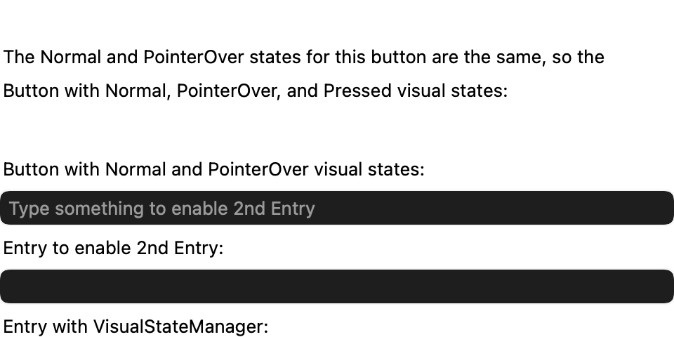
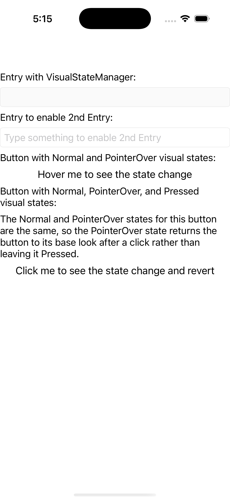
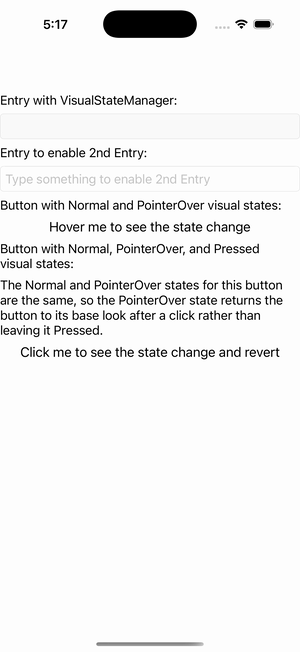

# Visual States

Ports .NET MAUI's `VisualStatesPage` ([oracle](../../../../../src/Controls/samples/Controls.Sample/Pages/UserInterface/VisualStatesPage.xaml)) as a code-first `maui::samples::visual_states_page`. `VisualStateManager` swapping setters across CommonStates + custom groups.

| macOS (AppKit) | iOS (UIKit) |
| --- | --- |
|  |  |

**Running on iOS:**

**Platforms:** macOS ✅ demo · iOS ✅ demo · Windows ⬜ TODO · Linux ⬜ TODO · Android ⬜ TODO

**Run it:** `MAUI_SAMPLE_PAGE=visual_states ./examples/build/gallery/gallery` (macOS) · `SIMCTL_CHILD_MAUI_SAMPLE_PAGE=visual_states xcrun simctl launch booted dev.maui-cpp.ios-gallery` (iOS)

> A CommonStates VSM on an entry's own `visual_states()` (Normal/Focused/Disabled) driven automatically by `set_is_focused`/`set_is_enabled` via `change_visual_state()` (Focused enlarges FontSize to 36); a second entry whose text drives the first's IsEnabled (the DataTrigger, in code); two buttons with custom Normal/PointerOver and Normal/PointerOver/Pressed groups driven via `go_to_state`. BackgroundColor is a paint (not a color descriptor) on this surface, so setters use TextColor/Text/FontSize as the faithful observable state markers.
