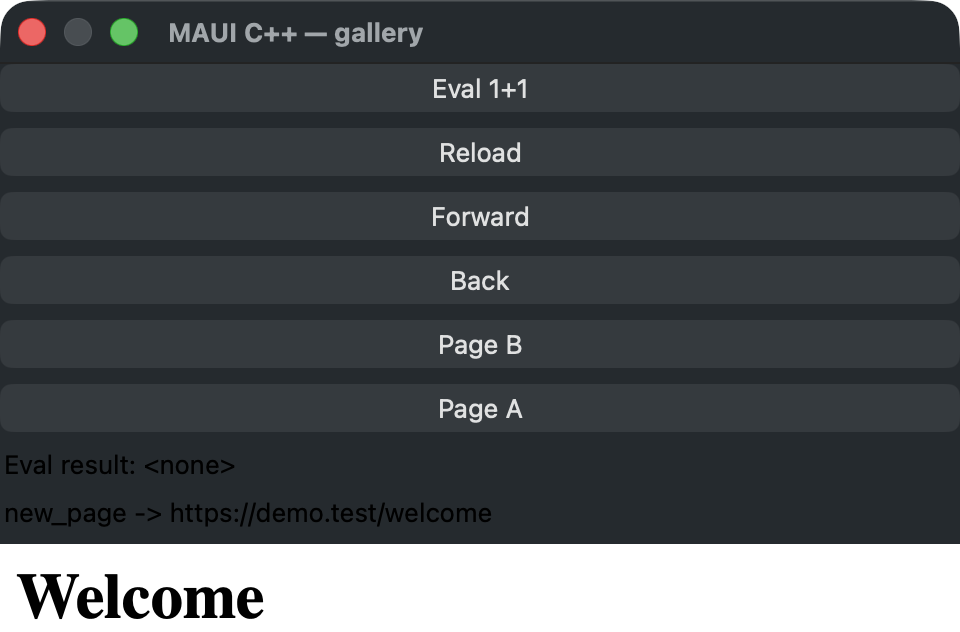
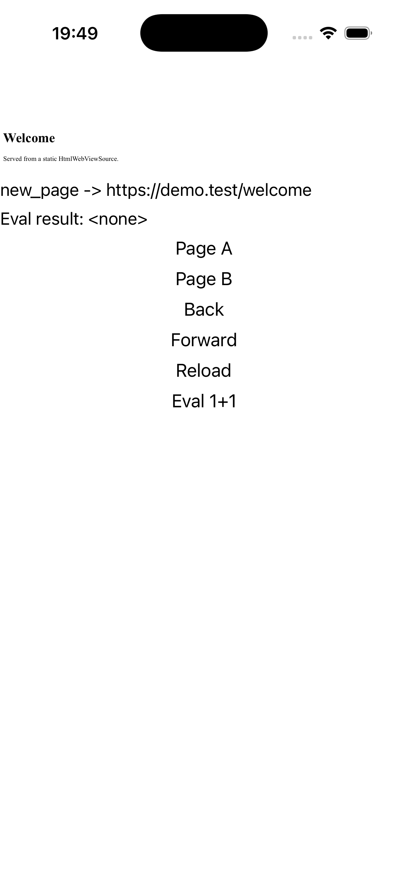
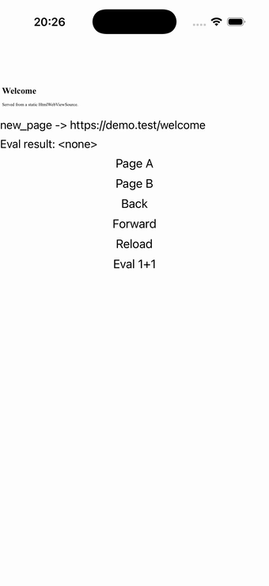

# WebView

A `web_view` loading a static HTML source (no network), with back/forward/reload buttons over the
handler-pushed `CanGoBack`/`CanGoForward` read-onlys and an "Eval 1+1" button driving the
`EvaluateJavaScriptAsync` round-trip. Source: [`web_view_page.hpp`](../../../examples/gallery/pages/web_view_page.hpp).

| macOS (AppKit) | iOS (UIKit) |
| --- | --- |
|  |  |

**Running on iOS:**

**Native controls exercised:** `WKWebView` (shared apple/iOS handler), navigation/eval buttons, and the
navigation/eval status labels.

**Platforms:** macOS ✅ demo · iOS ✅ demo · Windows ⬜ TODO · Linux ⬜ TODO · Android ⬜ TODO

**Run it:**
- macOS — `MAUI_SAMPLE_PAGE=web_view ./examples/build/gallery/gallery`
- iOS sim — `SIMCTL_CHILD_MAUI_SAMPLE_PAGE=web_view xcrun simctl launch booted dev.maui-cpp.ios-gallery`

> ⚠️ Partial: the control chrome (navigation/eval buttons + the `new_page -> https://demo.test/welcome`
> and `Eval result` status labels) renders and the `WKWebView` is created, but the web *content* area is
> blank in the capture — the demo navigates to a placeholder URL with no live network/HTML, so there is
> nothing to paint inside the web view.
