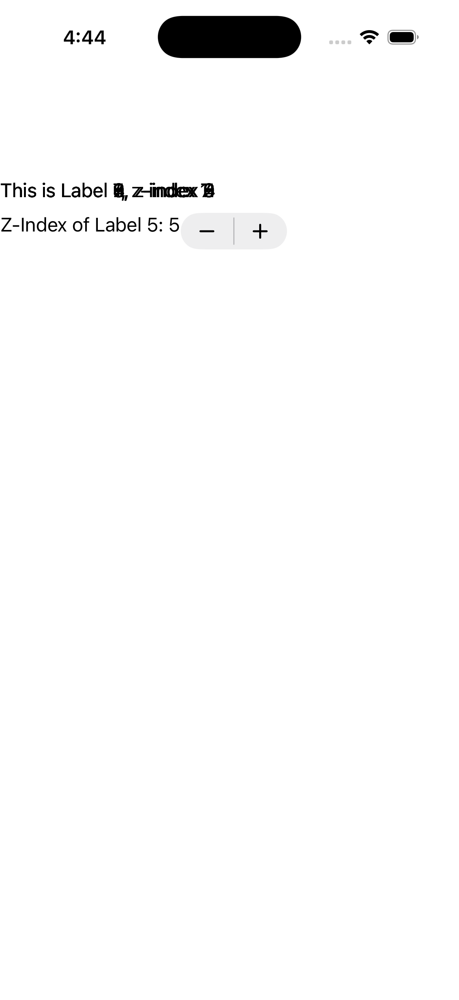
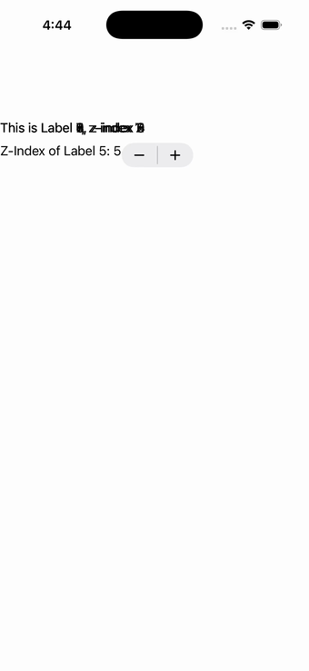

# ZIndex

Ports .NET MAUI's `ZIndexPage` ([oracle](../../../../../src/Controls/samples/Controls.Sample/Pages/Layouts/ZIndexPage.xaml)) as a code-first `maui::samples::z_index_page`. Ten overlapping 200×100 labels with set_z_index(n) and cycling background colors, plus a stepper whose ValueChanged rewrites Label 5's z-index live.

| macOS (AppKit) | iOS (UIKit) |
| --- | --- |
|  |  |

**Running on iOS:**

**Platforms:** macOS ✅ demo · iOS ✅ demo · Windows ⬜ TODO · Linux ⬜ TODO · Android ⬜ TODO

**Run it:**
- macOS — `MAUI_SAMPLE_PAGE=z_index ./examples/build/gallery/gallery`
- iOS sim — `SIMCTL_CHILD_MAUI_SAMPLE_PAGE=z_index xcrun simctl launch booted dev.maui-cpp.ios-gallery`

> On macOS the gallery host sizes the window to the measured content over plain (unflipped) NSViews, so
> layout pages can show a partial/single block — the iOS capture is the faithful top-down layout. Notes: the per-label Margin cascade is omitted (no view-level margin seam).
