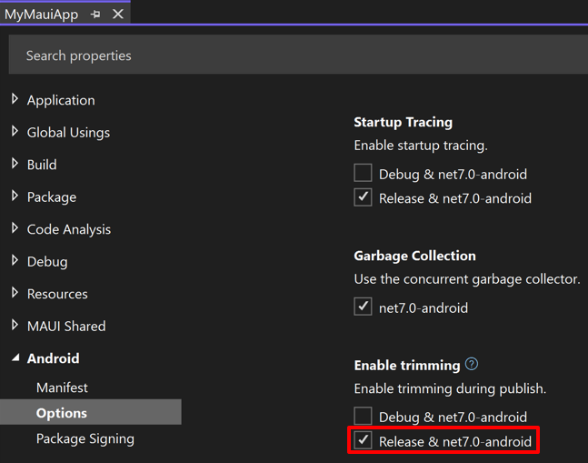

# Linking a .NET MAUI Android app

When it builds your app, .NET Multi-platform App UI (.NET MAUI) can use a linker called *ILLink* to reduce the overall size of the app. ILLink reduces the size by analyzing the intermediate code produced by the compiler. It removes unused methods, properties, fields, events, structs, and classes to produce an app that contains only code and assembly dependencies that are necessary to run the app.

## Linker behavior

The linker enables you to trim your .NET MAUI Android apps. When trimming is enabled, the linker leaves your assemblies untouched and reduces the size of the SDK assemblies by removing types and members that your app doesn't use.

Linker behavior can be configured for each build configuration of your app. By default, trimming is disabled for debug builds and enabled for release builds.

> [!WARNING]
> Enabling the linker for your app's debug configuration may hinder your debugging experience, as it may remove property accessors that enable you to inspect the state of your objects.

To ensure that trimming is enabled:

1. In Visual Studio, in **Solution Explorer**, right-click on your .NET MAUI app project and select **Properties**. Then, navigate to the **Android > Options** tab and ensure that trimming is enabled for the release build configuration:

    

![[linker-control]]
