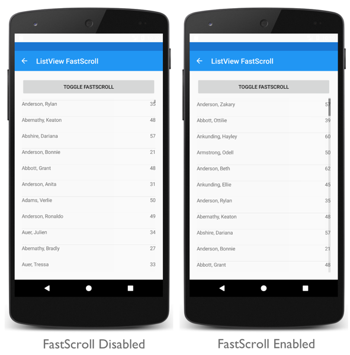

# ListView fast scrolling on Android

This .NET Multi-platform App UI (.NET MAUI) Android platform-specific is used to enable fast scrolling through data in a [[ListView (Controls)|ListView]]. It's consumed in XAML by setting the `ListView.IsFastScrollEnabled` attached property to a `boolean` value:

```xaml
<ContentPage ...
             xmlns:android="clr-namespace:Microsoft.Maui.Controls.PlatformConfiguration.AndroidSpecific;assembly=Microsoft.Maui.Controls"
             xmlns:local="clr-namespace:PlatformSpecifics"
             x:DataType="local:ListViewViewModel">
    <StackLayout>
        ...
        <ListView ItemsSource="{Binding GroupedEmployees}"
                  GroupDisplayBinding="{Binding Key}"
                  IsGroupingEnabled="true"
                  android:ListView.IsFastScrollEnabled="true">
            ...
        </ListView>
    </StackLayout>
</ContentPage>
```

Alternatively, it can be consumed from C# using the fluent API:

```csharp
using Microsoft.Maui.Controls.PlatformConfiguration.AndroidSpecific;
...

var listView = new Microsoft.Maui.Controls.ListView { IsGroupingEnabled = true, ItemTemplate = personDataTemplate };
listView.SetBinding(ItemsView<Cell>.ItemsSourceProperty, static (ListViewViewModel vm) => vm.GroupedEmployees); // .NET 9+ compiled binding
listView.GroupDisplayBinding = Binding.Create(static (Grouping<char, Person> g) => g.Key); // .NET 9+ compiled binding
listView.On<Microsoft.Maui.Controls.PlatformConfiguration.Android>().SetIsFastScrollEnabled(true);
```

The `ListView.On<Microsoft.Maui.Controls.PlatformConfiguration.Android>` method specifies that this platform-specific will only run on Android. The `ListView.SetIsFastScrollEnabled` method, in the `Microsoft.Maui.Controls.PlatformConfiguration.AndroidSpecific` namespace, is used to enable fast scrolling through data in a [[ListView (Controls)|ListView]]. In addition, the `SetIsFastScrollEnabled` method can be used to toggle fast scrolling by calling the `IsFastScrollEnabled` method to return whether fast scrolling is enabled:

```csharp
listView.On<Microsoft.Maui.Controls.PlatformConfiguration.Android>().SetIsFastScrollEnabled(!listView.On<Microsoft.Maui.Controls.PlatformConfiguration.Android>().IsFastScrollEnabled());
```

The result is that fast scrolling through data in a [[ListView (Controls)|ListView]] can be enabled, which changes the size of the scroll thumb:


