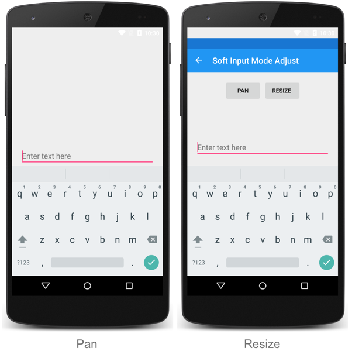

# Soft keyboard input mode on Android

This .NET Multi-platform App UI (.NET MAUI) Android platform-specific is used to set the operating mode for a soft keyboard input area, and is consumed in XAML by setting the `Application.WindowSoftInputModeAdjust` attached property to a value of the `WindowSoftInputModeAdjust` enumeration:

```xaml
<Application ...
             xmlns:android="clr-namespace:Microsoft.Maui.Controls.PlatformConfiguration.AndroidSpecific;assembly=Microsoft.Maui.Controls"
             android:Application.WindowSoftInputModeAdjust="Resize">
  ...
</Application>
```

Alternatively, it can be consumed from C# using the fluent API:

```csharp
using Microsoft.Maui.Controls.PlatformConfiguration.AndroidSpecific;
...

App.Current.On<Microsoft.Maui.Controls.PlatformConfiguration.Android>().UseWindowSoftInputModeAdjust(WindowSoftInputModeAdjust.Resize);
```

The `Application.On<Microsoft.Maui.Controls.PlatformConfiguration.Android>` method specifies that this platform-specific will only run on Android. The `Application.UseWindowSoftInputModeAdjust` method, in the `Microsoft.Maui.Controls.PlatformConfiguration.AndroidSpecific` namespace, is used to set the soft keyboard input area operating mode, with the `WindowSoftInputModeAdjust` enumeration providing two values: `Pan` and `Resize`. The `Pan` value uses the `AdjustPan` adjustment option, which doesn't resize the window when an input control has focus. Instead, the contents of the window are panned so that the current focus isn't obscured by the soft keyboard. The `Resize` value uses the `AdjustResize` adjustment option, which resizes the window when an input control has focus, to make room for the soft keyboard.

> [!IMPORTANT]
> **.NET 10 behavior change:**
> In .NET 10, when using `WindowSoftInputModeAdjust.Resize`, you may need to set `ContentPage.SafeAreaEdges="All"` to ensure the page content properly avoids the keyboard. This is because `ContentPage` now defaults to `SafeAreaEdges.None` (edge-to-edge) in .NET 10, whereas it behaved more like `Container` in .NET 9. For more information about safe area behavior in .NET 10, see [[safe-area|Safe area layout]].

This platform-specific can also be set on a [[Window|Window]]. This enables you to define a different soft keyboard input area operating mode on each `Window` that you open:

```csharp
Microsoft.Maui.Controls.PlatformConfiguration.AndroidSpecific.Application.SetWindowSoftInputModeAdjust
    (this.Window, WindowSoftInputModeAdjust.Resize);
```

The result is that the soft keyboard input area operating mode can be set when an input control has focus:


