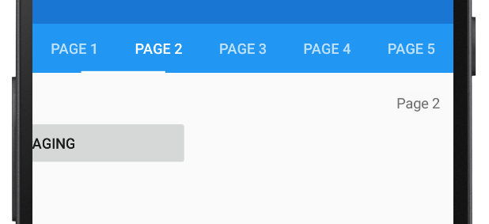

# TabbedPage page swiping on Android

This .NET Multi-platform App UI (.NET MAUI) Android platform-specific is used to enable swiping with a horizontal finger gesture between pages in a [[TabbedPage (Controls)|TabbedPage]]. It's consumed in XAML by setting the `TabbedPage.IsSwipePagingEnabled` attached property to a `boolean` value:

```xaml
<TabbedPage ...
            xmlns:android="clr-namespace:Microsoft.Maui.Controls.PlatformConfiguration.AndroidSpecific;assembly=Microsoft.Maui.Controls"
            android:TabbedPage.OffscreenPageLimit="2"
            android:TabbedPage.IsSwipePagingEnabled="true">
    ...
</TabbedPage>
```

Alternatively, it can be consumed from C# using the fluent API:

```csharp
using Microsoft.Maui.Controls.PlatformConfiguration.AndroidSpecific;
...

On<Microsoft.Maui.Controls.PlatformConfiguration.Android>()
    .SetOffscreenPageLimit(2)
    .SetIsSwipePagingEnabled(true);
```

> [!NOTE]
> This platform-specific has no effect on tabs in Shell-based apps.

The `TabbedPage.On<Microsoft.Maui.Controls.PlatformConfiguration.Android>` method specifies that this platform-specific will only run on Android. The `TabbedPage.SetIsSwipePagingEnabled` method, in the `Microsoft.Maui.Controls.PlatformConfiguration.AndroidSpecific` namespace, is used to enable swiping between pages in a [[TabbedPage (Controls)|TabbedPage]]. In addition, the [[TabbedPage (Controls)|TabbedPage]] class in the `Microsoft.Maui.Controls.PlatformConfiguration.AndroidSpecific` namespace also has a `EnableSwipePaging` method that enables this platform-specific, and a `DisableSwipePaging` method that disables this platform-specific. The `TabbedPage.OffscreenPageLimit` attached property, and `SetOffscreenPageLimit` method, are used to set the number of pages that should be retained in an idle state on either side of the current page.

The result is that swipe paging through the pages displayed by a [[TabbedPage (Controls)|TabbedPage]] is enabled:


