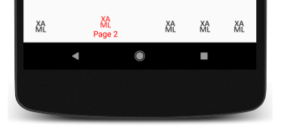

# TabbedPage toolbar placement on Android

This .NET Multi-platform App UI (.NET MAUI) Android platform-specific is used to set the placement of the toolbar on a [[TabbedPage (Controls)|TabbedPage]]. It's consumed in XAML by setting the `TabbedPage.ToolbarPlacement` attached property to a value of the `ToolbarPlacement` enumeration:

```xaml
<TabbedPage ...
            xmlns:android="clr-namespace:Microsoft.Maui.Controls.PlatformConfiguration.AndroidSpecific;assembly=Microsoft.Maui.Controls"
            android:TabbedPage.ToolbarPlacement="Bottom">
    ...
</TabbedPage>
```

Alternatively, it can be consumed from C# using the fluent API:

```csharp
using Microsoft.Maui.Controls.PlatformConfiguration.AndroidSpecific;
...

On<Microsoft.Maui.Controls.PlatformConfiguration.Android>().SetToolbarPlacement(ToolbarPlacement.Bottom);
```

> [!NOTE]
> This platform-specific has no effect on tabs in Shell-based apps.

The `TabbedPage.On<Microsoft.Maui.Controls.PlatformConfiguration.Android>` method specifies that this platform-specific will only run on Android. The `TabbedPage.SetToolbarPlacement` method, in the `Microsoft.Maui.Controls.PlatformConfiguration.AndroidSpecific` namespace, is used to set the toolbar placement on a [[TabbedPage (Controls)|TabbedPage]], with the `ToolbarPlacement` enumeration providing the following values:

- `Default` – indicates that the toolbar is placed at the default location on the page. This is the top of the page on phones, and the bottom of the page on other device idioms.
- `Top` – indicates that the toolbar is placed at the top of the page.
- `Bottom` – indicates that the toolbar is placed at the bottom of the page.

> [!NOTE]
> The `GetToolbarPlacement` method can be used to retrieve the placement of the [[TabbedPage (Controls)|TabbedPage]] toolbar.

The result is that the toolbar placement can be set on a [[TabbedPage (Controls)|TabbedPage]]:


