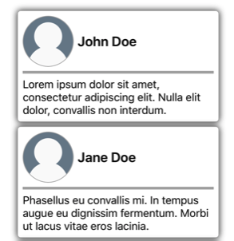
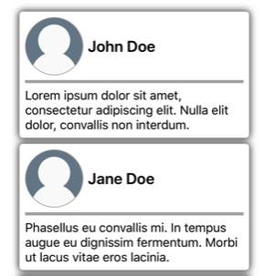
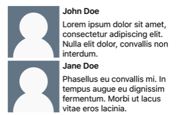
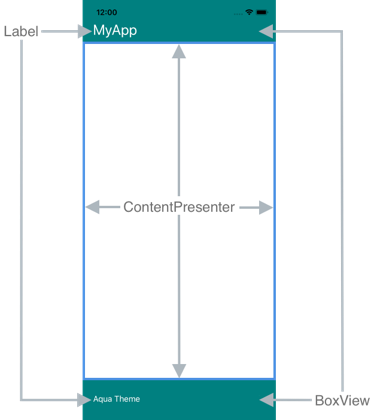
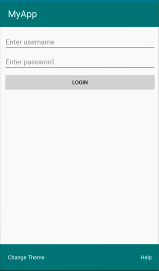
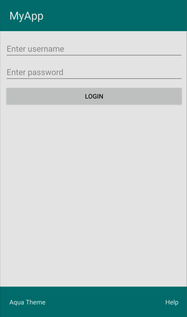
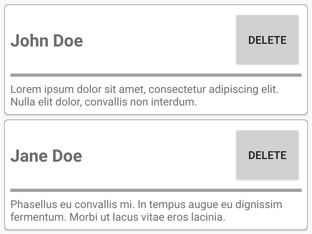

# Control templates

[ Browse the sample](/samples/dotnet/maui-samples/fundamentals-controltemplates)

.NET Multi-platform App UI (.NET MAUI) control templates enable you to define the visual structure of [[ContentView (Controls)|ContentView]] derived custom controls, and [[ContentPage|ContentPage]] derived pages. Control templates separate the user interface (UI) for a custom control, or page, from the logic that implements the control or page. Additional content can also be inserted into the templated custom control, or templated page, at a pre-defined location.

For example, a control template can be created that redefines the UI provided by a custom control. The control template can then be consumed by the required custom control instance. Alternatively, a control template can be created that defines any common UI that will be used by multiple pages in an app. The control template can then be consumed by multiple pages, with each page still displaying its unique content.

## Create a ControlTemplate

The following example shows the code for a `CardView` custom control:

```csharp
public class CardView : ContentView
{
    public static readonly BindableProperty CardTitleProperty =
        BindableProperty.Create(nameof(CardTitle), typeof(string), typeof(CardView), string.Empty);
    public static readonly BindableProperty CardDescriptionProperty =
        BindableProperty.Create(nameof(CardDescription), typeof(string), typeof(CardView), string.Empty);

    public string CardTitle
    {
        get => (string)GetValue(CardTitleProperty);
        set => SetValue(CardTitleProperty, value);
    }

    public string CardDescription
    {
        get => (string)GetValue(CardDescriptionProperty);
        set => SetValue(CardDescriptionProperty, value);
    }
    ...
}
```

The `CardView` class, which derives from the [[ContentView (Controls)|ContentView]] class, represents a custom control that displays data in a card-like layout. The class contains properties, which are backed by bindable properties, for the data it displays. However, the `CardView` class does not define any UI. Instead, the UI will be defined with a control template. For more information about creating [[ContentView (Controls)|ContentView]] derived custom controls, see [[contentview|ContentView]].

A control template is created with the [[ControlTemplate|ControlTemplate]] type. When you create a [[ControlTemplate|ControlTemplate]], you combine [[View|View]] objects to build the UI for a custom control, or page. A [[ControlTemplate|ControlTemplate]] must have only one [[View|View]] as its root element. However, the root element usually contains other [[View|View]] objects. The combination of objects makes up the control's visual structure.

While a [[ControlTemplate|ControlTemplate]] can be defined inline, the typical approach to declaring a [[ControlTemplate|ControlTemplate]] is as a resource in a resource dictionary. Because control templates are resources, they obey the same scoping rules that apply to all resources. For example, if you declare a control template in your app-level resource dictionary, the template can be used anywhere in your app. If you define the template in a page, only that page can use the control template. For more information about resources, see [[resource-dictionaries|Resource dictionaries]].

The following XAML example shows a [[ControlTemplate|ControlTemplate]] for `CardView` objects:

```xaml
<ContentPage xmlns="http://schemas.microsoft.com/dotnet/2021/maui"
             xmlns:x="http://schemas.microsoft.com/winfx/2009/xaml"
             xmlns:controls="clr-namespace:ControlTemplateDemos.Controls"
             ...>
    <ContentPage.Resources>
      <ControlTemplate x:Key="CardViewControlTemplate"
                       x:DataType="controls:CardView">
          <Border BindingContext="{Binding Source={RelativeSource TemplatedParent}}"
                  BackgroundColor="{Binding CardColor}"
                  Stroke="{Binding BorderColor}"
                 ...>
              <!-- UI objects that define the CardView visual structure -->
          </Border>
      </ControlTemplate>
    </ContentPage.Resources>
    ...
</ContentPage>
```

When a [[ControlTemplate|ControlTemplate]] is declared as a resource, it must have a key specified with the `x:Key` attribute so that it can be identified in the resource dictionary. In this example, the root element of the `CardViewControlTemplate` is a [[Border|Border]] object. The [[Border|Border]] object uses the [[RelativeSourceExtension|`RelativeSource`]] markup extension to set its [[BindableObject.BindingContext|BindingContext]] to the runtime object instance to which the template will be applied, which is known as the *templated parent*. The [[Border|Border]] object uses a combination of controls to define the visual structure of a `CardView` object. The binding expressions of these objects resolve against `CardView` properties, due to inheriting the [[BindableObject.BindingContext|BindingContext]] from the root [[Border|Border]] element. For more information about the [[RelativeSourceExtension|`RelativeSource`]] markup extension, see [[relative-bindings|Relative bindings]].

## Consume a ControlTemplate

A [[ControlTemplate|ControlTemplate]] can be applied to a [[ContentView (Controls)|ContentView]] derived custom control by setting its [[ControlTemplate|ControlTemplate]] property to the control template object. Similarly, a [[ControlTemplate|ControlTemplate]] can be applied to a [[ContentPage|ContentPage]] derived page by setting its [[ControlTemplate|ControlTemplate]] property to the control template object. At runtime, when a [[ControlTemplate|ControlTemplate]] is applied, all of the controls that are defined in the [[ControlTemplate|ControlTemplate]] are added to the visual tree of the templated custom control, or templated page.

The following example shows the `CardViewControlTemplate` being assigned to the [[ControlTemplate|ControlTemplate]] property of two `CardView` objects:

```xaml
<ContentPage xmlns="http://schemas.microsoft.com/dotnet/2021/maui"
             xmlns:x="http://schemas.microsoft.com/winfx/2009/xaml"
             xmlns:controls="clr-namespace:ControlTemplateDemos.Controls"
             ...>
    <StackLayout Margin="30">
        <controls:CardView BorderColor="DarkGray"
                           CardTitle="John Doe"
                           CardDescription="Lorem ipsum dolor sit amet, consectetur adipiscing elit. Nulla elit dolor, convallis non interdum."
                           IconBackgroundColor="SlateGray"
                           IconImageSource="user.png"
                           ControlTemplate="{StaticResource CardViewControlTemplate}" />
        <controls:CardView BorderColor="DarkGray"
                           CardTitle="Jane Doe"
                           CardDescription="Phasellus eu convallis mi. In tempus augue eu dignissim fermentum. Morbi ut lacus vitae eros lacinia."
                           IconBackgroundColor="SlateGray"
                           IconImageSource="user.png"
                           ControlTemplate="{StaticResource CardViewControlTemplate}" />
    </StackLayout>
</ContentPage>
```

In this example, the controls in the `CardViewControlTemplate` become part of the visual tree for each `CardView` object. Because the root [[Border|Border]] object for the control template sets its [[BindableObject.BindingContext|BindingContext]] to the templated parent, the [[Border|Border]] and its children resolve their binding expressions against the properties of each `CardView` object.

The following screenshot shows the `CardViewControlTemplate` applied to the the `CardView` objects:



> [!IMPORTANT]
> The point in time that a [[ControlTemplate|ControlTemplate]] is applied to a control instance can be detected by overriding the `OnApplyTemplate%2A` method in the templated custom control, or templated page. For more information, see [Get a named element from a template](#get-a-named-element-from-a-template).

## Pass parameters with TemplateBinding

The [[TemplateBindingExtension|`TemplateBinding`]] markup extension binds a property of an element that is in a [[ControlTemplate|ControlTemplate]] to a public property that is defined by the templated custom control or templated page. When you use a [[TemplateBindingExtension|`TemplateBinding`]], you enable properties on the control to act as parameters to the template. Therefore, when a property on a templated custom control or templated page is set, that value is passed onto the element that has the [[TemplateBindingExtension|`TemplateBinding`]] on it.

> [!IMPORTANT]
> The [[TemplateBindingExtension|`TemplateBinding`]] markup expression enables the [[RelativeSourceExtension|`RelativeSource`]] binding from the previous control template to be removed, and replaces the `Binding` expressions.

The [[TemplateBindingExtension|`TemplateBinding`]] markup extension defines the following properties:

- [[TemplateBindingExtension.Path|Path]], of type `string`, the path to the property.
- [[TemplateBindingExtension.Mode|Mode]], of type [[BindingMode|BindingMode]], the direction in which changes propagate between the *source* and *target*.
- [[TemplateBindingExtension.Converter|Converter]], of type [[IValueConverter|IValueConverter]], the binding value converter.
- [[TemplateBindingExtension.ConverterParameter|ConverterParameter]], of type `object`, the parameter to the binding value converter.
- [[TemplateBindingExtension.StringFormat|StringFormat]], of type `string`, the string format for the binding.

The [[ContentPropertyAttribute|`ContentProperty`]] for the [[TemplateBindingExtension|`TemplateBinding`]] markup extension is [[TemplateBindingExtension.Path|Path]]. Therefore, the "Path=" part of the markup extension can be omitted if the path is the first item in the [[TemplateBindingExtension|`TemplateBinding`]] expression. For more information about using these properties in a binding expression, see [[data-binding|Data binding]].

> [!WARNING]
> The [[TemplateBindingExtension|`TemplateBinding`]] markup extension should only be used within a [[ControlTemplate|ControlTemplate]]. However, attempting to use a [[TemplateBindingExtension|`TemplateBinding`]] expression outside of a [[ControlTemplate|ControlTemplate]] will not result in a build error or an exception being thrown.

The following XAML example shows a [[ControlTemplate|ControlTemplate]] for `CardView` objects, that uses the [[TemplateBindingExtension|`TemplateBinding`]] markup extension:

```xaml
<ContentPage xmlns="http://schemas.microsoft.com/dotnet/2021/maui"
             xmlns:x="http://schemas.microsoft.com/winfx/2009/xaml"
             ...>
    <ContentPage.Resources>
        <ControlTemplate x:Key="CardViewControlTemplate">
            <Border BackgroundColor="{TemplateBinding CardColor}"
                    Stroke="{TemplateBinding BorderColor}"
                   ...>
                <!-- UI objects that define the CardView visual structure -->                   
            </Border>
        </ControlTemplate>
    </ContentPage.Resources>
    ...
</ContentPage>
```

In this example, the [[TemplateBindingExtension|`TemplateBinding`]] markup extension resolves binding expressions against the properties of each `CardView` object. The following screenshot shows the `CardViewControlTemplate` applied to the `CardView` objects:



> [!IMPORTANT]
> Using the [[TemplateBindingExtension|`TemplateBinding`]] markup extension is equivalent to setting the [[BindableObject.BindingContext|BindingContext]] of the root element in the template to its templated parent with the [[RelativeSourceExtension|`RelativeSource`]] markup extension, and then resolving bindings of child objects with the `Binding` markup extension. In fact, the [[TemplateBindingExtension|`TemplateBinding`]] markup extension creates a `Binding` whose `Source` is `RelativeBindingSource.TemplatedParent`.

## Apply a ControlTemplate with a style

Control templates can also be applied with styles. This is achieved by creating an *implicit* or *explicit* style that consumes the [[ControlTemplate|ControlTemplate]].

The following XAML example shows an *implicit* style that consumes the `CardViewControlTemplate`:

```xaml
<ContentPage xmlns="http://schemas.microsoft.com/dotnet/2021/maui"
             xmlns:x="http://schemas.microsoft.com/winfx/2009/xaml"
             xmlns:controls="clr-namespace:ControlTemplateDemos.Controls"
             ...>
    <ContentPage.Resources>
        <ControlTemplate x:Key="CardViewControlTemplate">
            ...
        </ControlTemplate>

        <Style TargetType="controls:CardView">
            <Setter Property="ControlTemplate"
                    Value="{StaticResource CardViewControlTemplate}" />
        </Style>
    </ContentPage.Resources>
    <StackLayout Margin="30">
        <controls:CardView BorderColor="DarkGray"
                           CardTitle="John Doe"
                           CardDescription="Lorem ipsum dolor sit amet, consectetur adipiscing elit. Nulla elit dolor, convallis non interdum."
                           IconBackgroundColor="SlateGray"
                           IconImageSource="user.png" />
        ...
    </StackLayout>
</ContentPage>
```

In this example, the *implicit* [[Style|Style]] is automatically applied to each `CardView` object, and sets the [[ControlTemplate|ControlTemplate]] property of each `CardView` to `CardViewControlTemplate`.

For more information about styles, see [[xaml|Styles]].

## Redefine a control’s UI

When a [[ControlTemplate|ControlTemplate]] is instantiated and assigned to the [[ControlTemplate|ControlTemplate]] property of a [[ContentView (Controls)|ContentView]] derived custom control, or a [[ContentPage|ContentPage]] derived page, the visual structure defined for the custom control or page is replaced with the visual structure defined in the [[ControlTemplate|ControlTemplate]].

For example, the `CardViewUI` custom control defines its user interface using the following XAML:

```xaml
<ContentView xmlns="http://schemas.microsoft.com/dotnet/2021/maui"
             xmlns:x="http://schemas.microsoft.com/winfx/2009/xaml"
             xmlns:controls="clr-namespace:ControlTemplateDemos.Controls"
             x:Class="ControlTemplateDemos.Controls.CardViewUI"
             x:Name="this"
             x:DataType="controls:CardViewUI">
    <Border BindingContext="{x:Reference this}"
            BackgroundColor="{Binding CardColor}"
            Stroke="{Binding BorderColor}"
           ...>
        <!-- UI objects that define the CardView visual structure -->           
    </Border>
</ContentView>
```

However, the controls that comprise this UI can be replaced by defining a new visual structure in a [[ControlTemplate|ControlTemplate]], and assigning it to the [[ControlTemplate|ControlTemplate]] property of a `CardViewUI` object:

```xaml
<ContentPage xmlns="http://schemas.microsoft.com/dotnet/2021/maui"
             xmlns:x="http://schemas.microsoft.com/winfx/2009/xaml"
             xmlns:controls="clr-namespace:ControlTemplateDemos.Controls"             
             ...>
    <ContentPage.Resources>
        <ControlTemplate x:Key="CardViewCompressed"
                         x:DataType="controls:CardView">
            <Grid RowDefinitions="100"
                  ColumnDefinitions="100, *">
                <Image Source="{TemplateBinding IconImageSource}"
                       BackgroundColor="{TemplateBinding IconBackgroundColor}"
                       ...>
                <!-- Other UI objects that define the CardView visual structure -->
            </Grid>
        </ControlTemplate>
    </ContentPage.Resources>
    <StackLayout Margin="30">
        <controls:CardViewUI BorderColor="DarkGray"
                             CardTitle="John Doe"
                             CardDescription="Lorem ipsum dolor sit amet, consectetur adipiscing elit. Nulla elit dolor, convallis non interdum."
                             IconBackgroundColor="SlateGray"
                             IconImageSource="user.png"
                             ControlTemplate="{StaticResource CardViewCompressed}" />
        ...
    </StackLayout>
</ContentPage>
```

In this example, the visual structure of the `CardViewUI` object is redefined in a [[ControlTemplate|ControlTemplate]] that provides a more compact visual structure that's suitable for a condensed list:



## Substitute content into a ContentPresenter

A [[ContentPresenter|ContentPresenter]] can be placed in a control template to mark where content to be displayed by the templated custom control or templated page will appear. The custom control or page that consumes the control template will then define content to be displayed by the [[ContentPresenter|ContentPresenter]]. The following diagram illustrates a [[ControlTemplate|ControlTemplate]] for a page that contains a number of controls, including a [[ContentPresenter|ContentPresenter]] marked by a blue rectangle:



The following XAML shows a control template named `TealTemplate` that contains a [[ContentPresenter|ContentPresenter]] in its visual structure:

```xaml
<ControlTemplate x:Key="TealTemplate">
    <Grid RowDefinitions="0.1*, 0.8*, 0.1*">
        <BoxView Color="Teal" />
        <Label Margin="20,0,0,0"
               Text="{TemplateBinding HeaderText}"
               ... />
        <ContentPresenter Grid.Row="1" />
        <BoxView Grid.Row="2"
                 Color="Teal" />
        <Label x:Name="changeThemeLabel"
               Grid.Row="2"
               Margin="20,0,0,0"
               Text="Change Theme"
               ...>
            <Label.GestureRecognizers>
                <TapGestureRecognizer Tapped="OnChangeThemeLabelTapped" />
            </Label.GestureRecognizers>
        </Label>
        <controls:HyperlinkLabel Grid.Row="2"
                                 Margin="0,0,20,0"
                                 Text="Help"
                                 Url="https://learn.microsoft.com/dotnet/maui/"
                                 ... />
    </Grid>
</ControlTemplate>
```

The following example shows `TealTemplate` assigned to the [[ControlTemplate|ControlTemplate]] property of a [[ContentPage|ContentPage]] derived page:

```xaml
<controls:HeaderFooterPage xmlns="http://schemas.microsoft.com/dotnet/2021/maui"
                           xmlns:x="http://schemas.microsoft.com/winfx/2009/xaml"
                           xmlns:controls="clr-namespace:ControlTemplateDemos.Controls"                           
                           ControlTemplate="{StaticResource TealTemplate}"
                           HeaderText="MyApp"
                           ...>
    <StackLayout Margin="10">
        <Entry Placeholder="Enter username" />
        <Entry Placeholder="Enter password"
               IsPassword="True" />
        <Button Text="Login" />
    </StackLayout>
</controls:HeaderFooterPage>
```

At runtime, when `TealTemplate` is applied to the page, the page content is substituted into the [[ContentPresenter|ContentPresenter]] defined in the control template:



## Get a named element from a template

Named elements within a control template can be retrieved from the templated custom control or templated page. This can be achieved with the `GetTemplateChild%2A` method, which returns the named element in the instantiated [[ControlTemplate|ControlTemplate]] visual tree, if found. Otherwise, it returns `null`.

After a control template has been instantiated, the template's `OnApplyTemplate%2A` method is called. The `GetTemplateChild%2A` method should therefore be called from a `OnApplyTemplate%2A` override in the templated control or templated page.

> [!IMPORTANT]
> The `GetTemplateChild%2A` method should only be called after the `OnApplyTemplate%2A` method has been called.

The following XAML shows a control template named `TealTemplate` that can be applied to [[ContentPage|ContentPage]] derived pages:

```xaml
<ControlTemplate x:Key="TealTemplate">
    <Grid>
        ...
        <Label x:Name="changeThemeLabel"
               Text="Change Theme"
               ...>
            <Label.GestureRecognizers>
                <TapGestureRecognizer Tapped="OnChangeThemeLabelTapped" />
            </Label.GestureRecognizers>
        </Label>
        ...
    </Grid>
</ControlTemplate>
```

In this example, the [[Label (Controls)|Label]] element is named, and can be retrieved in the code for the templated page. This is achieved by calling the `GetTemplateChild%2A` method from the `OnApplyTemplate%2A` override for the templated page:

```csharp
public partial class AccessTemplateElementPage : HeaderFooterPage
{
    Label themeLabel;

    public AccessTemplateElementPage()
    {
        InitializeComponent();
    }

    protected override void OnApplyTemplate()
    {
        base.OnApplyTemplate();
        themeLabel = (Label)GetTemplateChild("changeThemeLabel");
        themeLabel.Text = OriginalTemplate ? "Aqua Theme" : "Teal Theme";
    }
}
```

In this example, the [[Label (Controls)|Label]] object named `changeThemeLabel` is retrieved once the [[ControlTemplate|ControlTemplate]] has been instantiated. `changeThemeLabel` can then be accessed and manipulated by the `AccessTemplateElementPage` class. The following screenshot shows that the text displayed by the [[Label (Controls)|Label]] has been changed:



## Bind to a viewmodel

A [[ControlTemplate|ControlTemplate]] can data bind to a viewmodel, even when the [[ControlTemplate|ControlTemplate]] binds to the templated parent (the runtime object instance to which the template is applied).

The following XAML example shows a page that consumes a viewmodel named `PeopleViewModel`:

```xaml
<ContentPage xmlns="http://schemas.microsoft.com/dotnet/2021/maui"
             xmlns:x="http://schemas.microsoft.com/winfx/2009/xaml"
             xmlns:local="clr-namespace:ControlTemplateDemos"
             xmlns:controls="clr-namespace:ControlTemplateDemos.Controls"
             x:DataType="local:PeopleViewModel"
             ...>
    <ContentPage.BindingContext>
        <local:PeopleViewModel />
    </ContentPage.BindingContext>

    <ContentPage.Resources>
        <DataTemplate x:Key="PersonTemplate"
                      x:DataType="local:Person">
            <controls:CardView BorderColor="DarkGray"
                               CardTitle="{Binding Name}"
                               CardDescription="{Binding Description}"
                               ControlTemplate="{StaticResource CardViewControlTemplate}" />
        </DataTemplate>
    </ContentPage.Resources>

    <StackLayout Margin="10"
                 BindableLayout.ItemsSource="{Binding People}"
                 BindableLayout.ItemTemplate="{StaticResource PersonTemplate}" />
</ContentPage>
```

In this example, the [[BindableObject.BindingContext|BindingContext]] of the page is set to a `PeopleViewModel` instance. This viewmodel exposes a `People` collection and an `ICommand` named `DeletePersonCommand`. The [[StackLayout (Controls)|StackLayout]] on the page uses a bindable layout to data bind to the `People` collection, and the [[BindableLayout.ItemTemplateProperty|`ItemTemplate`]] of the bindable layout is set to the `PersonTemplate` resource. This [[DataTemplate|DataTemplate]] specifies that each item in the `People` collection will be displayed using a `CardView` object. The visual structure of the `CardView` object is defined using a [[ControlTemplate|ControlTemplate]] named `CardViewControlTemplate`:

```xaml
<ControlTemplate x:Key="CardViewControlTemplate"
                 x:DataType="controls:CardView">
    <Border BindingContext="{Binding Source={RelativeSource TemplatedParent}}"
            BackgroundColor="{Binding CardColor}"
            Stroke="{Binding BorderColor}"
           ...>
        <!-- UI objects that define the CardView visual structure -->           
    </Border>
</ControlTemplate>
```

In this example, the root element of the [[ControlTemplate|ControlTemplate]] is a [[Border|Border]] object. The [[Border|Border]] object uses the [[RelativeSourceExtension|`RelativeSource`]] markup extension to set its [[BindableObject.BindingContext|BindingContext]] to the templated parent. The binding expressions of the [[Border|Border]] object and its children resolve against `CardView` properties, due to inheriting the [[BindableObject.BindingContext|BindingContext]] from the root [[Border|Border]] element. The following screenshot shows the page displaying the `People` collection:



While the objects in the [[ControlTemplate|ControlTemplate]] bind to properties on its templated parent, the [[Button (Controls)|Button]] within the control template binds to both its templated parent, and to the `DeletePersonCommand` in the viewmodel. This is because the `Button.Command` property redefines its binding source to be the binding context of the ancestor whose binding context type is `PeopleViewModel`, which is the [[StackLayout (Controls)|StackLayout]]. The `Path` part of the binding expressions can then resolve the `DeletePersonCommand` property. However, the `Button.CommandParameter` property doesn't alter its binding source, instead inheriting it from its parent in the [[ControlTemplate|ControlTemplate]]. Therefore, the `CommandParameter` property binds to the `CardTitle` property of the `CardView`.

The overall effect of the [[Button (Controls)|Button]] bindings is that when the [[Button (Controls)|Button]] is tapped, the `DeletePersonCommand` in the `PeopleViewModel` class is executed, with the value of the `CardName` property being passed to the `DeletePersonCommand`. This results in the specified `CardView` being removed from the bindable layout.

For more information about relative bindings, see [[relative-bindings|Relative bindings]].
