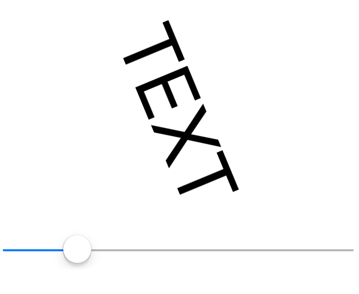

# Basic bindings

[ Browse the sample](/samples/dotnet/maui-samples/fundamentals-databinding)

A .NET Multi-platform App UI (.NET MAUI) data binding links a pair of properties between two objects, at least one of which is usually a user-interface object. These two objects are called the *target* and the *source*:

- The *target* is the object (and property) on which the data binding is set.
- The *source* is the object (and property) referenced by the data binding.

In the simplest case, data flows from the source to the target, which means that the value of the target property is set from the value of the source property. However, in some cases, data can alternatively flow from the target to the source, or in both directions.

> [!IMPORTANT]
> The target is always the object on which the data binding is set even if it's providing data rather than receiving data.

## Bindings with a binding context

Consider the following XAML example, whose intent is to rotate a [[Label (Controls)|Label]] by manipulating a [[Slider (Controls)|Slider]]:

```xaml
<ContentPage xmlns="http://schemas.microsoft.com/dotnet/2021/maui"
             xmlns:x="http://schemas.microsoft.com/winfx/2009/xaml"
             x:Class="DataBindingDemos.BasicCodeBindingPage"
             Title="Basic Code Binding">
    <StackLayout Padding="10, 0">
        <Label x:Name="label"
               Text="TEXT"
               FontSize="48"
               HorizontalOptions="Center"
               VerticalOptions="Center" />

        <Slider x:Name="slider"
                Maximum="360"
                VerticalOptions="Center" />
    </StackLayout>
</ContentPage>
```

Without data bindings, you would set the `ValueChanged` event of the [[Slider (Controls)|Slider]] to an event handler that accesses the `Value` property of the [[Slider (Controls)|Slider]] and sets that value to the `Rotation` property of the [[Label (Controls)|Label]]. The data binding automates this task, and so the event handler and the code within it are no longer necessary.

You can set a binding on an instance of any class that derives from [[BindableObject|BindableObject]], which includes [[Element|Element]], [[VisualElement (Controls)|VisualElement]], [[View|View]], and [[View|View]] derivatives. The binding is always set on the target object. The binding references the source object. To set the data binding, use the following two members of the target class:

- The `BindingContext` property specifies the source object.
- The `SetBinding` method specifies the target property and source property.

In this example, the [[Label (Controls)|Label]] is the binding target, and the [[Slider (Controls)|Slider]] is the binding source. Changes in the [[Slider (Controls)|Slider]] source affect the rotation of the [[Label (Controls)|Label]] target. Data flows from the source to the target.

Bindings written in code sometimes use string paths that are resolved at runtime with reflection. However, the `SetBinding%2A` extension method also has an overload that defines bindings using a `Func` argument:

```csharp
public partial class BasicCodeBindingPage : ContentPage
{
    public BasicCodeBindingPage()
    {
        InitializeComponent();

        label.BindingContext = slider;
        label.SetBinding(Label.RotationProperty, static (Slider slider) => slider.Value);
    }
}
```

The [[Label (Controls)|Label]] object is the binding target so that's the object on which this property is set and on which the method is called. The `Func` argument indicates the binding source, which is the [[Slider (Controls)|Slider]]. The `SetBinding` method is called on the binding target but specifies both the target property and the source property. The target property is specified as a [[BindableProperty|BindableProperty]] object: `Label.RotationProperty`. The source property is specified using a lambda expression and indicates the `Value` property of [[Slider (Controls)|Slider]].

> [!IMPORTANT]
> The target property must be backed by a bindable property. Therefore, the target object must be an instance of a class that derives from [[BindableObject|BindableObject]]. For more information, see [[bindable-properties|Bindable properties]].

In the example above the binding source is specified using a `Func`, which ensures that the binding expression is compiled for increased runtime performance. For more information about compiled bindings, see [[compiled-bindings|Compiled bindings]].

As you manipulate the [[Slider (Controls)|Slider]], the [[Label (Controls)|Label]] rotates accordingly:



Alternatively, the data binding can be specified in XAML:

```xaml
<ContentPage xmlns="http://schemas.microsoft.com/dotnet/2021/maui"
             xmlns:x="http://schemas.microsoft.com/winfx/2009/xaml"
             x:Class="DataBindingDemos.BasicXamlBindingPage"
             Title="Basic XAML Binding">
    <StackLayout Padding="10, 0">
        <Label x:DataType="Slider"
               Text="TEXT"
               FontSize="80"
               HorizontalOptions="Center"
               VerticalOptions="Center"
               BindingContext="{x:Reference Name=slider}"
               Rotation="{Binding Path=Value}" />

        <Slider x:Name="slider"
                Maximum="360"
                VerticalOptions="Center" />
    </StackLayout>
</ContentPage>
```

Just as in code, the data binding is set on the target object, which is the [[Label (Controls)|Label]]. Two XAML markup extensions are used to define the data binding:

- The `x:Reference` markup extension is required to reference the source object, which is the [[Slider (Controls)|Slider]] named `slider`.
- The `Binding` markup extension links the `Rotation` property of the [[Label (Controls)|Label]] to the `Value` property of the [[Slider (Controls)|Slider]].

For more information about XAML markup extensions, see [[consume|Consume XAML markup extensions]].

In addition, the `x:DataType` attribute on the `Label` instructs the XAML compiler to compile the binding expression on the `Label` for increased runtime performance, and specifies that the binding expression should be resolved against the `Slider` type. For more information, see [[compiled-bindings|Compiled bindings]].

> [!NOTE]
> The source property is specified with the `Path` property of the `Binding` markup extension, which corresponds with the `Path` property of the `Binding` class.

XAML markup extensions such as `x:Reference` and `Binding` can have *content property* attributes defined, which for XAML markup extensions means that the property name doesn't need to appear. The `Name` property is the content property of `x:Reference`, and the `Path` property is the content property of `Binding`, which means that they can be eliminated from the expressions:

```xaml
<Label x:DataType="Slider"
       Text="TEXT"
       FontSize="80"
       HorizontalOptions="Center"
       VerticalOptions="Center"
       BindingContext="{x:Reference slider}"
       Rotation="{Binding Value}" />
```

## Bindings without a binding context

The `BindingContext` property is an important component of data bindings, but it is not always necessary. The source object can instead be specified in the `SetBinding` call or the `Binding` markup extension:

```xaml
<ContentPage xmlns="http://schemas.microsoft.com/dotnet/2021/maui"
             xmlns:x="http://schemas.microsoft.com/winfx/2009/xaml"
             x:Class="DataBindingDemos.AlternativeCodeBindingPage"
             Title="Alternative Code Binding">
    <StackLayout Padding="10, 0">
        <Label x:Name="label"
               Text="TEXT"
               FontSize="40"
               HorizontalOptions="Center"
               VerticalOptions="Center" />

        <Slider x:Name="slider"
                Minimum="-2"
                Maximum="2"
                VerticalOptions="Center" />
    </StackLayout>
</ContentPage>
```

In this example, the [[Slider (Controls)|Slider]] is defined to control the `Scale` property of the [[Label (Controls)|Label]]. For that reason, the [[Slider (Controls)|Slider]] is set for a range of -2 to 2.

The code-behind file sets the binding with the `SetBinding` method, with the second argument being a `Func` that gets the value of the `Slider`:

```csharp
public partial class AlternativeCodeBindingPage : ContentPage
{
    public AlternativeCodeBindingPage()
    {
        InitializeComponent();

        label.SetBinding(Label.ScaleProperty, static (Slider s) => s.Value, source: slider);
    }
}
```

> [!NOTE]
> The [[VisualElement (Controls)|VisualElement]] class also defines `ScaleX` and `ScaleY` properties, which can scale the [[VisualElement (Controls)|VisualElement]] differently in the horizontal and vertical directions.

Alternatively, the data binding can be specified in XAML:

```xaml
<ContentPage xmlns="http://schemas.microsoft.com/dotnet/2021/maui"
             xmlns:x="http://schemas.microsoft.com/winfx/2009/xaml"
             x:Class="DataBindingDemos.AlternativeXamlBindingPage"
             Title="Alternative XAML Binding">
    <StackLayout Padding="10, 0">
        <Label Text="TEXT"
               FontSize="40"
               HorizontalOptions="Center"
               VerticalOptions="Center"
               Scale="{Binding x:DataType='Slider',
                               Source={x:Reference slider},
                               Path=Value}" />

        <Slider x:Name="slider"
                Minimum="-2"
                Maximum="2"
                VerticalOptions="Center" />
    </StackLayout>
</ContentPage>
```

In this example, the `Binding` markup extension has two properties set, `Source` and `Path`, separated by a comma. The `Source` property is set to an embedded `x:Reference` markup extension that otherwise has the same syntax as setting the `BindingContext`.

The content property of the `Binding` markup extension is `Path`, but the `Path=` part of the markup extension can only be eliminated if it is the first property in the expression. To eliminate the `Path=` part, you need to swap the two properties:

```xaml
Scale="{Binding Value, Source={x:Reference slider}, x:DataType='Slider'}" />
```

Although XAML markup extensions are usually delimited by curly braces, they can also be expressed as object elements:

```xaml
<Label Text="TEXT"
       FontSize="40"
       HorizontalOptions="Center"
       VerticalOptions="Center">
    <Label.Scale>
        <Binding x:DataType="Slider"
                 Source="{x:Reference slider}"
                 Path="Value" />
    </Label.Scale>
</Label>
```

In this example, the `Source` and `Path` properties are regular XAML attributes. The values appear within quotation marks and the attributes are not separated by a comma. The `x:Reference` markup extension can also become an object element:

```xaml
<Label Text="TEXT"
       FontSize="40"
       HorizontalOptions="Center"
       VerticalOptions="Center">
    <Label.Scale>
        <Binding x:DataType="Slider"
                 Path="Value">
            <Binding.Source>
                <x:Reference Name="slider" />
            </Binding.Source>
        </Binding>
    </Label.Scale>
</Label>
```

This syntax isn't common, but sometimes it's necessary when complex objects are involved.

The examples shown so far set the `BindingContext` property and the `Source` property of `Binding` to an `x:Reference` markup extension to reference another view on the page. These two properties are of type `Object`, and they can be set to any object that includes properties that are suitable for binding sources. You can also set the `BindingContext` or `Source` property to an `x:Static` markup extension to reference the value of a static property or field, or a [[StaticResourceExtension|`StaticResource`]] markup extension to reference an object stored in a resource dictionary, or directly to an object, which is often an instance of a viewmodel.

> [!NOTE]
> The `BindingContext` property can also be set to a `Binding` object so that the `Source` and `Path` properties of `Binding` define the binding context.

## Binding context inheritance

You can specify the source object using the `BindingContext` property or the `Source` property of the `Binding` object. If both are set, the `Source` property of the `Binding` takes precedence over the `BindingContext`.

> [!IMPORTANT]
> The `BindingContext` property value is inherited through the visual tree.

The following XAML example demonstrates binding context inheritance:

```xaml
<ContentPage xmlns="http://schemas.microsoft.com/dotnet/2021/maui"
             xmlns:x="http://schemas.microsoft.com/winfx/2009/xaml"
             x:Class="DataBindingDemos.BindingContextInheritancePage"
             Title="BindingContext Inheritance">
    <StackLayout Padding="10">
        <StackLayout x:DataType="Slider"
                     VerticalOptions="Fill"
                     BindingContext="{x:Reference slider}">

            <Label Text="TEXT"
                   FontSize="80"
                   HorizontalOptions="Center"
                   VerticalOptions="End"
                   Rotation="{Binding Value}" />

            <BoxView Color="#800000FF"
                     WidthRequest="180"
                     HeightRequest="40"
                     HorizontalOptions="Center"
                     VerticalOptions="Start"
                     Rotation="{Binding Value}" />
        </StackLayout>

        <Slider x:Name="slider"
                Maximum="360" />
    </StackLayout>
</ContentPage>
```

In this example, the `BindingContext` property of the [[StackLayout (Controls)|StackLayout]] is set to the `slider` object. This binding context is inherited by both the [[Label (Controls)|Label]] and the [[BoxView (Controls)|BoxView]], both of which have their `Rotation` properties set to the `Value` property of the [[Slider (Controls)|Slider]]:


