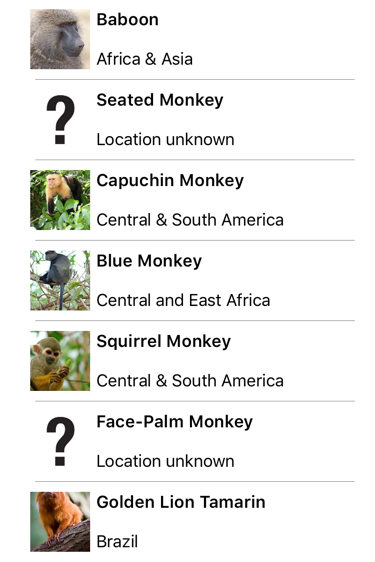

# Binding fallbacks

[ Browse the sample](/samples/dotnet/maui-samples/fundamentals-databinding)

Sometimes data bindings fail, because the binding source can't be resolved, or because the binding succeeds but returns a `null` value. While these scenarios can be handled with value converters, or other additional code, data bindings can be made more robust by defining fallback values to use if the binding process fails. In a .NET Multi-platform App UI (.NET MAUI) app this can be accomplished by defining the [[BindingBase.FallbackValue|FallbackValue]] and [[BindingBase.TargetNullValue|TargetNullValue]] properties in a binding expression. Because these properties reside in the [[BindingBase|BindingBase]] class, they can be used with bindings, multi-bindings, compiled bindings, and with the `Binding` markup extension.

> [!NOTE]
> Use of the [[BindingBase.FallbackValue|FallbackValue]] and [[BindingBase.TargetNullValue|TargetNullValue]] properties in a binding expression is optional.

## Define a fallback value

The [[BindingBase.FallbackValue|FallbackValue]] property allows a fallback value to be defined that will be used when the binding *source* can't be resolved. A common scenario for setting this property is when binding to source properties that might not exist on all objects in a bound collection of heterogeneous types.

The following example demonstrates setting the [[BindingBase.FallbackValue|FallbackValue]] property:

```xaml
<Label Text="{Binding Population, FallbackValue='Population size unknown'}"
       ... />   
```

The binding on the [[Label (Controls)|Label]] defines a [[BindingBase.FallbackValue|FallbackValue]] value (delimited by single-quote characters) that will be set on the target if the binding source can't be resolved. Therefore, the value defined by the [[BindingBase.FallbackValue|FallbackValue]] property will be displayed if the `Population` property doesn't exist on the bound object.

Rather than defining [[BindingBase.FallbackValue|FallbackValue]] property values inline, it's recommended to define them as resources in a [[ResourceDictionary|ResourceDictionary]]. The advantage of this approach is that such values are defined once in a single location, and are more easily localizable. The resources can then be retrieved using the [[StaticResourceExtension|`StaticResource`]] markup extension:

```xaml
<Label Text="{Binding Population, FallbackValue={StaticResource populationUnknown}}"
       ... />  
```

> [!NOTE]
> It's not possible to set the [[BindingBase.FallbackValue|FallbackValue]] property with a binding expression.

When the [[BindingBase.FallbackValue|FallbackValue]] property isn't set in a binding expression and the binding path or part of the path isn't resolved, `BindableProperty.DefaultValue` is set on the target. However, when the [[BindingBase.FallbackValue|FallbackValue]] property is set and the binding path or part of the path isn't resolved, the value of the [[BindingBase.FallbackValue|FallbackValue]] value property is set on the target:


Therefore, in this example the [[Label (Controls)|Label]] displays "Population size unknown" because the bound object lacks a `Population` property.

> [!IMPORTANT]
> A defined value converter is not executed in a binding expression when the [[BindingBase.FallbackValue|FallbackValue]] property is set.

## Define a null replacement value

The [[BindingBase.TargetNullValue|TargetNullValue]] property allows a replacement value to be defined that will be used when the binding *source* is resolved, but the value is `null`. A common scenario for setting this property is when binding to source properties that might be `null` in a bound collection.

The following example demonstrates setting the [[BindingBase.TargetNullValue|TargetNullValue]] property:

```xaml
<ListView ItemsSource="{Binding Monkeys}"
          ...>
    <ListView.ItemTemplate>
        <DataTemplate x:DataType="local:Monkey">
            <ViewCell>
                <Grid>
                    ...
                    <Image Source="{Binding ImageUrl, TargetNullValue='https://upload.wikimedia.org/wikipedia/commons/2/20/Point_d_interrogation.jpg'}"
                           ... />
                    ...
                    <Label Text="{Binding Location, TargetNullValue='Location unknown'}"
                           ... />
                </Grid>
            </ViewCell>
        </DataTemplate>
    </ListView.ItemTemplate>
</ListView>
```

The bindings on the [[Image (Controls)|Image]] and [[Label (Controls)|Label]] both define [[BindingBase.TargetNullValue|TargetNullValue]] values (delimited by single-quote characters) that will be applied if the binding path returns `null`. Therefore, the values defined by the [[BindingBase.TargetNullValue|TargetNullValue]] properties will be displayed for any objects in the collection where the `ImageUrl` and `Location` properties are not defined.

Rather than defining [[BindingBase.TargetNullValue|TargetNullValue]] property values inline, it's recommended to define them as resources in a [[ResourceDictionary|ResourceDictionary]]. The advantage of this approach is that such values are defined once in a single location, and are more easily localizable. The resources can then be retrieved using the [[StaticResourceExtension|`StaticResource`]] markup extension:

```xaml
<Image Source="{Binding ImageUrl, TargetNullValue={StaticResource fallbackImageUrl}}"
       ... />
<Label Text="{Binding Location, TargetNullValue={StaticResource locationUnknown}}"
       ... />
```

> [!NOTE]
> It's not possible to set the [[BindingBase.TargetNullValue|TargetNullValue]] property with a binding expression.

When the [[BindingBase.TargetNullValue|TargetNullValue]] property isn't set in a binding expression, a source value of `null` will be converted if a value converter is defined, formatted if a `StringFormat` is defined, and the result is then set on the target. However, when the [[BindingBase.TargetNullValue|TargetNullValue]] property is set, a source value of `null` will be converted if a value converter is defined, and if it's still `null` after the conversion, the value of the [[BindingBase.TargetNullValue|TargetNullValue]] property is set on the target:



Therefore, in this example the [[Image (Controls)|Image]] and [[Label (Controls)|Label]] objects display their [[BindingBase.TargetNullValue|TargetNullValue]] when their source objects are `null`.

> [!IMPORTANT]
> String formatting is not applied in a binding expression when the [[BindingBase.TargetNullValue|TargetNullValue]] property is set.

## TargetNullValue and FallbackValue comparison

Both [[BindingBase.TargetNullValue|TargetNullValue]] and [[BindingBase.FallbackValue|FallbackValue]] are used in data bindings to handle scenarios where the bound value is `null` or when the binding fails. Knowing when to use each helps ensure a smooth user experience.

### TargetNullValue

Use the [[BindingBase.TargetNullValue|TargetNullValue]] property to specify a value to display when the binding succeeds but the bound property is `null`:

```xaml
<Label Text="{Binding FirstName, TargetNullValue='No name available'}" />
```

In this example, if `FirstName` is `null` the [[Label (Controls)|Label]] will display "No name available".

### FallbackValue

Use the [[BindingBase.FallbackValue|FallbackValue]] property to provide a value when the binding process fails entirely, such as an incorrect path, or a missing binding context:

```xaml
<Label Text="{Binding FirstName, FallbackValue='Binding failed'}" />
```

In this example, if the binding fails the [[Label (Controls)|Label]] will display "Binding failed".

### Combined use

The [[BindingBase.TargetNullValue|TargetNullValue]] and [[BindingBase.FallbackValue|FallbackValue]] properties can be combined in a single binding expression:

```xaml
<Label Text="{Binding FirstName, TargetNullValue='No name available', FallbackValue='Binding failed'}" />
```
