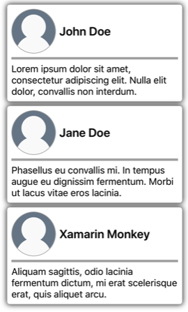

# Relative bindings

[ Browse the sample](/samples/dotnet/maui-samples/fundamentals-databinding)

.NET Multi-platform App UI (.NET MAUI) relative bindings provide the ability to set the binding source relative to the position of the binding target. They are created with the [[RelativeSourceExtension|`RelativeSource`]] markup extension, and set as the `Source` property of a binding expression.

The [[RelativeSourceExtension|`RelativeSource`]] markup extension is supported by the `RelativeSourceExtension` class, which defines the following properties:

- `Mode`, of type `RelativeBindingSourceMode`, describes the location of the binding source relative to the position of the binding target.
- `AncestorLevel`, of type `int`, an optional ancestor level to look for, when the `Mode` property is `FindAncestor`. An `AncestorLevel` of `n` skips `n-1` instances of the `AncestorType`.
- `AncestorType`, of type `Type`, the type of ancestor to look for, when the `Mode` property is `FindAncestor`.

> [!NOTE]
> The XAML parser allows the `RelativeSourceExtension` class to be abbreviated as [[RelativeSourceExtension|`RelativeSource`]].

The `Mode` property should be set to one of the `RelativeBindingSourceMode` enumeration members:

- `TemplatedParent` indicates the element to which the template, in which the bound element exists, is applied. For more information, see [Bind to a templated parent](#bind-to-a-templated-parent).
- `Self` indicates the element on which the binding is being set, allowing you to bind one property of that element to another property on the same element. For more information, see [Bind to self](#bind-to-self).
- `FindAncestor` indicates the ancestor in the visual tree of the bound element. This mode should be used to bind to an ancestor control represented by the `AncestorType` property. For more information, see [Bind to an ancestor](#bind-to-an-ancestor).
- `FindAncestorBindingContext` indicates the `BindingContext` of the ancestor in the visual tree of the bound element. This mode should be used to bind to the `BindingContext` of an ancestor represented by the `AncestorType` property. For more information, see [Bind to an ancestor](#bind-to-an-ancestor).

The `Mode` property is the content property of the `RelativeSourceExtension` class. Therefore, for XAML markup expressions expressed with curly braces, you can eliminate the `Mode=` part of the expression.

For more information about .NET MAUI markup extensions, see [[consume|Consume XAML markup extensions]].

## Bind to self

The `Self` relative binding mode is used bind a property of an element to another property on the same element:

```xaml
<BoxView x:DataType="ContentPage"
         Color="Red"
         WidthRequest="200"
         HeightRequest="{Binding Source={RelativeSource Self}, Path=WidthRequest}"
         HorizontalOptions="Center" />
```

In this example, the [[BoxView (Controls)|BoxView]] sets its [[VisualElement (Controls).WidthRequest|WidthRequest]] property to a fixed size, and the [[VisualElement (Controls).HeightRequest|HeightRequest]] property binds to the [[VisualElement (Controls).WidthRequest|WidthRequest]] property. Therefore, both properties are equal and so a square is drawn:


> [!IMPORTANT]
> When binding a property of an element to another property on the same element, the properties must be the same type. Alternatively, you can specify a converter on the binding to convert the value.

A common use of this binding mode is set an object's `BindingContext` to a property on itself. The following code shows an example of this:

```xaml
<ContentPage ...
             xmlns:local="clr-namespace:DataBindingDemos"
             BindingContext="{Binding Source={RelativeSource Self}, Path=DefaultViewModel}"
             x:DataType="local:PeopleViewModel">
    <StackLayout>
        <ListView ItemsSource="{Binding Employees}">
            ...
        </ListView>
    </StackLayout>
</ContentPage>
```

In this example, the `BindingContext` of the page is set to the `DefaultViewModel` property of itself. This property is defined in the code-behind file for the page, and provides a viewmodel instance. The [[ListView (Controls)|ListView]] binds to the `Employees` property of the viewmodel.

## Bind to an ancestor

The `FindAncestor` and `FindAncestorBindingContext` relative binding modes are used to bind to parent elements, of a certain type, in the visual tree. The `FindAncestor` mode is used to bind to a parent element, which derives from the [[Element|Element]] type. The `FindAncestorBindingContext` mode is used to bind to the `BindingContext` of a parent element.

> [!WARNING]
> The `AncestorType` property must be set to a `Type` when using the `FindAncestor` and `FindAncestorBindingContext` relative binding modes, otherwise a `XamlParseException` is thrown.

If the `Mode` property isn't explicitly set, setting the `AncestorType` property to a type that derives from [[Element|Element]] will implicitly set the `Mode` property to `FindAncestor`. Similarly, setting the `AncestorType` property to a type that does not derive from [[Element|Element]] will implicitly set the `Mode` property to `FindAncestorBindingContext`.

> [!NOTE]
> Relative bindings that use the `FindAncestorBindingContext` mode will be reapplied when the `BindingContext` of any ancestors change.

The following XAML shows an example where the `Mode` property will be implicitly set to `FindAncestorBindingContext`:

```xaml
<ContentPage ...
             xmlns:local="clr-namespace:DataBindingDemos"
             BindingContext="{Binding Source={RelativeSource Self}, Path=DefaultViewModel}"
             x:DataType="local:PeopleViewModel">
    <StackLayout>
        <ListView ItemsSource="{Binding Employees}">
            <ListView.ItemTemplate>
                <DataTemplate>
                    <ViewCell>
                        <StackLayout Orientation="Horizontal">
                            <Label Text="{Binding Fullname}"
                                   VerticalOptions="Center" />
                            <Button Text="Delete"
                                    Command="{Binding x:DataType='local:PeopleViewModel', Source={RelativeSource AncestorType={x:Type local:PeopleViewModel}}, Path=DeleteEmployeeCommand}"
                                    CommandParameter="{Binding}"
                                    HorizontalOptions="End" />
                        </StackLayout>
                    </ViewCell>
                </DataTemplate>
            </ListView.ItemTemplate>
        </ListView>
    </StackLayout>
</ContentPage>
```

In this example, the `BindingContext` of the page is set to the `DefaultViewModel` property of itself. This property is defined in the code-behind file for the page, and provides a viewmodel instance. The [[ListView (Controls)|ListView]] binds to the `Employees` property of the viewmodel. The [[DataTemplate|DataTemplate]], which defines the appearance of each item in the [[ListView (Controls)|ListView]], contains a [[Button (Controls)|Button]]. The button's `Command` property is bound to the `DeleteEmployeeCommand` in its parent's viewmodel. Tapping a [[Button (Controls)|Button]] deletes an employee:


In addition, the optional `AncestorLevel` property can help disambiguate ancestor lookup in scenarios where there is possibly more than one ancestor of that type in the visual tree:

```xaml
<Label Text="{Binding x:DataType='Entry', Source={RelativeSource AncestorType={x:Type Entry}, AncestorLevel=2}, Path=Text}" />
```

In this example, the `Label.Text` property binds to the `Text` property of the second [[Entry (Controls)|Entry]] that's encountered on the upward path, starting at the target element of the binding.

> [!NOTE]
> The `AncestorLevel` property should be set to 1 to find the ancestor nearest to the binding target element.

## Bind to a templated parent

The `TemplatedParent` relative binding mode is used to bind from within a control template to the runtime object instance to which the template is applied (known as the templated parent). This mode is only applicable if the relative binding is within a control template, and is similar to setting a `TemplateBinding`.

The following XAML shows an example of the `TemplatedParent` relative binding mode:

```xaml
<ContentPage ...
             xmlns:controls="clr-namespace:DataBindingDemos.Controls">
    <ContentPage.Resources>
        <ControlTemplate x:Key="CardViewControlTemplate"
                         x:DataType="controls:CardView">
            <Border BindingContext="{Binding Source={RelativeSource TemplatedParent}}"
                    BackgroundColor="{Binding CardColor}"
                    Stroke="{Binding BorderColor}"
                   ...>
                <Grid>
                    ...
                    <Label Text="{Binding CardTitle}"
                           ... />
                    <BoxView BackgroundColor="{Binding BorderColor}"
                             ... />
                    <Label Text="{Binding CardDescription}"
                           ... />
                </Grid>
            </Border>
        </ControlTemplate>
    </ContentPage.Resources>
    <StackLayout>        
        <controls:CardView BorderColor="DarkGray"
                           CardTitle="John Doe"
                           CardDescription="Lorem ipsum dolor sit amet, consectetur adipiscing elit. Nulla elit dolor, convallis non interdum."
                           IconBackgroundColor="SlateGray"
                           IconImageSource="user.png"
                           ControlTemplate="{StaticResource CardViewControlTemplate}" />
        <controls:CardView BorderColor="DarkGray"
                           CardTitle="Jane Doe"
                           CardDescription="Phasellus eu convallis mi. In tempus augue eu dignissim fermentum. Morbi ut lacus vitae eros lacinia."
                           IconBackgroundColor="SlateGray"
                           IconImageSource="user.png"
                           ControlTemplate="{StaticResource CardViewControlTemplate}" />
        <controls:CardView BorderColor="DarkGray"
                           CardTitle="Xamarin Monkey"
                           CardDescription="Aliquam sagittis, odio lacinia fermentum dictum, mi erat scelerisque erat, quis aliquet arcu."
                           IconBackgroundColor="SlateGray"
                           IconImageSource="user.png"
                           ControlTemplate="{StaticResource CardViewControlTemplate}" />
    </StackLayout>
</ContentPage>
```

In this example, the [[Border|Border]], which is the root element of the [[ControlTemplate|ControlTemplate]], has its `BindingContext` set to the runtime object instance to which the template is applied. Therefore, the [[Border|Border]] and its children resolve their binding expressions against the properties of each `CardView` object:



For more information about control templates, see [[controltemplate|Control templates]].
