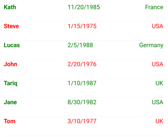

# Data templates

[ Browse the sample](/samples/dotnet/maui-samples/fundamentals-datatemplates)

.NET Multi-platform App UI (.NET MAUI) data templates provide the ability to define the presentation of data on supported controls.

Consider a [[CollectionView|CollectionView]] that displays a collection of `Person` objects. The following example shows the definition of the `Person` class:

```csharp
public class Person
{
    public string Name { get; set; }
    public int Age { get; set; }
    public string Location { get; set; }
}
```

The `Person` class defines `Name`, `Age`, and `Location` properties, which can be set when a `Person` object is created. A control that displays collections, such as [[CollectionView|CollectionView]], can be used to display `Person` objects:

```xaml
<ContentPage xmlns="http://schemas.microsoft.com/dotnet/2021/maui"
             xmlns:x="http://schemas.microsoft.com/winfx/2009/xaml"
             xmlns:local="clr-namespace:DataTemplates"
             x:Class="DataTemplates.WithoutDataTemplatePage">
    <StackLayout>
        <CollectionView>
            <CollectionView.ItemsSource>
                <x:Array Type="{x:Type local:Person}">
                    <local:Person Name="Steve" Age="21" Location="USA" />
                    <local:Person Name="John" Age="37" Location="USA" />
                    <local:Person Name="Tom" Age="42" Location="UK" />
                    <local:Person Name="Lucas" Age="29" Location="Germany" />
                    <local:Person Name="Tariq" Age="39" Location="UK" />
                    <local:Person Name="Jane" Age="30" Location="USA" />
                </x:Array>
            </CollectionView.ItemsSource>
        </CollectionView>
    </StackLayout>
</ContentPage>
```

In this example, items are added to the [[CollectionView|CollectionView]] by initializing its [[ItemsView{TVisual}.ItemsSource|ItemsSource]] property from an array of `Person` objects. [[CollectionView|CollectionView]] calls `ToString` when displaying the objects in the collection. However, because there is no `Person.ToString` override, `ToString` returns the type name of each object:


The `Person` object can override the `ToString` method to display meaningful data:

```csharp
public class Person
{
    ...
    public override string ToString ()
    {
        return Name;
    }
}
```

This results in the [[CollectionView|CollectionView]] displaying the `Person.Name` property value for each object in the collection:


The `Person.ToString` override could return a formatted string consisting of the `Name`, `Age`, and `Location` properties. However, this approach only offers limited control over the appearance of each item of data. For more flexibility, a [[DataTemplate|DataTemplate]] can be created that defines the appearance of the data.

## Create a DataTemplate

A [[DataTemplate|DataTemplate]] is used to specify the appearance of data, and typically uses data binding to display data. A common usage scenario for data templates is when displaying data from a collection of objects in a control such as a [[CollectionView|CollectionView]] or [[CarouselView|CarouselView]]. For example, when a [[CollectionView|CollectionView]] is bound to a collection of `Person` objects, the [[ItemsView{TVisual}.ItemTemplate|ItemTemplate]] property can be set to a [[DataTemplate|DataTemplate]] that defines the appearance of each `Person` object in the [[CollectionView|CollectionView]]. The [[DataTemplate|DataTemplate]] will contain objects that bind to property values of each `Person` object. For more information about data binding, see [[data-binding|Data binding]].

A [[DataTemplate|DataTemplate]] that's defined inline in a control is known as an *inline template*. Alternatively, data templates can be defined as a control-level, page-level, or app-level resource. Choosing where to define a [[DataTemplate|DataTemplate]] impacts where it can be used:

- A [[DataTemplate|DataTemplate]] defined at the control-level can only be applied to the control.
- A [[DataTemplate|DataTemplate]] defined at the page-level can be applied to multiple controls on the page.
- A [[DataTemplate|DataTemplate]] defined at the app-level can be applied to valid controls throughout the app.

> [!NOTE]
> Data templates lower in the view hierarchy take precedence over those defined higher up when they share `x:Key` attributes. For example, an app-level data template will be overridden by a page-level data template, and a page-level data template will be overridden by a control-level data template, or an inline data template.

A [[DataTemplate|DataTemplate]] can be created inline, with a type, or as a resource, regardless of where it's defined.

### Create an inline DataTemplate

An inline data template, which is one that's defined inline in a control, should be used if there's no need to reuse the data template elsewhere. The objects specified in the [[DataTemplate|DataTemplate]] define the appearance of each item of data. A control such as [[CollectionView|CollectionView]] can then set its [[ItemsView{TVisual}.ItemTemplate|ItemTemplate]] property to the inline [[DataTemplate|DataTemplate]]:

```xaml
<CollectionView>
    <CollectionView.ItemsSource>
        <x:Array Type="{x:Type local:Person}">
            <local:Person Name="Steve" Age="21" Location="USA" />
            <local:Person Name="John" Age="37" Location="USA" />
            <local:Person Name="Tom" Age="42" Location="UK" />
            <local:Person Name="Lucas" Age="29" Location="Germany" />
            <local:Person Name="Tariq" Age="39" Location="UK" />
            <local:Person Name="Jane" Age="30" Location="USA" />
        </x:Array>
    </CollectionView.ItemsSource>
    <CollectionView.ItemTemplate>
        <DataTemplate x:DataType="local:Person">
            <Grid>
                ...
                <Label Text="{Binding Name}" FontAttributes="Bold" />
                <Label Grid.Column="1" Text="{Binding Age}" />
                <Label Grid.Column="2" Text="{Binding Location}" HorizontalTextAlignment="End" />
            </Grid>
        </DataTemplate>
    </CollectionView.ItemTemplate>
</CollectionView>
```

In a [[CollectionView|CollectionView]], the child of an inline [[DataTemplate|DataTemplate]] must derive from [[BindableObject|BindableObject]]. In this example, a [[Grid (Controls)|Grid]], which derives from [[Layout (Controls)|Layout]] is used. The [[Grid (Controls)|Grid]] contains three [[Label (Controls)|Label]] objects that bind their `Text` properties to properties of each `Person` object in the collection. The following screenshot shows the resulting appearance:


### Create a DataTemplate with a type

A [[DataTemplate|DataTemplate]] can be created with a custom view type. The advantage of this approach is that the appearance defined by the view can be reused by multiple data templates throughout an app. A control such as [[CollectionView|CollectionView]] can then set its [[ItemsView{TVisual}.ItemTemplate|ItemTemplate]] property to the [[DataTemplate|DataTemplate]]:

```xaml
<ContentPage xmlns="http://schemas.microsoft.com/dotnet/2021/maui"
             xmlns:x="http://schemas.microsoft.com/winfx/2009/xaml"
             xmlns:local="clr-namespace:DataTemplates"
             x:Class="DataTemplates.WithDataTemplatePageFromType">
    <StackLayout>
        <CollectionView>
           <CollectionView.ItemsSource>
                <x:Array Type="{x:Type local:Person}">
                    <local:Person Name="Steve" Age="21" Location="USA" />
                    ...
                </x:Array>
            </CollectionView.ItemsSource>
            <CollectionView.ItemTemplate>
                <DataTemplate>
                    <local:PersonView />
                </DataTemplate>
            </CollectionView.ItemTemplate>
        </CollectionView>
    </StackLayout>
</ContentPage>
```

In this example, the [[ItemsView{TVisual}.ItemTemplate|ItemTemplate]] property is set to a [[DataTemplate|DataTemplate]] that's created from a custom type that defines the view appearance. The custom type must derive from [[ContentView (Controls)|ContentView]]:

```xaml
<ContentView xmlns="http://schemas.microsoft.com/dotnet/2021/maui"
             xmlns:x="http://schemas.microsoft.com/winfx/2009/xaml"
             xmlns:local="clr-namespace:DataTemplates"
             x:Class="DataTemplates.PersonView"
             x:DataType="local:Person">
     <Grid>
        <Grid.ColumnDefinitions>
            <ColumnDefinition Width="0.5*" />
            <ColumnDefinition Width="0.2*" />
            <ColumnDefinition Width="0.3*" />
        </Grid.ColumnDefinitions>
        <Label Text="{Binding Name}" FontAttributes="Bold" />
        <Label Grid.Column="1" Text="{Binding Age}" />
        <Label Grid.Column="2" Text="{Binding Location}" HorizontalTextAlignment="End" />
    </Grid>
</ContentView>
```

In this example, layout within the [[ContentView (Controls)|ContentView]] is managed by a [[Grid (Controls)|Grid]]. The [[Grid (Controls)|Grid]] contains three [[Label (Controls)|Label]] objects that bind their `Text` properties to properties of each `Person` object in the collection.

For more information about creating custom views, see [[contentview|ContentView]].

### Create a DataTemplate as a resource

Data templates can be created as reusable objects in a [[ResourceDictionary|ResourceDictionary]]. This is achieved by giving each [[DataTemplate|DataTemplate]] a unique `x:Key` value, which provides it with a descriptive key in the [[ResourceDictionary|ResourceDictionary]]. A control such as [[CollectionView|CollectionView]] can then set its [[ItemsView{TVisual}.ItemTemplate|ItemTemplate]] property to the [[DataTemplate|DataTemplate]]:

```xaml
<ContentPage xmlns="http://schemas.microsoft.com/dotnet/2021/maui"
             xmlns:x="http://schemas.microsoft.com/winfx/2009/xaml"
             xmlns:local="clr-namespace:DataTemplates"
             x:Class="DataTemplates.WithDataTemplateResource">
    <ContentPage.Resources>
        <ResourceDictionary>
            <DataTemplate x:Key="personTemplate">
                <Grid>
                    ...
                </Grid>
            </DataTemplate>
        </ResourceDictionary>
    </ContentPage.Resources>

    <StackLayout>
        <CollectionView ItemTemplate="{StaticResource personTemplate}">
            <CollectionView.ItemsSource>
                <x:Array Type="{x:Type local:Person}">
                    <local:Person Name="Steve" Age="21" Location="USA" />
                    ...
                </x:Array>
            </CollectionView.ItemsSource>
        </CollectionView>
    </StackLayout>
</ContentPage>
```

In this example, the [[DataTemplate|DataTemplate]] is assigned to the [[ItemsView{TVisual}.ItemTemplate|ItemTemplate]] property by using the [[StaticResourceExtension|`StaticResource`]] markup extension. While the [[DataTemplate|DataTemplate]] is defined in the page's [[ResourceDictionary|ResourceDictionary]], it could also be defined at the control-level or app-level.

## Create a DataTemplateSelector

A [[DataTemplateSelector|DataTemplateSelector]] can be used to choose a [[DataTemplate|DataTemplate]] at runtime based on the value of a data-bound property. This enables multiple data templates to be applied to the same type of object, to choose their appearance at runtime. A data template selector enables scenarios such as a [[CollectionView|CollectionView]] or [[CarouselView|CarouselView]] binding to a collection of objects where the appearance of each object can be chosen at runtime by the data template selector returning a specific [[DataTemplate|DataTemplate]].

A data template selector is implemented by creating a class that inherits from [[DataTemplateSelector|DataTemplateSelector]]. The `OnSelectTemplate%2A` method should then be overridden to return a specific [[DataTemplate|DataTemplate]]:

```csharp
public class PersonDataTemplateSelector : DataTemplateSelector
{
    public DataTemplate ValidTemplate { get; set; }
    public DataTemplate InvalidTemplate { get; set; }

    protected override DataTemplate OnSelectTemplate(object item, BindableObject container)
    {
        return ((Person)item).DateOfBirth.Year >= 1980 ? ValidTemplate : InvalidTemplate;
    }
}
```

In this example, the `OnSelectTemplate%2A` method returns a specific data template based on the value of the `DateOfBirth` property. The returned data template is defined by the `ValidTemplate` or `InvalidTemplate` property, which are set when consuming the data template selector.

### Limitations

[[DataTemplateSelector|DataTemplateSelector]] objects have the following limitations:

- The [[DataTemplateSelector|DataTemplateSelector]] subclass must always return the same template for the same data if queried multiple times.
- The [[DataTemplateSelector|DataTemplateSelector]] subclass must not return another [[DataTemplateSelector|DataTemplateSelector]] subclass.
- The [[DataTemplateSelector|DataTemplateSelector]] subclass must not return new instances of a [[DataTemplate|DataTemplate]] on each call. Instead, the same instance must be returned. Failure to do so will create a memory leak and will disable control virtualization.

### Consume a DataTemplateSelector

A data template selector can be consumed by creating it as a resource and assigning its instance to .NET MAUI control properties of type [[DataTemplate|DataTemplate]], such as [[ItemsView{TVisual}.ItemTemplate|ItemTemplate]].

The following example shows declaring `PersonDataTemplateSelector` as a page-level resource:

```xaml
<ContentPage xmlns="http://schemas.microsoft.com/dotnet/2021/maui"
             xmlns:local="clr-namespace:Selector"
             xmlns:x="http://schemas.microsoft.com/winfx/2009/xaml"
             x:Class="Selector.MainPage">
    <ContentPage.Resources>
        <DataTemplate x:Key="validPersonTemplate">
            <Grid>
                ...
            </Grid>
        </DataTemplate>
        <DataTemplate x:Key="invalidPersonTemplate">
            <Grid>
                ...
            </Grid>
        </DataTemplate>
        <local:PersonDataTemplateSelector x:Key="personDataTemplateSelector"
                                          ValidTemplate="{StaticResource validPersonTemplate}"
                                          InvalidTemplate="{StaticResource invalidPersonTemplate}" />
    </ContentPage.Resources>
    ...
</ContentPage>
```

In this example, the page-level [[ResourceDictionary|ResourceDictionary]] defines two [[DataTemplate|DataTemplate]] objects and a `PersonDataTemplateSelector` object. The `PersonDataTemplateSelector` object sets its `ValidTemplate` and `InvalidTemplate` properties to the [[DataTemplate|DataTemplate]] objects using the [[StaticResourceExtension|`StaticResource`]] markup extension. While the resources are defined in the page's [[ResourceDictionary|ResourceDictionary]], they could also be defined at the control-level or app-level.

The `PersonDataTemplateSelector` object can be consumed by assigning it to the [[ItemsView{TVisual}.ItemTemplate|ItemTemplate]] property:

```xaml
<CollectionView x:Name="collectionView"
                ItemTemplate="{StaticResource personDataTemplateSelector}" />
```

At runtime, the [[CollectionView|CollectionView]] calls the `PersonDataTemplateSelector.OnSelectTemplate` method for each of the items in the underlying collection, with the call passing the data object as the `item` parameter. The returned [[DataTemplate|DataTemplate]] is then applied to that object.

The following screenshot shows the result of the [[CollectionView|CollectionView]] applying the `PersonDataTemplateSelector` to each object in the underlying collection:



In this example, any `Person` object that has a `DateOfBirth` property value greater than or equal to 1980 is displayed in green, with the remaining objects being displayed in red.
