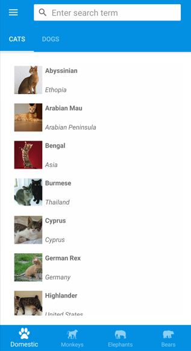

# Create a .NET MAUI Shell app

[ Browse the sample](/samples/dotnet/maui-samples/fundamentals-shell)

A .NET Multi-platform App UI (.NET MAUI) Shell app can be created with the **.NET MAUI App** project template, and then by describing the visual hierarchy of the app in the `AppShell` class.

For a step-by-step walkthrough of how to create a Shell app, see [[notes-app|Create a .NET MAUI app]].

## Describe the visual hierarchy of the app

The visual hierarchy of a .NET MAUI Shell app is described in the subclassed [[Shell|Shell]] class, which the project template names `AppShell`. A subclassed [[Shell|Shell]] class consists of three main hierarchical objects:

1. [[FlyoutItem|FlyoutItem]] or [[TabBar|TabBar]]. A [[FlyoutItem|FlyoutItem]] represents one or more items in the flyout, and should be used when the navigation pattern for the app requires a flyout. A [[TabBar|TabBar]] represents the bottom tab bar, and should be used when the navigation pattern for the app begins with bottom tabs and doesn't require a flyout. Every [[FlyoutItem|FlyoutItem]] object or [[TabBar|TabBar]] object is a child of the [[Shell|Shell]] object.
1. [[Tab|Tab]], which represents grouped content, navigable by bottom tabs. Every [[Tab|Tab]] object is a child of a [[FlyoutItem|FlyoutItem]] object or [[TabBar|TabBar]] object.
1. [[ShellContent|ShellContent]], which represents the [[ContentPage|ContentPage]] objects for each tab. Every [[ShellContent|ShellContent]] object is a child of a [[Tab|Tab]] object. When more than one [[ShellContent|ShellContent]] object is present in a [[Tab|Tab]], the objects will be navigable by top tabs.

These objects don't represent any user interface, but rather the organization of the app's visual hierarchy. Shell will take these objects and produce the navigation user interface for the content.

The following XAML shows an example of a subclassed [[Shell|Shell]] class:

```xaml
<Shell xmlns="http://schemas.microsoft.com/dotnet/2021/maui"
       xmlns:x="http://schemas.microsoft.com/winfx/2009/xaml"
       xmlns:views="clr-namespace:Xaminals.Views"
       x:Class="Xaminals.AppShell">
    ...
    <FlyoutItem FlyoutDisplayOptions="AsMultipleItems">
        <Tab Title="Domestic"
             Icon="paw.png">
            <ShellContent Title="Cats"
                          Icon="cat.png"
                          ContentTemplate="{DataTemplate views:CatsPage}" />
            <ShellContent Title="Dogs"
                          Icon="dog.png"
                          ContentTemplate="{DataTemplate views:DogsPage}" />
        </Tab>
        <!--
        Shell has implicit conversion operators that enable the Shell visual hierarchy to be simplified.
        This is possible because a subclassed Shell object can only ever contain a FlyoutItem object or a TabBar object,
        which can only ever contain Tab objects, which can only ever contain ShellContent objects.

        The implicit conversion automatically wraps the ShellContent objects below in Tab objects.
        -->
        <ShellContent Title="Monkeys"
                      Icon="monkey.png"
                      ContentTemplate="{DataTemplate views:MonkeysPage}" />
        <ShellContent Title="Elephants"
                      Icon="elephant.png"
                      ContentTemplate="{DataTemplate views:ElephantsPage}" />
        <ShellContent Title="Bears"
                      Icon="bear.png"
                      ContentTemplate="{DataTemplate views:BearsPage}" />
    </FlyoutItem>
    ...
</Shell>
```

When run, this XAML displays the `CatsPage`, because it's the first item of content declared in the subclassed [[Shell|Shell]] class:



Pressing the hamburger icon, or swiping from the left, displays the flyout:


Multiple items are displayed on the flyout because the [[FlyoutDisplayOptions|FlyoutDisplayOptions]] property is set to `AsMultipleItems`. For more information, see [[flyout#flyout-display-options|Flyout display options]].

> [!IMPORTANT]
> In a Shell app, pages are created on demand in response to navigation. This is accomplished by using the [[DataTemplate|DataTemplate]] markup extension to set the `ContentTemplate` property of each [[ShellContent|ShellContent]] object to a [[ContentPage|ContentPage]] object.
