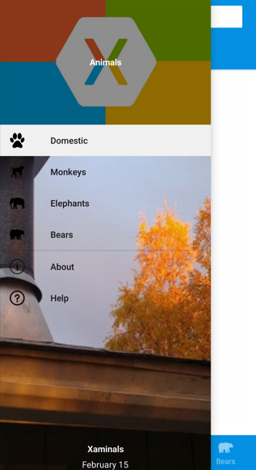
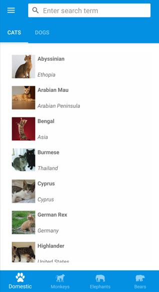
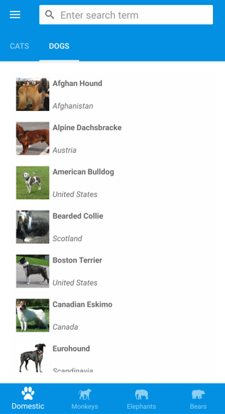
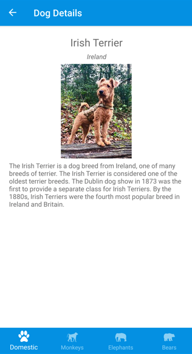
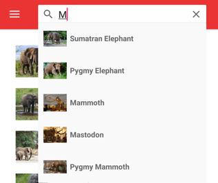

# .NET MAUI Shell overview

[ Browse the sample](/samples/dotnet/maui-samples/fundamentals-shell)

.NET Multi-platform App UI (.NET MAUI) Shell reduces the complexity of app development by providing the fundamental features that most apps require, including:

- A single place to describe the visual hierarchy of an app.
- A common navigation user experience.
- A URI-based navigation scheme that permits navigation to any page in the app.
- An integrated search handler.

## App visual hierarchy

In a .NET MAUI Shell app, the visual hierarchy of the app is described in a class that subclasses the [[Shell|Shell]] class. This class can consist of three main hierarchical objects:

1. [[FlyoutItem|FlyoutItem]] or [[TabBar|TabBar]]. A [[FlyoutItem|FlyoutItem]] represents one or more items in the flyout, and should be used when the navigation pattern for the app requires a flyout. A [[TabBar|TabBar]] represents the bottom tab bar, and should be used when the navigation pattern for the app begins with bottom tabs and doesn't require a flyout. For more information about flyout items, see [[flyout|.NET MAUI Shell flyout]]. For more information about tab bars, see [[tabs|.NET MAUI Shell tabs]].
1. [[Tab|Tab]], which represents grouped content, navigable by bottom tabs. For more information, see [[tabs|.NET MAUI Shell tabs]].
1. [[ShellContent|ShellContent]], which represents the [[ContentPage|ContentPage]] objects for each tab. For more information, see [[pages|.NET MAUI Shell pages]].

These objects don't represent any user interface, but rather the organization of the app's visual hierarchy. Shell will take these objects and produce the navigation user interface for the content.

> [!NOTE]
> Pages are created on demand in Shell apps, in response to navigation.

For more information, see [[create|Create a .NET MAUI Shell app]].

## Navigation user experience

The navigation experience provided by .NET MAUI Shell is based on flyouts and tabs. The top level of navigation in a Shell app is either a flyout or a bottom tab bar, depending on the navigation requirements of the app. The following example shows an app where the top level of navigation is a flyout:

In this example, some flyout items are duplicated as tab bar items. However, there are also items that can only be accessed from the flyout. Selecting a flyout item results in the bottom tab that represents the item being selected and displayed:

> [!NOTE]
> When the flyout isn't open the bottom tab bar can be considered to be the top level of navigation in the app.

Each tab on the tab bar displays a [[ContentPage|ContentPage]]. However, if a bottom tab contains more than one page, the pages are navigable by the top tab bar:

Within each tab, additional [[ContentPage|ContentPage]] objects that are known as detail pages, can be navigated to:

Shell uses a URI-based navigation experience that uses routes to navigate to any page in the app, without having to follow a set navigation hierarchy. In addition, it also provides the ability to navigate backwards without having to visit all of the pages on the navigation stack. For more information, see [[navigation|.NET MAUI Shell navigation]].

## Search

.NET MAUI Shell includes integrated search functionality that's provided by the [[SearchHandler|SearchHandler]] class. Search capability can be added to a page by adding a subclassed [[SearchHandler|SearchHandler]] object to it. This results in a search box being added at the top of the page. When data is entered into the search box, the search suggestions area is populated with data:

Then, when a result is selected from the search suggestions area, custom logic can be executed such as navigating to a detail page.

For more information, see [[search|.NET MAUI Shell search]].
