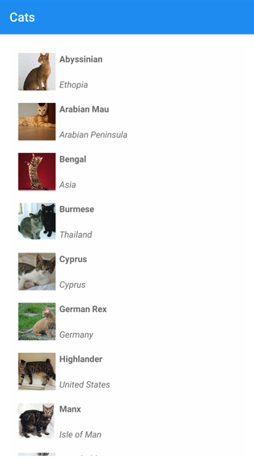
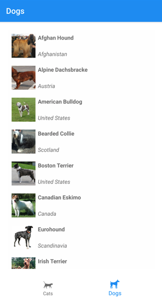
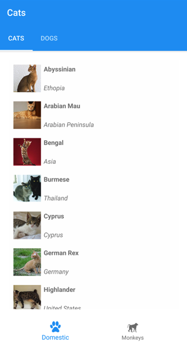

# .NET MAUI Shell tabs

[ Browse the sample](/samples/dotnet/maui-samples/fundamentals-shell)

The navigation experience provided by .NET Multi-platform App UI (.NET MAUI) Shell is based on flyouts and tabs. The top level of navigation in a Shell app is either a flyout or a bottom tab bar, depending on the navigation requirements of the app. When the navigation experience for an app begins with bottom tabs, the child of the subclassed [[Shell|Shell]] object should be a [[TabBar|TabBar]] object, which represents the bottom tab bar.

A [[TabBar|TabBar]] object can contain one or more [[Tab|Tab]] objects, with each [[Tab|Tab]] object representing a tab on the bottom tab bar. Each [[Tab|Tab]] object can contain one or more [[ShellContent|ShellContent]] objects, with each [[ShellContent|ShellContent]] object displaying a single [[ContentPage|ContentPage]]. When more than one [[ShellContent|ShellContent]] object is present in a [[Tab|Tab]] object, the [[ContentPage|ContentPage]] objects are navigable by top tabs. Within a tab, you can navigate to other [[ContentPage|ContentPage]] objects that are known as detail pages.

> [!IMPORTANT]
> The [[TabBar|TabBar]] type disables the flyout.

> [!TIP]
> Tabs can be displayed with a flyout by adding multiple [[ShellContent|ShellContent]] objects to a [[FlyoutItem|FlyoutItem]] object or [[Tab|Tab]] object. For more information, see [[flyout#flyout-items|.NET MAUI Shell flyout]].

## Single page

A single page Shell app can be created by adding a [[Tab|Tab]] object to a [[TabBar|TabBar]] object. Within the [[Tab|Tab]] object, a [[ShellContent|ShellContent]] object should be set to a [[ContentPage|ContentPage]] object:

```xaml
<Shell xmlns="http://schemas.microsoft.com/dotnet/2021/maui"
       xmlns:x="http://schemas.microsoft.com/winfx/2009/xaml"
       xmlns:views="clr-namespace:Xaminals.Views"
       x:Class="Xaminals.AppShell">
    <TabBar>
       <Tab>
           <ShellContent ContentTemplate="{DataTemplate views:CatsPage}" />
       </Tab>
    </TabBar>
</Shell>
```

This example results in the following single page app:



Shell has implicit-conversion operators that enable the Shell visual hierarchy to be simplified without introducing more views into the visual tree. This simplification is possible because a subclassed [[Shell|Shell]] object can only ever contain [[FlyoutItem|FlyoutItem]] objects or a [[TabBar|TabBar]] object, which can only ever contain [[Tab|Tab]] objects, which can only ever contain [[ShellContent|ShellContent]] objects. These implicit-conversion operators can be used to remove the [[Tab|Tab]] objects from the previous example:

```xaml
<Shell xmlns="http://schemas.microsoft.com/dotnet/2021/maui"
       xmlns:x="http://schemas.microsoft.com/winfx/2009/xaml"
       xmlns:views="clr-namespace:Xaminals.Views"
       x:Class="Xaminals.AppShell">
    <Tab>
        <ShellContent ContentTemplate="{DataTemplate views:CatsPage}" />
    </Tab>
</Shell>
```

This implicit conversion automatically wraps the [[ShellContent|ShellContent]] object in a [[Tab|Tab]] object, which is wrapped in a [[TabBar|TabBar]] object.

> [!IMPORTANT]
> In a Shell app, pages are created on demand in response to navigation. This is accomplished by using the [[DataTemplate|DataTemplate]] markup extension to set the `ContentTemplate` property of each [[ShellContent|ShellContent]] object to a [[ContentPage|ContentPage]] object.

## Bottom tabs

If there are multiple [[Tab|Tab]] objects in a single [[TabBar|TabBar]] object, [[Tab|Tab]] objects are rendered as bottom tabs:

```xaml
<Shell xmlns="http://schemas.microsoft.com/dotnet/2021/maui"
       xmlns:x="http://schemas.microsoft.com/winfx/2009/xaml"
       xmlns:views="clr-namespace:Xaminals.Views"
       x:Class="Xaminals.AppShell">
    <TabBar>
       <Tab Title="Cats"
            Icon="cat.png">
           <ShellContent ContentTemplate="{DataTemplate views:CatsPage}" />
       </Tab>
       <Tab Title="Dogs"
            Icon="dog.png">
           <ShellContent ContentTemplate="{DataTemplate views:DogsPage}" />
       </Tab>
    </TabBar>
</Shell>
```

The `Title` property, of type `string`, defines the tab title. The `Icon` property, of type [[ImageSource|ImageSource]], defines the tab icon:



When there are more than five tabs on a [[TabBar|TabBar]], a **More** tab appears, which can be used to access the other tabs:


In addition, Shell's implicit conversion operators can be used to remove the [[ShellContent|ShellContent]] and [[Tab|Tab]] objects from the previous example:

```xaml
<Shell xmlns="http://schemas.microsoft.com/dotnet/2021/maui"
       xmlns:x="http://schemas.microsoft.com/winfx/2009/xaml"
       xmlns:views="clr-namespace:Xaminals.Views"
       x:Class="Xaminals.AppShell">
    <TabBar>
       <ShellContent Title="Cats"
                     Icon="cat.png"
                     ContentTemplate="{DataTemplate views:CatsPage}" />
       <ShellContent Title="Dogs"
                     Icon="dog.png"
                     ContentTemplate="{DataTemplate views:DogsPage}" />
    </TabBar>
</Shell>
```

This implicit conversion automatically wraps each [[ShellContent|ShellContent]] object in a [[Tab|Tab]] object.

> [!IMPORTANT]
> In a Shell app, pages are created on demand in response to navigation. This is accomplished by using the [[DataTemplate|DataTemplate]] markup extension to set the `ContentTemplate` property of each [[ShellContent|ShellContent]] object to a [[ContentPage|ContentPage]] object.

## Bottom and top tabs

When more than one [[ShellContent|ShellContent]] object is present in a [[Tab|Tab]] object, a top tab bar is added to the bottom tab, through which the [[ContentPage|ContentPage]] objects are navigable:

```xaml
<Shell xmlns="http://schemas.microsoft.com/dotnet/2021/maui"
       xmlns:x="http://schemas.microsoft.com/winfx/2009/xaml"
       xmlns:views="clr-namespace:Xaminals.Views"
       x:Class="Xaminals.AppShell">
    <TabBar>
       <Tab Title="Domestic"
            Icon="paw.png">
           <ShellContent Title="Cats"
                         ContentTemplate="{DataTemplate views:CatsPage}" />
           <ShellContent Title="Dogs"
                         ContentTemplate="{DataTemplate views:DogsPage}" />
       </Tab>
       <Tab Title="Monkeys"
            Icon="monkey.png">
           <ShellContent ContentTemplate="{DataTemplate views:MonkeysPage}" />
       </Tab>
    </TabBar>
</Shell>
```

This code results in the layout shown in the following screenshot:



In addition, Shell's implicit conversion operators can be used to remove the second [[Tab|Tab]] object from the previous example:

```xaml
<Shell xmlns="http://schemas.microsoft.com/dotnet/2021/maui"
       xmlns:x="http://schemas.microsoft.com/winfx/2009/xaml"
       xmlns:views="clr-namespace:Xaminals.Views"
       x:Class="Xaminals.AppShell">
    <TabBar>
       <Tab Title="Domestic"
            Icon="paw.png">
           <ShellContent Title="Cats"
                         Icon="cat.png"
                         ContentTemplate="{DataTemplate views:CatsPage}" />
           <ShellContent Title="Dogs"
                         Icon="dog.png"
                         ContentTemplate="{DataTemplate views:DogsPage}" />
       </Tab>
       <ShellContent Title="Monkeys"
                     Icon="monkey.png"
                     ContentTemplate="{DataTemplate views:MonkeysPage}" />
    </TabBar>
</Shell>
```

This implicit conversion automatically wraps the third [[ShellContent|ShellContent]] object in a [[Tab|Tab]] object.

## Tab appearance

The [[Shell|Shell]] class defines the following attached properties that control the appearance of tabs:

- `TabBarBackgroundColor`, of type [[Color|Color]], that defines the background color for the tab bar. If the property is unset, the `BackgroundColor` property value is used.
- `TabBarDisabledColor`, of type [[Color|Color]], that defines the disabled color for the tab bar. If the property is unset, the `DisabledColor` property value is used.
- `TabBarForegroundColor`, of type [[Color|Color]], that defines the foreground color for the tab bar. If the property is unset, the `ForegroundColor` property value is used.
- `TabBarTitleColor`, of type [[Color|Color]], that defines the title color for the tab bar. If the property is unset, the `TitleColor` property value is used.
- `TabBarUnselectedColor`, of type [[Color|Color]], that defines the unselected color for the tab bar. If the property is unset, the `UnselectedColor` property value is used.

All of these properties are backed by [[BindableProperty|BindableProperty]] objects, which means that the properties can be targets of data bindings, and styled.

The three properties that most influence the color of a tab are `TabBarForegroundColor`, `TabBarTitleColor`, and `TabBarUnselectedColor`:

- If only the `TabBarTitleColor` property is set then its value will be used to color the title and icon of the selected tab. If `TabBarTitleColor` isn't set then the title color will match the value of the `TabBarForegroundColor` property.
- If the `TabBarForegroundColor` property is set and the `TabBarUnselectedColor` property isn't set then the value of the `TabBarForegroundColor` property will be used to color the title and icon of the selected tab.
- If only the `TabBarUnselectedColor` property is set then its value will be used to color the title and icon of the unselected tab.

For example:

- When the `TabBarTitleColor` property is set to `Green` the title and icon for the selected tab is green, and unselected tabs match system colors.
- When the `TabBarForegroundColor` property is set to `Blue` the title and icon for the selected tab is blue, and unselected tabs match system colors.
- When the `TabBarTitleColor` property is set to `Green` and the `TabBarForegroundColor` property is set to `Blue` the title is green and the icon is blue for the selected tab, and unselected tabs match system colors.
- When the `TabBarTitleColor` property is set to `Green` and the `Shell.ForegroundColor` property is set to `Blue` the title is green and the icon is blue for the selected tab, and unselected tabs match system colors. This occurs because the `Shell.ForegroundColor` property value propagates to the `TabBarForegroundColor` property.
- When the `TabBarTitleColor` property is set to `Green`, the `TabBarForegroundColor` property is set to `Blue`, and the `TabBarUnselectedColor` property is set to `Red`, the title is green and the icon is blue for the selected tab, and unselected tab titles and icons are red.

The following example shows a XAML style that sets different tab bar color properties:

```xaml
<Style TargetType="TabBar">
    <Setter Property="Shell.TabBarBackgroundColor"
            Value="CornflowerBlue" />
    <Setter Property="Shell.TabBarTitleColor"
            Value="Black" />
    <Setter Property="Shell.TabBarUnselectedColor"
            Value="AntiqueWhite" />
</Style>
```

In addition, tabs can also be styled using Cascading Style Sheets (CSS). For more information, see [[css#net-maui-shell-specific-properties|.NET MAUI Shell specific properties]].

## Tab selection

When a Shell app that uses a tab bar is first run, the `Shell.CurrentItem` property is set to the first [[Tab|Tab]] object in the subclassed [[Shell|Shell]] object. However, the property can be set to another [[Tab|Tab]], as shown in the following example:

```xaml
<Shell ...
       CurrentItem="{x:Reference dogsItem}">
    <TabBar>
        <ShellContent Title="Cats"
                      Icon="cat.png"
                      ContentTemplate="{DataTemplate views:CatsPage}" />
        <ShellContent x:Name="dogsItem"
                      Title="Dogs"
                      Icon="dog.png"
                      ContentTemplate="{DataTemplate views:DogsPage}" />
    </TabBar>
</Shell>
```

This example sets the `CurrentItem` property to the [[ShellContent|ShellContent]] object named `dogsItem`, which results in it being selected and displayed. In this example, an implicit conversion is used to wrap each [[ShellContent|ShellContent]] object in a [[Tab|Tab]] object.

The equivalent C# code, given a [[ShellContent|ShellContent]] object named `dogsItem`, is:

```csharp
CurrentItem = dogsItem;
```

In this example, the `CurrentItem` property is set in the subclassed [[Shell|Shell]] class. Alternatively, the `CurrentItem` property can be set in any class through the `Shell.Current` static property:

```csharp
Shell.Current.CurrentItem = dogsItem;
```

## TabBar and Tab visibility

The tab bar and tabs are visible in Shell apps by default. However, the tab bar can be hidden by setting the `Shell.TabBarIsVisible` attached property to `false`.

While this property can be set on a subclassed [[Shell|Shell]] object, it's typically set on any [[ShellContent|ShellContent]] or [[ContentPage|ContentPage]] objects that want to make the tab bar invisible:

```xaml
<TabBar>
   <Tab Title="Domestic"
        Icon="paw.png">
       <ShellContent Title="Cats"
                     ContentTemplate="{DataTemplate views:CatsPage}" />
       <ShellContent Shell.TabBarIsVisible="false"
                     Title="Dogs"
                     ContentTemplate="{DataTemplate views:DogsPage}" />
   </Tab>
   <Tab Title="Monkeys"
        Icon="monkey.png">
       <ShellContent ContentTemplate="{DataTemplate views:MonkeysPage}" />
   </Tab>
</TabBar>
```

In this example, the tab bar is hidden when the upper **Dogs** tab is selected.

In addition, [[Tab|Tab]] objects can be hidden by setting the `IsVisible` bindable property to `false`:

```xaml
<TabBar>
    <ShellContent Title="Cats"
                  Icon="cat.png"
                  ContentTemplate="{DataTemplate views:CatsPage}" />
    <ShellContent Title="Dogs"
                  Icon="dog.png"
                  ContentTemplate="{DataTemplate views:DogsPage}"
                  IsVisible="False" />
    <ShellContent Title="Monkeys"
                  Icon="monkey.png"
                  ContentTemplate="{DataTemplate views:MonkeysPage}" />
</TabBar>
```

In this example, the second tab is hidden.


## Tab badges

A badge can be displayed on a tab to surface unread counts or status indicators. Badges are set on the Shell navigation item (`Tab`, `ShellContent`, or `FlyoutItem`) by using three bindable properties inherited from `BaseShellItem`:

- `BadgeText`, of type `string`, is the text displayed on the badge. Set to a non-empty value to show a text or count badge, an empty string to show a dot indicator, or `null` (the default) to hide the badge.
- `BadgeColor`, of type [[Color|Color]], is the background color of the badge. When `null`, the platform default is used.
- `BadgeTextColor`, of type [[Color|Color]], is the foreground (text) color of the badge. When `null`, the platform default is used (typically white).

The following example sets a numeric badge on a tab:

```xaml
<TabBar>
    <ShellContent Title="Inbox"
                  Icon="inbox.png"
                  BadgeText="3"
                  BadgeColor="Red"
                  BadgeTextColor="White"
                  ContentTemplate="{DataTemplate views:InboxPage}" />
    <ShellContent Title="Sent"
                  Icon="sent.png"
                  ContentTemplate="{DataTemplate views:SentPage}" />
</TabBar>
```

To bind the badge text to a view model, use a regular data binding:

```xaml
<ShellContent Title="Inbox"
              Icon="inbox.png"
              BadgeText="{Binding UnreadCount}" />
```

Badge rendering varies by platform:

- **Android** uses the Material Design `BadgeDrawable`. `BadgeTextColor` maps to `BadgeDrawable.BadgeTextColor`.
- **iOS and Mac Catalyst** use `UITabBarItem.BadgeValue`. `BadgeTextColor` maps to `UITabBarItem.SetBadgeTextAttributes`.
- **Windows** uses the WinUI `InfoBadge` control. Only numeric `BadgeText` values display as a count; non-numeric text and the empty string display as a dot indicator. `BadgeTextColor` maps to `InfoBadge.Foreground`.

