# Build your first app

In this tutorial, you'll learn how to create and run your first .NET Multi-platform App UI (.NET MAUI) app in Visual Studio 2022 on Windows or Visual Studio Code on Windows, macOS, or Linux. This will help to ensure that your development environment is correctly set up.

<!-- markdownlint-disable MD025 -->
# [Visual Studio](#tab/vswin)
<!-- markdownlint-enable MD025 -->

## Prerequisites

- Visual Studio 2022 17.12 or greater, with the .NET Multi-platform App UI workload installed. For more information, see [Installation](installation.md?tabs=visual-studio).

## Create an app

In this tutorial, you'll create your first .NET MAUI app in Visual Studio 2022 and run it on an Android emulator:

Developing .NET MAUI apps for iOS on Windows requires a Mac build host. If you don't specifically need to target iOS and don't have a Mac, consider getting started with Android or Windows instead.

In this tutorial, you'll create your first .NET MAUI app in Visual Studio and run it on an iOS simulator:

In this tutorial, you'll create your first .NET MAUI app in Visual Studio 2022 and run it on Windows:

01. Launch Visual Studio 2022. In the start window, click **Create a new project** to create a new project:

    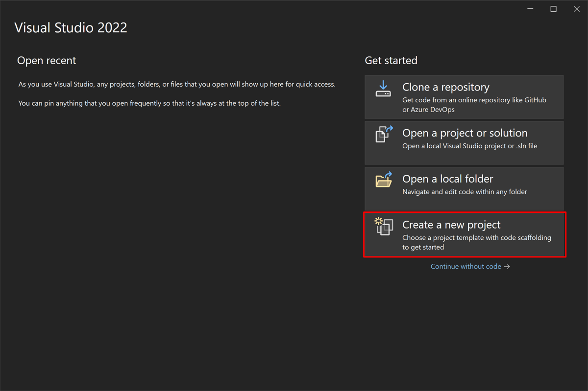

01. In the **Create a new project** window, select **MAUI** in the **All project types** drop-down, select the **.NET MAUI App** template, and click the **Next** button:

    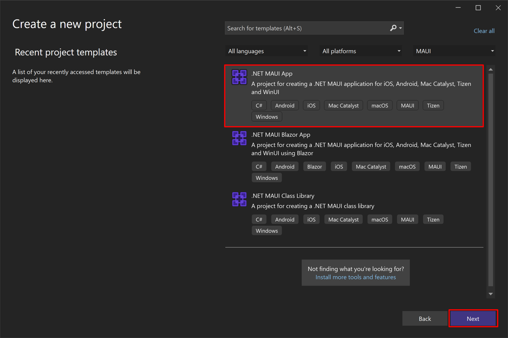

01. In the **Configure your new project** window, name your project, choose a suitable location for it, and click the **Next** button:

    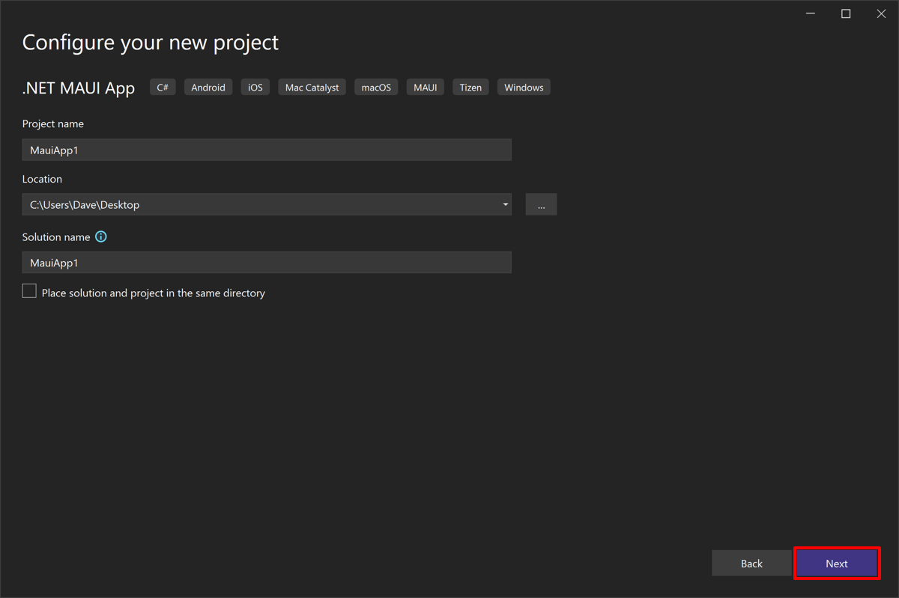

01. In the **Additional information** window, choose the version of .NET that you'd like to target and click the **Create** button:

    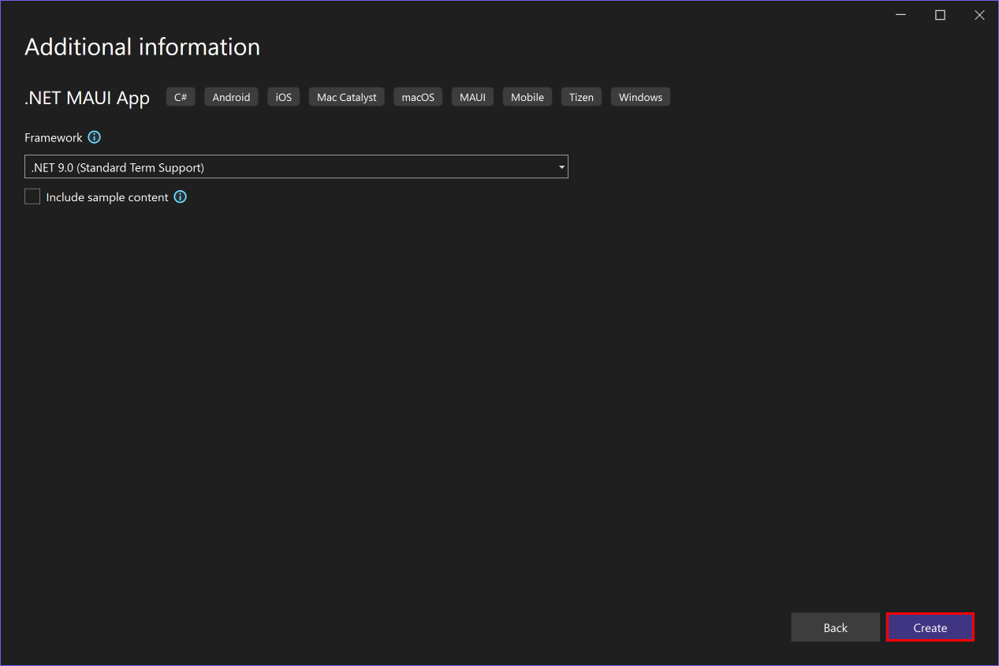

01. Wait for the project to be created and its dependencies to be restored:

    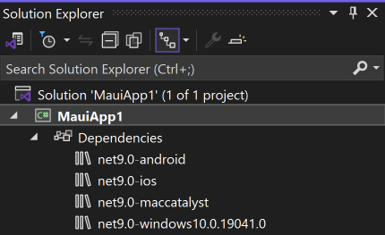

<!-- markdownlint-disable MD029 -->
06. In the Visual Studio toolbar, use the **Debug Target** drop-down to select **Android Emulators** and then the **Android Emulator** entry:

    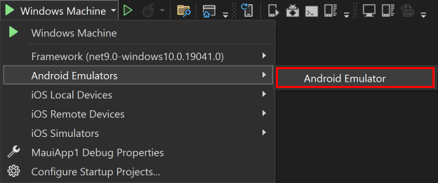

    <!-- markdownlint-enable MD029 -->

01. In the Visual Studio toolbar, press the **Android Emulator** button:

    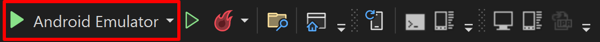

    Visual Studio will start the process of installing the default Android SDK and Android Emulator.

01. In the **Android SDK - License Agreement** window, press the **Accept** button:

    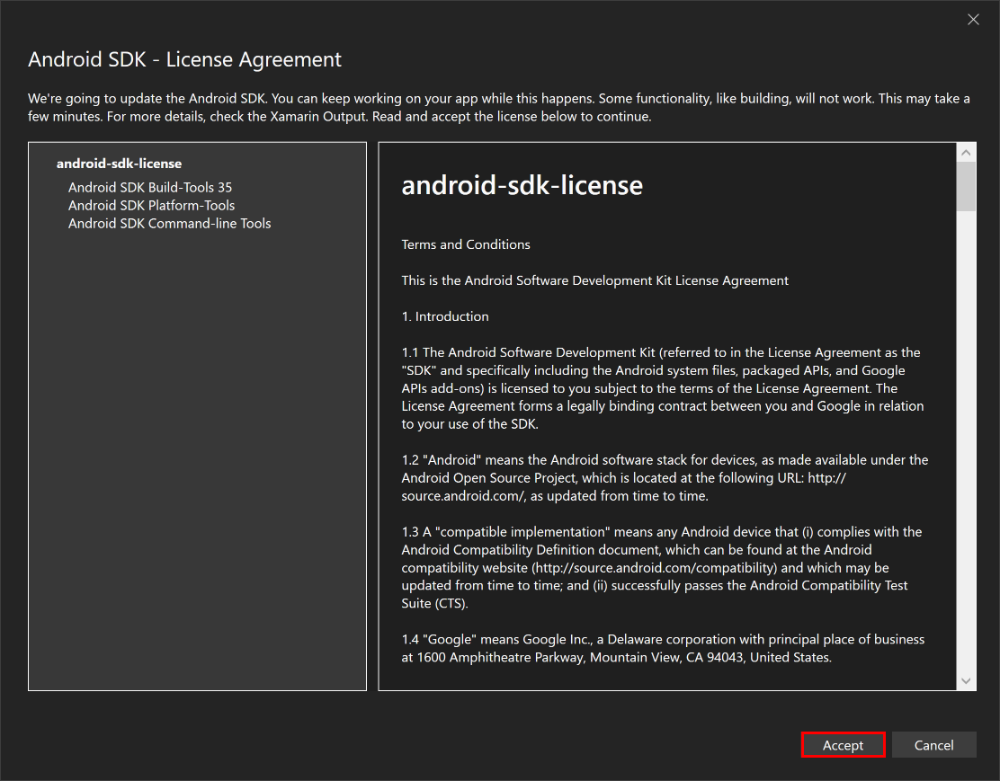

01. In the **User Account Control** dialog, press the **Yes** button:

    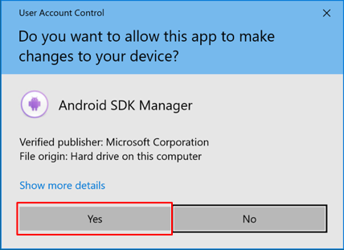

    Wait for Visual Studio to download the default Android SDK and Android Emulator.

01. In the **User Account Control** dialog, press the **Yes** button:

    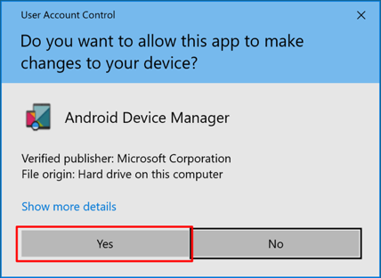

01. In the **Android SDK Platform is missing** dialog, press the **Install** button:

    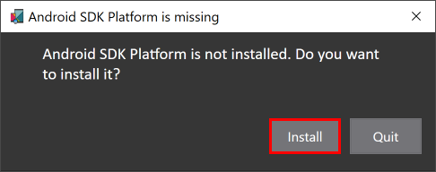

01. In the **Android SDK - License Agreement** window, press the **Accept** button:

    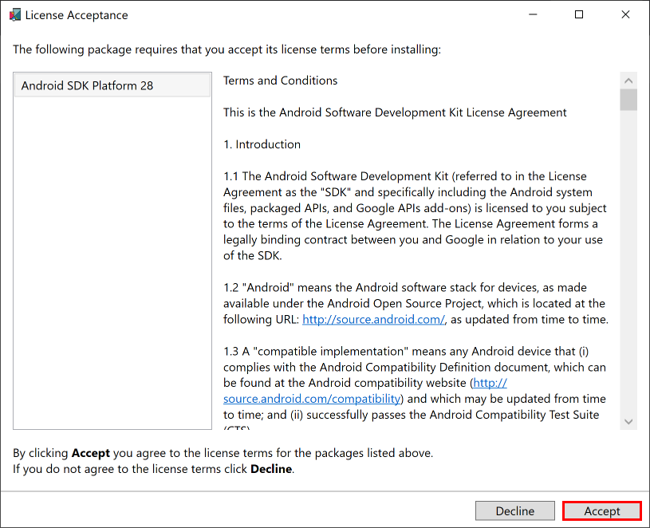

    Wait for Visual Studio to install the Android SDK components.

01. In the **New Device** window, press the **Create** button:

    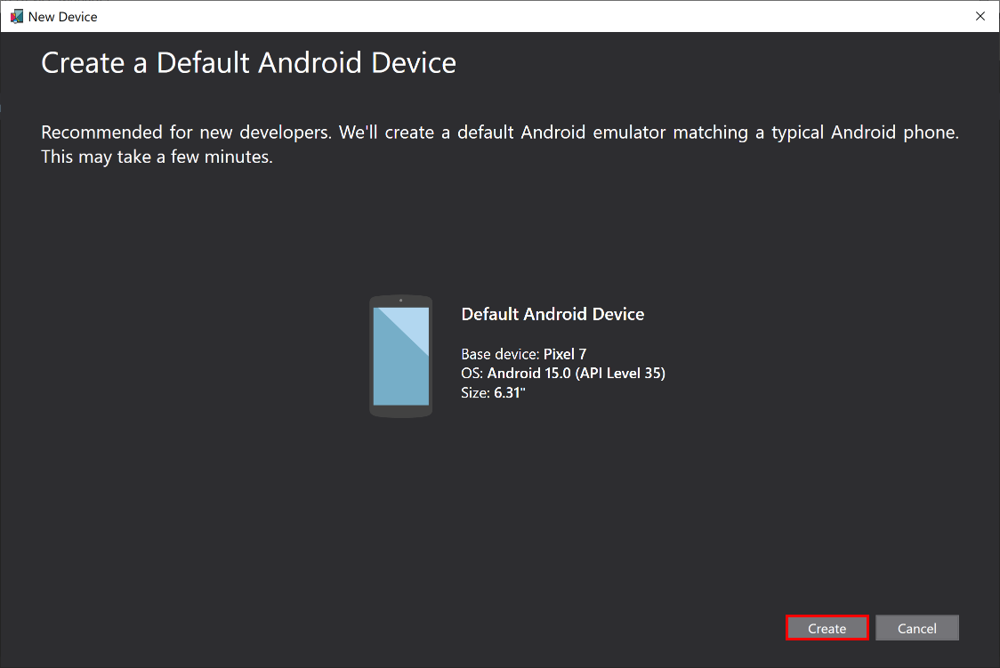

    Wait for Visual Studio to download, unzip, and create an Android emulator.

01. Close the **Android Device Manager** window:

    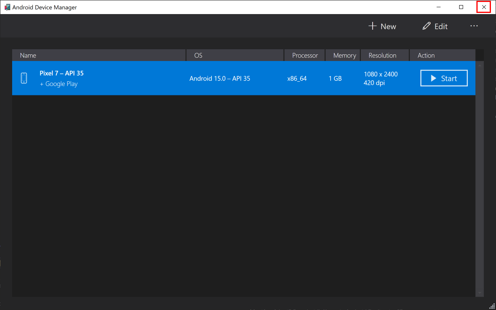

01. In the Visual Studio toolbar, press the **Pixel 7 - API 35 (Android 15.0 - API 35)** button:

    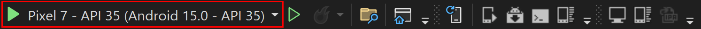

01. In the **Android SDK - License Agreement** window, press the **Accept** button:

    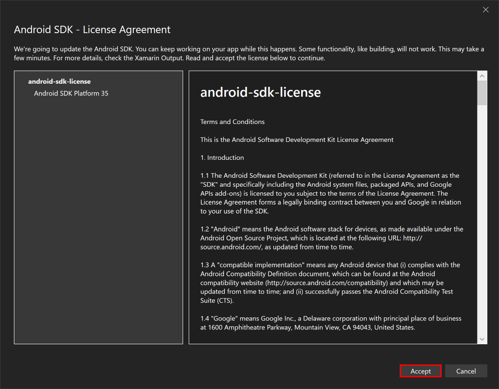

01. In the **User Account Control** dialog, press the **Yes** button:

    

    Wait for Visual Studio to install to download the Android SDK.

01. In the Visual Studio toolbar, press the **Pixel 7 - API 35 (Android 15.0 - API 35)** button to build and run the app:

    

    Visual Studio will start the Android emulator, build the app, and deploy the app to the emulator.

    > [!WARNING]
    > Hardware acceleration must be enabled to maximize Android emulator performance. Failure to do this will result in the emulator running very slowly. For more information, see [[hardware-acceleration|How to enable hardware acceleration with Android emulators (Hyper-V & AEHD)]].

01. In the running app in the Android emulator, press the **Click me** button several times and observe that the count of the number of button clicks is incremented.

    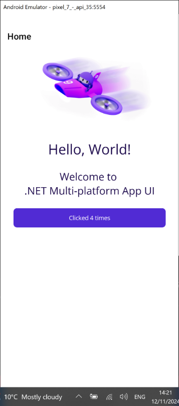

## Troubleshooting

If your app fails to compile, review [[troubleshooting|Troubleshooting known issues]], which may have a solution to your problem. If the problem is related to the Android emulator, see [[troubleshooting|Android emulator troubleshooting]].

<!-- markdownlint-disable MD029 -->
06. In the Visual Studio toolbar, press the **Windows Machine** button to build and run the app:

    
    <!-- markdownlint-enable MD029 -->

01. In the running app, press the **Click me** button several times and observe that the count of the number of button clicks is incremented:

    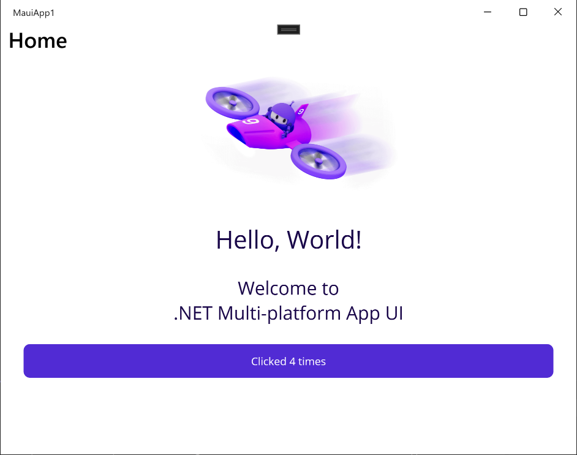

## Troubleshooting

If your app fails to compile, review [[troubleshooting|Troubleshooting known issues]], which may have a solution to your problem.

<!-- markdownlint-disable MD029 -->
06. In Visual Studio, pair the IDE to a Mac Build host. For more information, see [[pair-to-mac|Pair to Mac for iOS development]].

    <!-- markdownlint-enable MD029 -->

01. In the Visual Studio toolbar, use the **Debug Target** drop-down to select **iOS Simulators** and then a specific iOS simulator:

    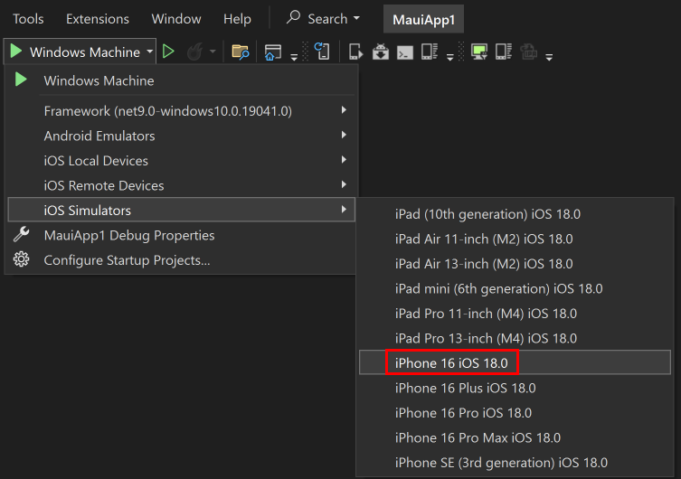

01. In the Visual Studio toolbar, press the Start button for your chosen iOS simulator to build and run your app:

    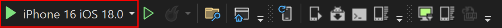

    Visual Studio will build the app, start the remote iOS Simulator for Windows, and deploy the app to the remote simulator. For more information about the remote iOS Simulator for Windows, see [[remote-simulator|Remote iOS Simulator for Windows]].

01. In the running app, press the **Click me** button several times and observe that the count of the number of button clicks is incremented.

    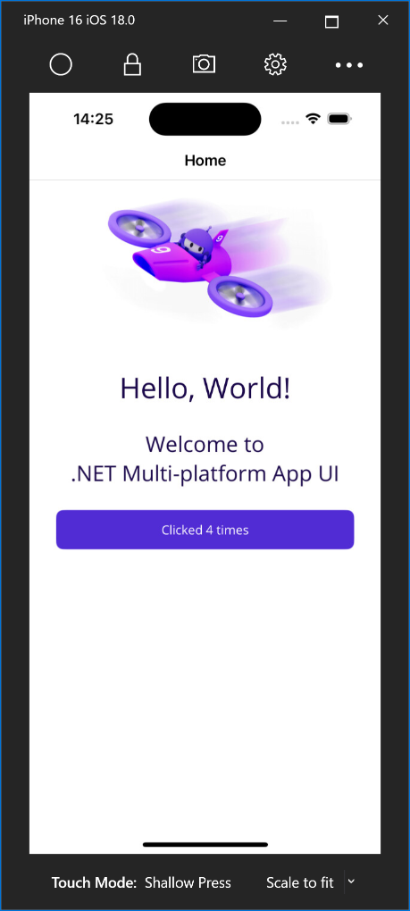

## Troubleshooting

If your app fails to compile, review [[troubleshooting|Troubleshooting known issues]], which may have a solution to your problem.

.NET MAUI apps that target Mac Catalyst can only be launched and debugged using Visual Studio Code.

<!-- markdownlint-disable MD025 -->
# [Visual Studio Code](#tab/visual-studio-code)
<!-- markdownlint-enable MD025 -->

## Prerequisites

- Visual Studio Code, with the .NET MAUI extension installed and configured:
  - Your Microsoft account connected to C# Dev Kit.
  - The .NET SDK installed.
  - The .NET MAUI SDK installed.
  - Xcode installed on your Mac, including simulator runtimes and the Xcode command line tools, if targeting Apple platforms.
  - Microsoft OpenJDK, the Android SDK, and an Android emulator installed on your machine, if targeting Android.

For more information, see [Installation](installation.md?tabs=visual-studio-code).

## Create an app

In this tutorial, you'll create your first .NET MAUI app in Visual Studio Code and run it on an Android emulator:

In this tutorial, you'll create your first .NET MAUI app in Visual Studio Code on a Mac, and run it on an iOS simulator:

In this tutorial, you'll create your first .NET MAUI app in Visual Studio Code on a Mac, and run it on macOS:

In this tutorial, you'll create your first .NET MAUI app in Visual Studio Code on Windows, and run it on Windows:

1. Launch Visual Studio Code. In the **Explorer**, press **Create .NET Project**:

    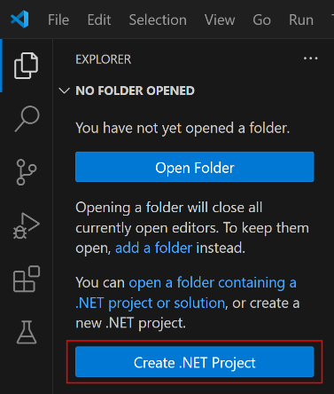

    Alternatively, press <kbd>Ctrl+Shift+P</kbd> on Windows, or <kbd>Cmd+Shift+P</kbd> on macOS, and then the **.NET: New Project...** command.

1. In the command palette, select the **.NET MAUI App** template:

    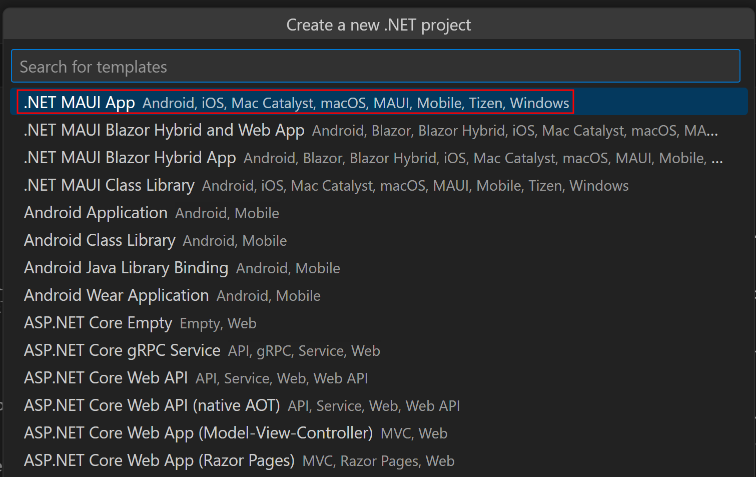

1. In the **Project Location** dialog, select the location where you'd like the new project to be created.

    > [!IMPORTANT]
    > Projects must be created in an empty folder.

1. In the command palette, enter a name for your new project and press <kbd>ENTER</kbd>:

    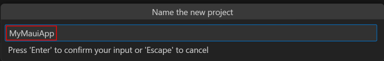

1. In the command palette, press **Create project**:

    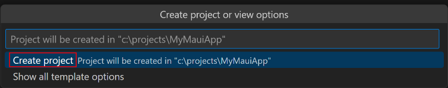

    Wait for the project to be created, accepting the folder as a trusted location if required.

1. In the **Explorer**, expand the root node of your project and then open a C# file such as *MainPage.xaml.cs*:

    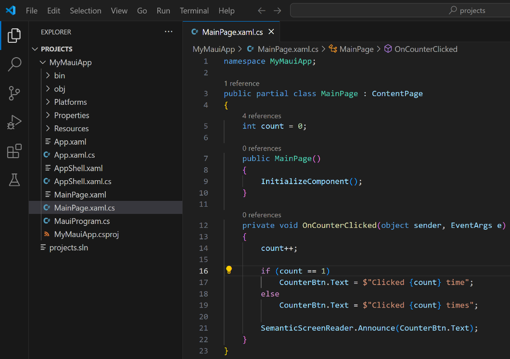

<!-- markdownlint-disable MD029 -->
7. In Visual Studio Code, verify that your Android environment is configured correctly by pressing <kbd>Ctrl+Shift+P</kbd> on Windows, or <kbd>Cmd+Shift+P</kbd> on macOS, and then selecting **.NET MAUI: Configure Android**, followed by **Refresh Android environment**. Any detected errors must be addressed.
    <!-- markdownlint-enable MD029 -->

1. In the status bar at the bottom of Visual Studio Code, press on the curly brackets symbol **{ }** and ensure that the **Debug Target** is set to a specific Android emulator:

    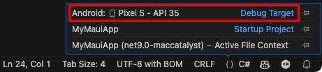

    You can also set the debug target by pressing <kbd>Ctrl+Shift+P</kbd> on Windows, or <kbd>Cmd+Shift+P</kbd> on macOS, and selecting **.NET MAUI: Pick Android Device** from the command palette.

1. Build and run the app on Android by pressing <kbd>F5</kbd> or by pressing the **Run** button in the upper right corner of Visual Studio Code:

    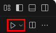

    If you're asked to select a debugger in the command palette, select **C#** and then the launch configuration for your project.

1. In the running app in your chosen Android emulator, press the **Click me** button several times and observe that the count of the number of button clicks is incremented:

    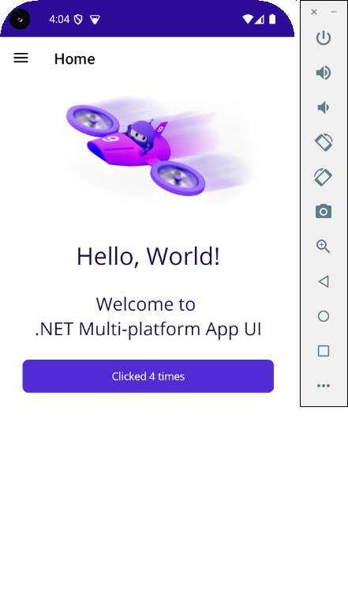

## Debug the app on an Android device

To debug the app on an Android device:

1. Ensure that your device is set up for deployment. For more information, see [[setup|Set up a device for deployment]].
1. Plug your device into your machine and select it as a debug target in Visual Studio Code.
1. Run the app.

<!-- markdownlint-disable MD029 -->
7. In Visual Studio Code, verify that your Apple environment is configured correctly by pressing <kbd>Cmd+Shift+P</kbd> and then selecting **.NET MAUI: Configure Apple**, followed by **Refresh Apple environment**. Any detected errors must be addressed.
    <!-- markdownlint-enable MD029 -->

1. In the status bar at the bottom of Visual Studio Code, press on the curly brackets symbol **{ }** and ensure that the **Debug Target** is set to a specific iOS simulator:

    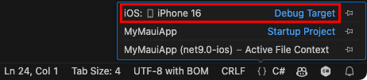

    You can also set the debug target by pressing <kbd>Cmd+Shift+P</kbd> and selecting **.NET MAUI: Pick iOS Device** from the command palette.

1. Build and run the app on iOS by pressing <kbd>F5</kbd> or by pressing the **Run** button in the upper right corner of Visual Studio Code:

    

    If you're asked to select a debugger in the command palette, select **C#** and then the launch configuration for your project.

1. In the running app in your chosen iOS simulator, press the **Click me** button several times and observe that the count of the number of button clicks is incremented:

    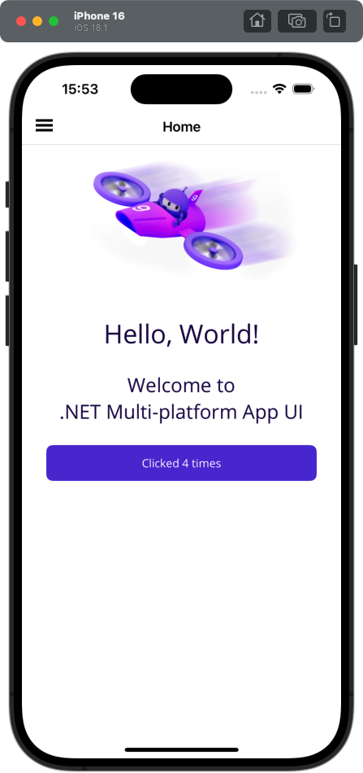

## Debug the app on an iOS device

To debug the app on an iOS device:

1. Ensure that you've added your Apple ID to Xcode in **Xcode > Settings > Accounts**.
1. Ensure that your device has been registered with your team, if you belong to the Apple Developer Program.
1. Enable Developer Mode on your device. The first time you run your app you may receive a pop-up on the device - ensure you select **Allow**. For more information about Developer Mode, see [Enabling Developer Mode on a device](https://developer.apple.com/documentation/xcode/enabling-developer-mode-on-a-device) on developer.apple.com.
1. Plug your device into your machine and select it as a debug target in Visual Studio Code.
1. Run the app.

<!-- markdownlint-disable MD029 -->
7. In Visual Studio Code, verify that your Apple environment is configured correctly by pressing <kbd>Cmd+Shift+P</kbd> and then selecting **.NET MAUI: Configure Apple**, followed by **Refresh Apple environment**. Any detected errors must be addressed.
    <!-- markdownlint-enable MD029 -->

1. In the status bar at the bottom of Visual Studio Code, press on the curly brackets symbol **{ }** and ensure that the **Debug Target** is set to your Mac:

    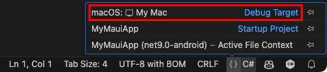

    You can also set the debug target by pressing <kbd>Cmd+Shift+P</kbd> and selecting **.NET MAUI: Pick macOS Device** from the command palette.

1. Build and run the app on macOS by pressing <kbd>F5</kbd> or by pressing the **Run** button in the upper right corner of Visual Studio Code:

    

    If you're asked to select a debugger in the command palette, select **C#** and then the launch configuration for your project.

1. In the running app, press the **Click me** button several times and observe that the count of the number of button clicks is incremented:

    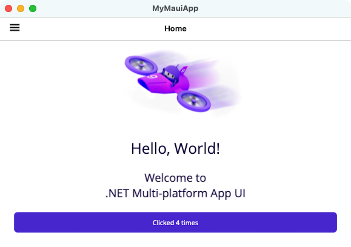

<!-- markdownlint-disable MD029 -->
7. In the status bar at the bottom of Visual Studio Code, press on the curly brackets symbol **{ }** and ensure that the **Debug Target** is set to Windows:

    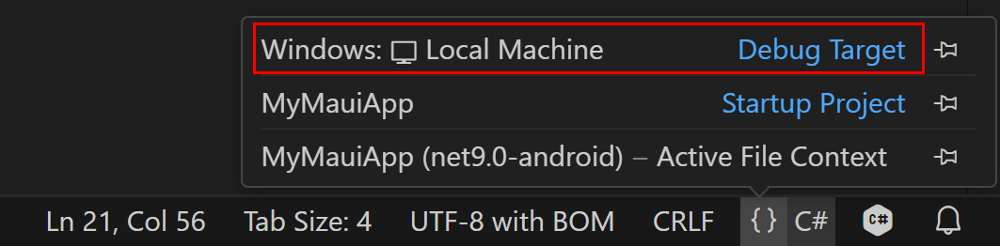

    You can also set the debug target by pressing <kbd>Ctrl+Shift+P</kbd> and selecting **.NET MAUI: Pick Windows Device** from the command palette.
    <!-- markdownlint-enable MD029 -->

1. Build and run the app on Windows by pressing <kbd>F5</kbd> or by pressing the **Run** button in the upper right corner of Visual Studio Code:

    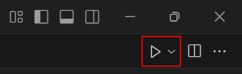

    If you're asked to select a debugger in the command palette, select **C#** and then the launch configuration for your project.

1. In the running app, press the **Click me** button several times and observe that the count of the number of button clicks is incremented:

    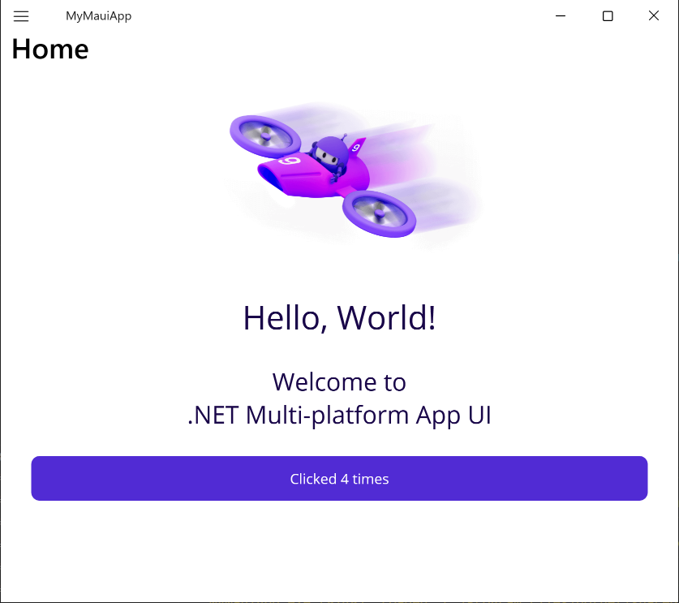

## Troubleshooting

If your app fails to build and deploy, review [[troubleshooting|Troubleshooting known issues]], which may have a solution to your problem.

---

## Next steps

In this tutorial, you've learned how to create and run your first .NET Multi-platform App UI (.NET MAUI) app.

To learn the fundamentals of building an app with .NET MAUI, see [Create a .NET MAUI app](~/tutorials/notes-app/index.yml). Alternatively, for a full .NET MAUI training course, see [Build mobile and desktop apps with .NET MAUI](/training/paths/build-apps-with-dotnet-maui).
