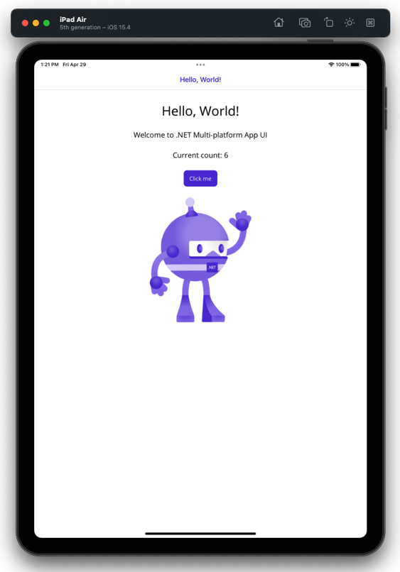
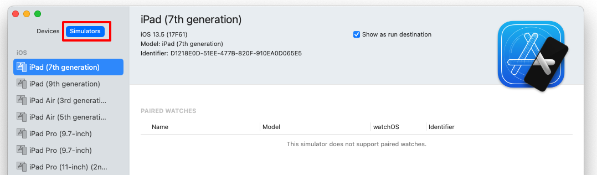
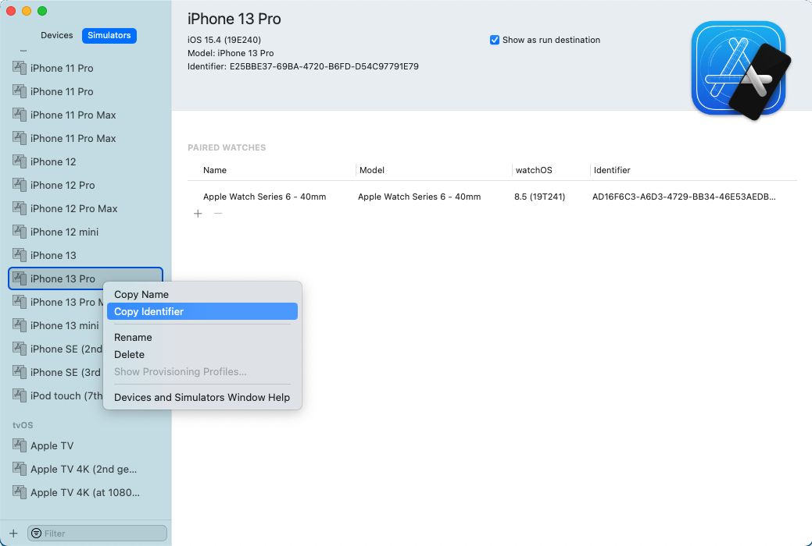
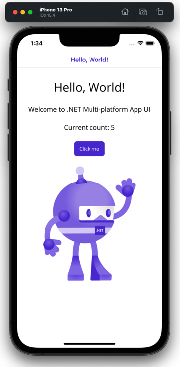

# Build an iOS app with .NET CLI

In this tutorial, you'll learn how to create and run a .NET Multi-platform App UI (.NET MAUI) app on iOS using .NET Command Line Interface (CLI) on macOS:

![[install-create-macos]]

<!-- markdownlint-disable MD029 -->
5. In **Terminal**, change directory to *MyMauiApp*, and build and run the app:

    ```zsh
    cd MyMauiApp
    dotnet build -t:Run -f net8.0-ios
    ```

    The `dotnet build` command will restore the project the dependencies, build the app, and launch it in the default simulator.

6. In the default simulator, press the **Click me** button several times and observe that the count of the number of button clicks is incremented.

    

<!-- markdownlint-enable MD029 -->

![[choose-xcode-version]]

## Launch the app on a specific simulator

A .NET MAUI iOS app can be launched on a specific iOS simulator from a Mac by providing its unique device id (UDID):

1. On your Mac, open **Xcode**, select the **Windows > Devices and Simulators** menu item, and then the **Simulators** tab.

    

1. Right-click on your chosen simulator, and select **Copy Identifier** to copy the UDID to the clipboard.

    

    Alternatively, you can retrieve a list of UDID values by executing the `simctl list` command:

    ```zsh
    /Applications/Xcode.app/Contents/Developer/usr/bin/simctl list
    ```

<!-- markdownlint-disable MD029 -->
3. In **Terminal**, build the app and run it on your chosen simulator by specifying the `_DeviceName` MSBuild property using the `-p` [MSBuild option](/dotnet/core/tools/dotnet-build#msbuild):

    ```zsh
    dotnet build -t:Run -f net8.0-ios -p:_DeviceName=:v2:udid=MY_SPECIFIC_UDID
    ```

    For example, use the following command to build the app and run it on the iPhone 13 Pro simulator:

    ```zsh
    dotnet build -t:Run -f net8.0-ios -p:_DeviceName=:v2:udid=E25BBE37-69BA-4720-B6FD-D54C97791E79
    ```

4. In your chosen simulator, press the **Click me** button several times and observe that the count of the number of button clicks is incremented.

    

<!-- markdownlint-enable MD029 -->

## Launch the app on a device

A device must be provisioned before you can deploy an iOS app to it. For more information, see [[device-provisioning|Device provisioning for iOS]]. Once a device has been provisioned, a .NET MAUI iOS app can be launched on the device from a Mac by providing its unique device id (UDID):

1. Connect your device to your local Mac with a USB cable.
1. Open **Xcode**, and navigate to **Window > Devices and Simulators**.
1. In **Xcode**, select the **Devices** tab, and select the device from the list of connected devices.
1. In **Xcode**, copy the **Identifier** value to the clipboard:

    

    Alternatively, right-click on your device and select **Copy Identifier** to copy the UDID to the clipboard.

<!-- markdownlint-disable MD029 -->
5. In **Terminal**, build the app and run it on your chosen device by specifying the `_DeviceName` MSBuild property using the `-p` [MSBuild option](/dotnet/core/tools/dotnet-build#msbuild):

    ```zsh
    dotnet build -t:Run -f net8.0-ios -p:RuntimeIdentifier=ios-arm64 -p:_DeviceName=MY_SPECIFIC_UDID
    ```

    Replace "MY_SPECIFIC_UDID" with the device identifier you copied to the clipboard.

<!-- markdownlint-enable MD029 -->
