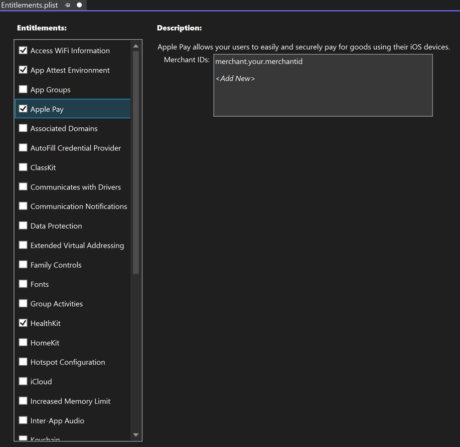
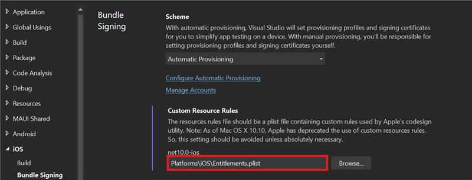

# iOS entitlements

On iOS, .NET Multi-platform App UI (.NET MAUI) apps run in a sandbox that provides a set of rules that limit access between the app and system resources or user data. *Entitlements* are used to request the expansion of the sandbox to give your app additional capabilities, such as integration with Siri. Any entitlements used by your app must be specified in the app's *Entitlements.plist* file. For more information about entitlements, see [Entitlements](https://developer.apple.com/documentation/bundleresources/entitlements) on developer.apple.com.

In addition to specifying entitlements, the *Entitlements.plist* file is used to code sign the app. When code signing your app, the entitlements file is combined with information from your Apple Developer Account, and other project information to apply a final set of entitlements to your app.

Entitlements are closely related to the concept of capabilities. They both request the expansion of the sandbox your app runs in, to give it additional capabilities. Entitlements are typically added when developing your app, while capabilities are typically added when code signing your app for distribution. However, when automatic provisioning is enabled, adding certain entitlements to your app will also update the capabilities for your app in its provisioning profile. For more information, see [[capabilities#add-capabilities-with-visual-studio|Add capabilities with Visual Studio]].

> [!IMPORTANT]
> An *Entitlements.plist* file isn't linked to an Apple Developer Account. Therefore, when creating a provisioning profile for your app, you should ensure that any entitlements used by your app are also specified as capabilities in its provisioning profile. For more information, see [[capabilities|Capabilities]].

## Add an Entitlements.plist file

To add a new entitlements file to your .NET MAUI app project, add a new XML file named *Entitlements.plist* to the *Platforms\\iOS* folder of your app project. Then add the following XML to the file:

```xml
<?xml version="1.0" encoding="UTF-8" ?>
<!DOCTYPE plist PUBLIC "-//Apple//DTD PLIST 1.0//EN" "http://www.apple.com/DTDs/PropertyList-1.0.dtd">
<plist version="1.0">
<dict>
</dict>
</plist>
```

## Set entitlements

Entitlements can be configured in Visual Studio by double-clicking the *Entitlements.plist* file to open it in the entitlements editor:

1. In **Solution Explorer**, double-click the *Entitlements.plist* file from the *Platforms > iOS* folder of your .NET MAUI app project to open it in the entitlements editor.
1. In the entitlements editor, select and configure any entitlements required by your app:

    

1. Save the changes to your *Entitlements.plist* file to add the entitlement key/value pairs to the file.

It may also be necessary to set privacy keys in *Info.plist*, for certain entitlements.

## Consume entitlements

A .NET MAUI iOS app must be configured in Visual Studio to consume the entitlements defined in the *Entitlements.plist* file:

1. In **Solution Explorer**, right-click on your .NET MAUI app project and select **Properties**. Then, navigate to the **iOS > Bundle Signing** tab.
1. In the **Bundle Signing** settings, click the **Browse...** button for the **Custom Resource Rules** field.
1. In the **Custom Resource Rules** dialog, navigate to the folder containing your *Entitlements.plist* file, select the file, and click the **Open** button.
1. In the project properties, the **Custom Resource Rules** field will be populated with your entitlements file:

    

1. Close the project properties.

> [!NOTE]
> Visual Studio will set the entitlements for both debug and release builds.

---

When automatic provisioning is enabled, a subset of entitlements will also be added to the provisioning profile of your app as capabilities. For more information, see [[capabilities#add-capabilities-with-visual-studio|Add capabilities with Visual Studio]].

![[entitlements-reference]]
