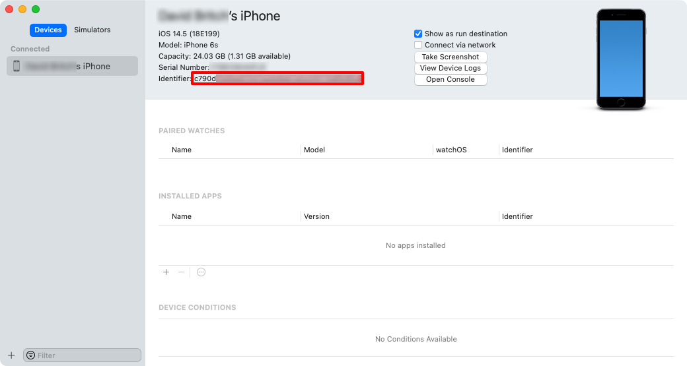
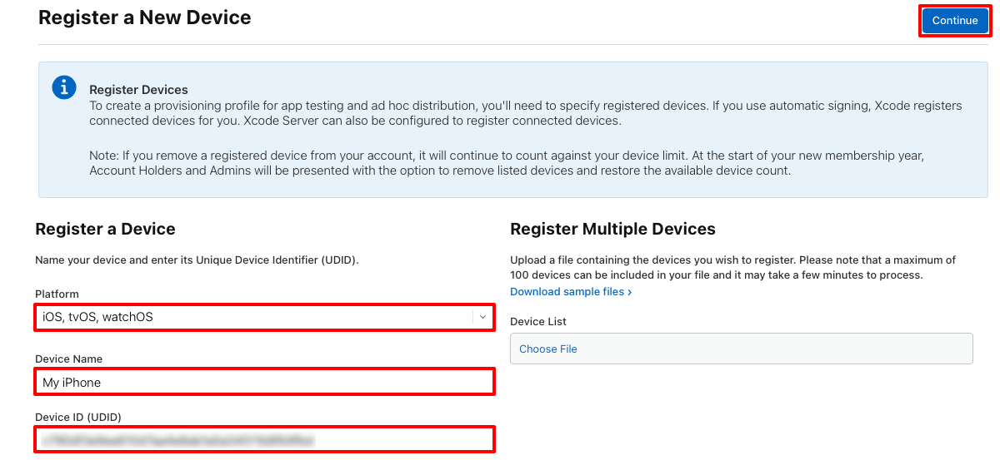

### Add a device

When you create a provisioning profile, the profile must include which devices can run the app. Before selecting a device to be added to a provisioning profile, you must first add the device to your Apple Developer Account. You can add the device with the following steps:

1. Connect the device to be provisioned to your local Mac with a USB cable.
1. Open Xcode, and navigate to **Window > Devices and Simulators**.
1. In Xcode, select the **Devices** tab, and select the device from the list of connected devices.
1. In Xcode, copy the **Identifier** value to the clipboard:

   

1. In a web browser, go to the [Devices](https://developer.apple.com/account/resources/devices/list) section of your Apple Developer Account and click the **+** button.
1. In the **Register a New Device** page, set the correct **Platform** and provide a name for the new device. Then paste the identifier from the clipboard into the **Device ID (UDID)** field, and click **Continue**:

   

1. In the **Register a New Device** page, review the information and then click **Register**.

Repeat the previous steps for any iOS device that you want to deploy a .NET MAUI iOS app onto.
