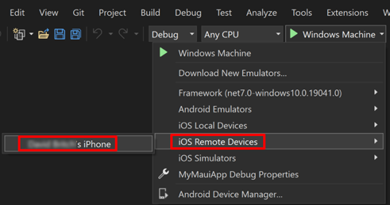
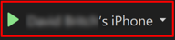

## Deploy to device

After configuring provisioning in your .NET MAUI app project, the app can be deployed to a device with Visual Studio:

1. In Visual Studio, ensure that the IDE is paired to a Mac Build host. For more information, see [[pair-to-mac|Pair to Mac for iOS development]].
1. Ensure that your iOS device is connected to your Mac build host via USB or WiFi. For more information about wireless deployment, see [[wireless-deployment|Wireless deployment for .NET MAUI iOS apps]].
1. In the Visual Studio toolbar, use the **Debug Target** drop-down to select **iOS Remote Devices** and then the device that's connected to your Mac build host:

    

1. In the Visual Studio toolbar, press the green Start button to launch the app on your remote device:

    
