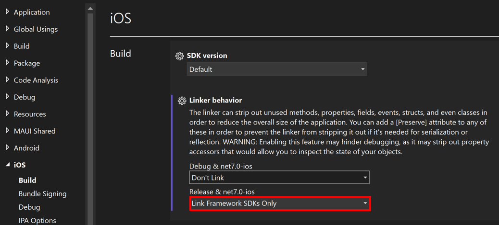

# Linking a .NET MAUI iOS app

![[linker-behavior]]

To configure linker behavior in Visual Studio:

1. In **Solution Explorer** right-click on your .NET MAUI app project and select **Properties**. Then, navigate to the **iOS > Build** tab and set the **Linker behavior** drop-down to your desired linker behavior:

    

![[linker-control]]
