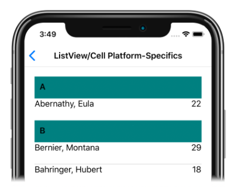

# Cell background color on iOS

This .NET Multi-platform App UI (.NET MAUI) iOS platform-specific sets the default background color of [[Cell (Controls)|Cell]] instances. It's consumed in XAML by setting the `Cell.DefaultBackgroundColor` bindable property to a [[Color|Color]]:

```xaml
<ContentPage ...
             xmlns:ios="clr-namespace:Microsoft.Maui.Controls.PlatformConfiguration.iOSSpecific;assembly=Microsoft.Maui.Controls"
             xmlns:local="clr-namespace:PlatformSpecifics"
             x:DataType="local:ListViewViewModel">
    <StackLayout Margin="20">
        <ListView ItemsSource="{Binding GroupedEmployees}"
                  IsGroupingEnabled="true">
            <ListView.GroupHeaderTemplate>
                <DataTemplate x:DataType="local:Grouping(x:Char,local:Person)">
                    <ViewCell ios:Cell.DefaultBackgroundColor="Teal">
                        <Label Margin="10,10"
                               Text="{Binding Key}"
                               FontAttributes="Bold" />
                    </ViewCell>
                </DataTemplate>
            </ListView.GroupHeaderTemplate>
            ...
        </ListView>
    </StackLayout>
</ContentPage>
```

Alternatively, it can be consumed from C# using the fluent API:

```csharp
using Microsoft.Maui.Controls.PlatformConfiguration;
using Microsoft.Maui.Controls.PlatformConfiguration.iOSSpecific;
...

ViewCell viewCell = new ViewCell { View = ... };
viewCell.On<iOS>().SetDefaultBackgroundColor(Colors.Teal);
```

The `ListView.On<iOS>` method specifies that this platform-specific will only run on iOS. The `Cell.SetDefaultBackgroundColor` method, in the `Microsoft.Maui.Controls.PlatformConfiguration.iOSSpecific` namespace, sets the cell background color to a specified [[Color|Color]]. In addition, the `Cell.DefaultBackgroundColor` method can be used to retrieve the current cell background color.

The result is that the background color in a [[Cell (Controls)|Cell]] can be set to a specific [[Color|Color]]:


