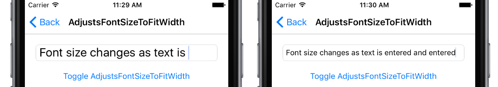

# Entry font size on iOS

This .NET Multi-platform App UI (.NET MAUI) iOS platform-specific is used to scale the font size of an [[Entry (Controls)|Entry]] to ensure that the inputted text fits in the control. It's consumed in XAML by setting the `Entry.AdjustsFontSizeToFitWidth` attached property to a `boolean` value:

```xaml
<ContentPage ...
             xmlns:ios="clr-namespace:Microsoft.Maui.Controls.PlatformConfiguration.iOSSpecific;assembly=Microsoft.Maui.Controls"
    <StackLayout Margin="20">
        <Entry x:Name="entry"
               Placeholder="Enter text here to see the font size change"
               FontSize="22"
               ios:Entry.AdjustsFontSizeToFitWidth="true" />
        ...
    </StackLayout>
</ContentPage>
```

Alternatively, it can be consumed from C# using the fluent API:

```csharp
using Microsoft.Maui.Controls.PlatformConfiguration;
using Microsoft.Maui.Controls.PlatformConfiguration.iOSSpecific;
...

entry.On<iOS>().EnableAdjustsFontSizeToFitWidth();
```

The `Entry.On<iOS>` method specifies that this platform-specific will only run on iOS. The `Entry.EnableAdjustsFontSizeToFitWidth` method, in the `Microsoft.Maui.Controls.PlatformConfiguration.iOSSpecific` namespace, is used to scale the font size of the inputted text to ensure that it fits in the [[Entry (Controls)|Entry]]. In addition, the [[Entry (Controls)|Entry]] class in the `Microsoft.Maui.Controls.PlatformConfiguration.iOSSpecific` namespace also has a `DisableAdjustsFontSizeToFitWidth` method that disables this platform-specific, and a `SetAdjustsFontSizeToFitWidth` method which can be used to toggle font size scaling by calling the `AdjustsFontSizeToFitWidth` method:

```csharp
entry.On<iOS>().SetAdjustsFontSizeToFitWidth(!entry.On<iOS>().AdjustsFontSizeToFitWidth());
```

The result is that the font size of the [[Entry (Controls)|Entry]] is scaled to ensure that the inputted text fits in the control:


