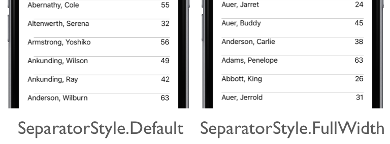

# ListView separator style on iOS

This .NET Multi-platform App UI (.NET MAUI) iOS platform-specific controls whether the separator between cells in a [[ListView (Controls)|ListView]] uses the full width of the [[ListView (Controls)|ListView]]. It's consumed in XAML by setting the `ListView.SeparatorStyle` attached property to a value of the `SeparatorStyle` enumeration:

```xaml
<ContentPage ...
             xmlns:ios="clr-namespace:Microsoft.Maui.Controls.PlatformConfiguration.iOSSpecific;assembly=Microsoft.Maui.Controls">
    <StackLayout Margin="20">
        <ListView ... ios:ListView.SeparatorStyle="FullWidth">
            ...
        </ListView>
    </StackLayout>
</ContentPage>
```

Alternatively, it can be consumed from C# using the fluent API:

```csharp
using Microsoft.Maui.Controls.PlatformConfiguration;
using Microsoft.Maui.Controls.PlatformConfiguration.iOSSpecific;
...

listView.On<iOS>().SetSeparatorStyle(SeparatorStyle.FullWidth);
```

The `ListView.On<iOS>` method specifies that this platform-specific will only run on iOS. The `ListView.SetSeparatorStyle` method, in the `Microsoft.Maui.Controls.PlatformConfiguration.iOSSpecific` namespace, is used to control whether the separator between cells in the [[ListView (Controls)|ListView]] uses the full width of the [[ListView (Controls)|ListView]], with the `SeparatorStyle` enumeration providing two possible values:

- `Default` – indicates the default iOS separator behavior. This is the default behavior.
- `FullWidth` – indicates that separators will be drawn from one edge of the [[ListView (Controls)|ListView]] to the other.

The result is that a specified `SeparatorStyle` value is applied to the [[ListView (Controls)|ListView]], which controls the width of the separator between cells:



> [!NOTE]
> Once the separator style has been set to `FullWidth`, it cannot be changed back to `Default` at runtime.
