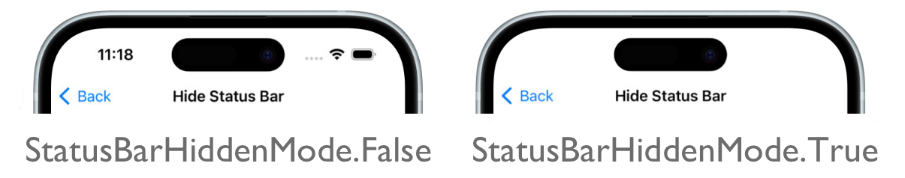

# Page status bar visibility on iOS

This iOS platform-specific is used to set the visibility of the status bar on a [[Page (Controls)|Page]], and it includes the ability to control how the status bar enters or leaves the [[Page (Controls)|Page]]. It's consumed in XAML by setting the `Page.PrefersStatusBarHidden` attached property to a value of the [[StatusBarHiddenMode|StatusBarHiddenMode]] enumeration, and optionally the `Page.PreferredStatusBarUpdateAnimation` attached property to a value of the [[UIStatusBarAnimation|UIStatusBarAnimation]] enumeration:

```xaml
<ContentPage ...
             xmlns:ios="clr-namespace:Microsoft.Maui.Controls.PlatformConfiguration.iOSSpecific;assembly=Microsoft.Maui.Controls"
             ios:Page.PrefersStatusBarHidden="True"
             ios:Page.PreferredStatusBarUpdateAnimation="Fade">
  ...
</ContentPage>
```

Alternatively, it can be consumed from C# using the fluent API:

```csharp
using Microsoft.Maui.Controls.PlatformConfiguration;
using Microsoft.Maui.Controls.PlatformConfiguration.iOSSpecific;
...

On<iOS>().SetPrefersStatusBarHidden(StatusBarHiddenMode.True)
         .SetPreferredStatusBarUpdateAnimation(UIStatusBarAnimation.Fade);
```

The `Page.On<iOS>` method specifies that this platform-specific will only run on iOS. The `Page.SetPrefersStatusBarHidden%2A` method, in the `iOSSpecific` namespace, is used to set the visibility of the status bar on a [[Page (Controls)|Page]] by specifying one of the [[StatusBarHiddenMode|StatusBarHiddenMode]] enumeration values: `Default`, `True`, or `False`. The `StatusBarHiddenMode.True` and `StatusBarHiddenMode.False` values set the status bar visibility regardless of device orientation, and the `StatusBarHiddenMode.Default` value hides the status bar in a vertically compact environment.

The result is that the visibility of the status bar on a [[Page (Controls)|Page]] can be set:



> [!NOTE]
> On a [[TabbedPage (Controls)|TabbedPage]], the specified [[StatusBarHiddenMode|StatusBarHiddenMode]] enumeration value will also update the status bar on all child pages. On all other [[Page (Controls)|Page]]-derived types, the specified [[StatusBarHiddenMode|StatusBarHiddenMode]] enumeration value will only update the status bar on the current page.

The `Page.SetPreferredStatusBarUpdateAnimation%2A` method is used to set how the status bar enters or leaves the [[Page (Controls)|Page]] by specifying one of the [[UIStatusBarAnimation|UIStatusBarAnimation]] enumeration values: `None`, `Fade`, or `Slide`. If the `Fade` or `Slide` enumeration value is specified, a 0.25 second animation executes as the status bar enters or leaves the [[Page (Controls)|Page]].
