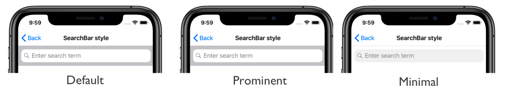
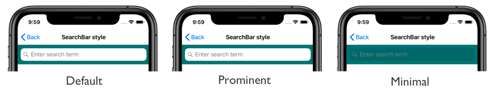

# SearchBar style on iOS

This .NET Multi-platform App UI (.NET MAUI) iOS platform-specific controls whether a [[SearchBar (Controls)|SearchBar]] has a background. It's consumed in XAML by setting the `SearchBar.SearchBarStyle` bindable property to a value of the `UISearchBarStyle` enumeration:

```xaml
<ContentPage ...
             xmlns:ios="clr-namespace:Microsoft.Maui.Controls.PlatformConfiguration.iOSSpecific;assembly=Microsoft.Maui.Controls">
    <StackLayout>
        <SearchBar ios:SearchBar.SearchBarStyle="Minimal"
                   Placeholder="Enter search term" />
        ...
    </StackLayout>
</ContentPage>
```

Alternatively, it can be consumed from C# using the fluent API:

```csharp
using Microsoft.Maui.Controls.PlatformConfiguration;
using Microsoft.Maui.Controls.PlatformConfiguration.iOSSpecific;
...

SearchBar searchBar = new SearchBar { Placeholder = "Enter search term" };
searchBar.On<iOS>().SetSearchBarStyle(UISearchBarStyle.Minimal);
```

The `SearchBar.On<iOS>` method specifies that this platform-specific will only run on iOS. The `SearchBar.SetSearchBarStyle` method, in the `Microsoft.Maui.Controls.PlatformConfiguration.iOSSpecific` namespace, is used to control whether the [[SearchBar (Controls)|SearchBar]] has a background. The `UISearchBarStyle` enumeration provides three possible values:

- `Default` indicates that the [[SearchBar (Controls)|SearchBar]] has the default style. This is the default value of the `SearchBar.SearchBarStyle` bindable property.
- `Prominent` indicates that the [[SearchBar (Controls)|SearchBar]] has a translucent background, and the search field is opaque.
- `Minimal` indicates that the [[SearchBar (Controls)|SearchBar]] has no background, and the search field is translucent.

In addition, the `SearchBar.GetSearchBarStyle` method can be used to return the `UISearchBarStyle` that's applied to the [[SearchBar (Controls)|SearchBar]].

The result is that a specified `UISearchBarStyle` member is applied to a [[SearchBar (Controls)|SearchBar]], which controls whether the [[SearchBar (Controls)|SearchBar]] has a background:



The following screenshot shows the `UISearchBarStyle` members applied to [[SearchBar (Controls)|SearchBar]] objects that have their `BackgroundColor` property set:


