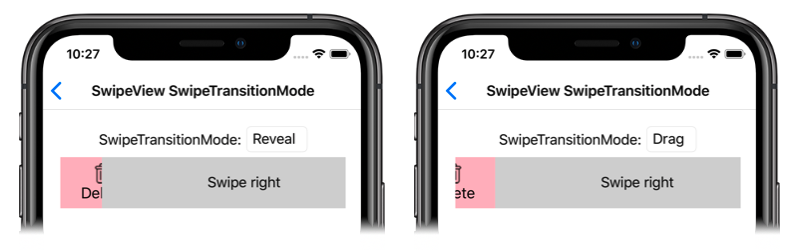

# SwipeView swipe transition mode on iOS

This .NET Multi-platform App UI (.NET MAUI) iOS platform-specific controls the transition that's used when opening a [[SwipeView (Controls)|SwipeView]]. It's consumed in XAML by setting the `SwipeView.SwipeTransitionMode` bindable property to a value of the `SwipeTransitionMode` enumeration:

```xaml
<ContentPage ...
             xmlns:ios="clr-namespace:Microsoft.Maui.Controls.PlatformConfiguration.iOSSpecific;assembly=Microsoft.Maui.Controls">
    <StackLayout>
        <SwipeView ios:SwipeView.SwipeTransitionMode="Drag">
            <SwipeView.LeftItems>
                <SwipeItems>
                    <SwipeItem Text="Delete"
                               IconImageSource="delete.png"
                               BackgroundColor="LightPink"
                               Invoked="OnDeleteSwipeItemInvoked" />
                </SwipeItems>
            </SwipeView.LeftItems>
            <!-- Content -->
        </SwipeView>
    </StackLayout>
</ContentPage>
```

Alternatively, it can be consumed from C# using the fluent API:

```csharp
using Microsoft.Maui.Controls.PlatformConfiguration;
using Microsoft.Maui.Controls.PlatformConfiguration.iOSSpecific;
...

var swipeView = new Microsoft.Maui.Controls.SwipeView();
swipeView.On<iOS>().SetSwipeTransitionMode(SwipeTransitionMode.Drag);
// ...
```

The `SwipeView.On<iOS>` method specifies that this platform-specific will only run on iOS. The `SwipeView.SetSwipeTransitionMode` method, in the `Microsoft.Maui.Controls.PlatformConfiguration.iOSSpecific` namespace, is used to control the transition that's used when opening a [[SwipeView (Controls)|SwipeView]]. The `SwipeTransitionMode` enumeration provides two possible values:

- `Reveal` indicates that the swipe items will be revealed as the [[SwipeView (Controls)|SwipeView]] content is swiped, and is the default value of the `SwipeView.SwipeTransitionMode` property.
- `Drag` indicates that the swipe items will be dragged into view as the [[SwipeView (Controls)|SwipeView]] content is swiped.

In addition, the `SwipeView.GetSwipeTransitionMode` method can be used to return the `SwipeTransitionMode` that's applied to the [[SwipeView (Controls)|SwipeView]].

The result is that a specified `SwipeTransitionMode` value is applied to the [[SwipeView (Controls)|SwipeView]], which controls the transition that's used when opening the [[SwipeView (Controls)|SwipeView]]:


