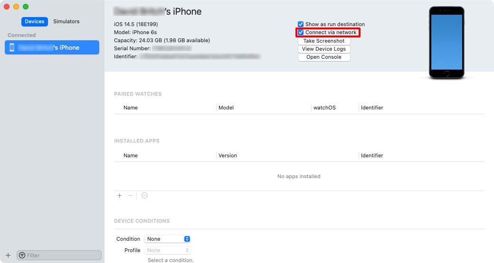
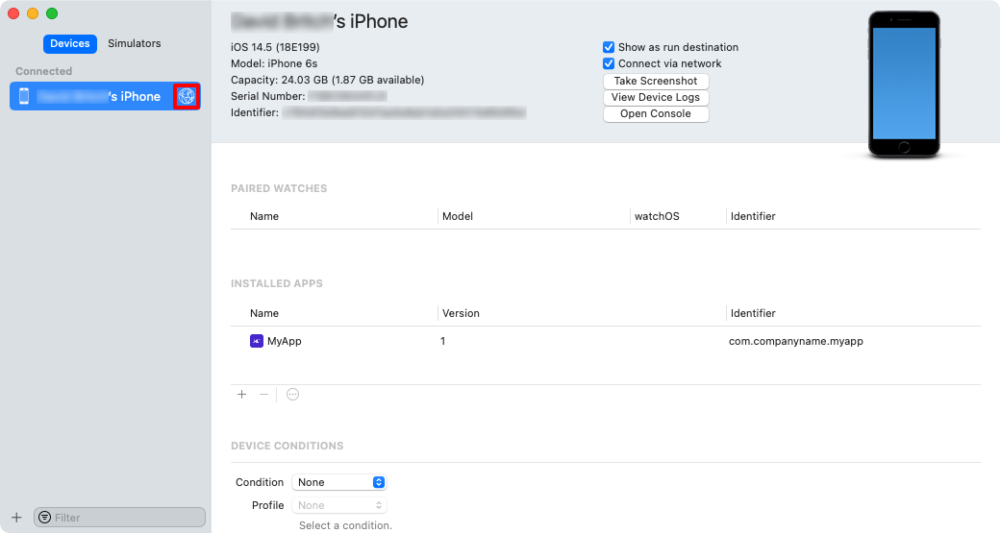
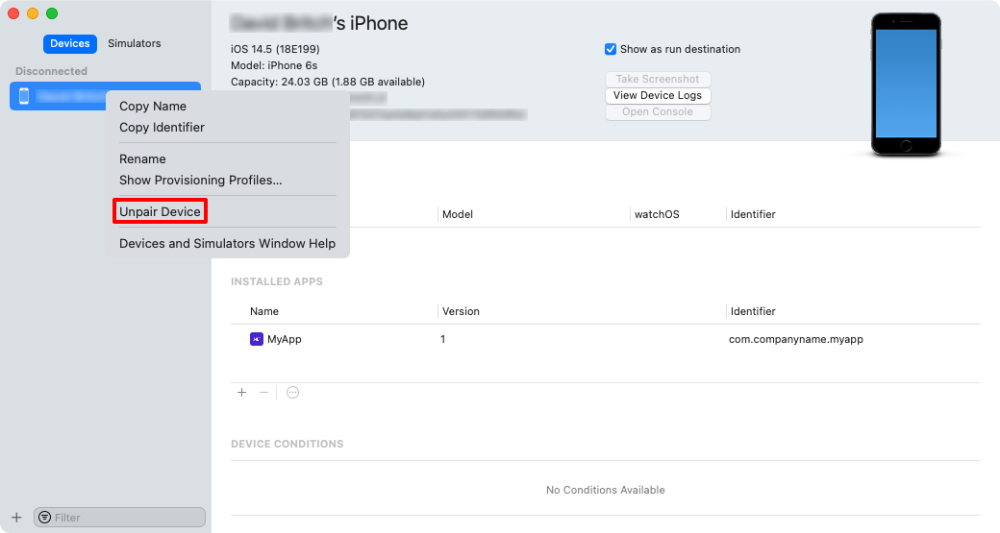
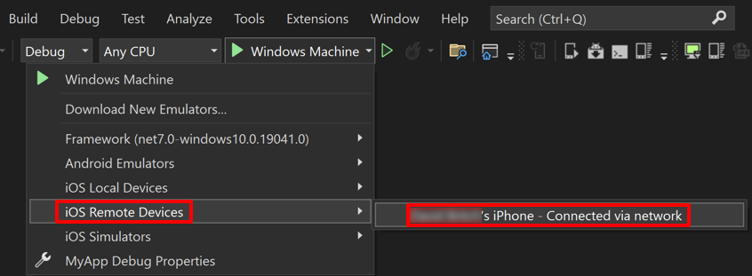

# Wireless deployment for .NET MAUI iOS apps

Rather than having to use a USB cable to connect an iOS device to your Mac to deploy and debug a .NET Multi-platform App UI (.NET MAUI) app, Visual Studio can deploy .NET MAUI iOS apps to devices wirelessly, and debug them wirelessly. To do this, you must pair your iOS device with Xcode on your Mac. Once paired, the device can be selected from the device target list in Visual Studio.

> [!IMPORTANT]
> .NET MAUI iOS apps must have been provisioned before they can be deployed to a device for testing and debugging. For more information, see [[device-provisioning|Device provisioning for iOS]].

## Pair an iOS device

Perform the following steps to pair an iOS device to Xcode on your Mac:

1. Ensure that your iOS device is connected to the same wireless network as your Mac.
1. Plug your iOS device into your Mac using a USB cable.

    > [!NOTE]
    > The first time you connect an iOS device to your Mac, you'll need to tap the **Trust** button in the **Trust This Computer** dialog on your device.

1. Open **Xcode** and click **Window > Devices and Simulators**. In the window that appears, click **Devices**.
1. In the **Devices and Simulators** window, in the left column, select your device. Then in the detail area select the **Connect via network** checkbox:

    

    Xcode pairs with the iOS device.

1. In the **Devices and Simulators** window, in the left column, a network icon will appear next to a connected device that's paired:

    

1. Disconnect the USB cable and check that the device remains paired.

Xcode will retain the pairing settings, so the device shouldn't need to be paired again.

## Unpair an iOS device

Perform the following steps to unpair an iOS device from Xcode on your Mac:

1. Ensure that your iOS device is connected to the same wireless network as your Mac.
1. Open **Xcode** and click **Window > Devices and Simulators**. In the window that appears, click **Devices**.
1. In the **Devices and Simulators** window, in the left column, select your paired device. Then right-click the device and select the **Unpair Device** item.

    

## Deploy to device

After wirelessly pairing your device to Xcode, provisioned .NET MAUI iOS apps can be wirelessly deployed to the device with Visual Studio:

1. Ensure that your iOS device is wirelessly paired to your Mac build host. For more information, see [Pair an iOS device](#pair-an-ios-device).
1. In Visual Studio, ensure that the IDE is paired to a Mac Build host. For more information, see [[pair-to-mac|Pair to Mac for iOS development]].
1. In the Visual Studio toolbar, use the **Debug Target** drop-down to select **iOS Remote Devices** and then the device that's connected to your Mac build host:

    

1. In the Visual Studio toolbar, press the green Start button to launch the app on your remote device:

    

## Troubleshoot

- Ensure that your iOS device is connected to the same network as your Mac.
- Ensure that your device is provisioned. For more information about provisioning, see [[device-provisioning|Device provisioning for iOS]].
- Verify that Xcode can see the device:
  - In Xcode, choose **Window > Devices and Simulators**, and in the window that appears click **Devices**. The device should appear under **Connected**.
- Ping the device:
  - Find the device's IP address. On the device open **Settings**, tap **Wi-Fi**, and then tap the information button next to the network that's active.
  - On a Mac, open **Terminal** and type `ping` followed by the device's IP address. Provided that your Mac can see the device, you'll receive output similar to:

    ```zsh
    PING 192.168.1.107 (192.168.1.107): 56 data bytes
    64 bytes from 192.168.1.107: icmp_seq=0 ttl=64 time=121.015 ms
    64 bytes from 192.168.1.107: icmp_seq=1 ttl=64 time=28.387 ms
    64 bytes from 192.168.1.107: icmp_seq=2 ttl=64 time=49.890 ms
    64 bytes from 192.168.1.107: icmp_seq=3 ttl=64 time=72.283 ms
    ```

    If there's an error, the output will be `Request timeout for icmp_seq 0`. If you can't ping the device, then the Internet Control Message Protocol (ICMP) is blocked or there's another connectivity issue.
- Ensure that port 62078 is open.
- Connect the device to the network using an Ethernet cable:
  - Use the Lightning to USB Camera Adapter and a USB to Ethernet adapter.
- Re-pair the iOS device:
  - Unpair the device. For more information, see [Unpair an iOS device](#unpair-an-ios-device).
  - Pair the iOS device with Xcode. For more information, see [Pair an iOS device](#pair-an-ios-device).
