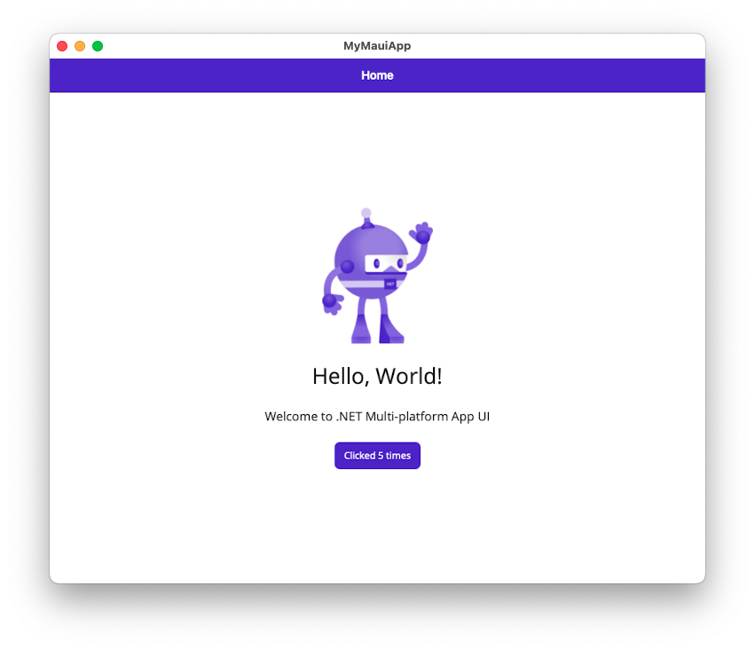

# Build a Mac Catalyst app with .NET CLI

In this tutorial, you'll learn how to create and run a .NET Multi-platform App UI (.NET MAUI) app on Mac Catalyst using .NET Command Line Interface (CLI) on macOS:

![[install-create-macos]]

<!-- markdownlint-disable MD029 -->

5. In **Terminal**, change directory to *MyMauiApp*, and build and run the app:

    ```zsh
    cd MyMauiApp
    dotnet build -t:Run -f net8.0-maccatalyst
    ```

    The `dotnet build` command will restore the project dependencies, build the app, and launch it.

    If you see a build error and a warning that the Xcode app bundle could not be found, you may need to run the following command:

    ```zsh
    xcode-select --reset
    ```

6. In the running app, press the **Click me** button several times and observe that the count of the number of button clicks is incremented.

    

<!-- markdownlint-enable MD029 -->

![[choose-xcode-version]]
