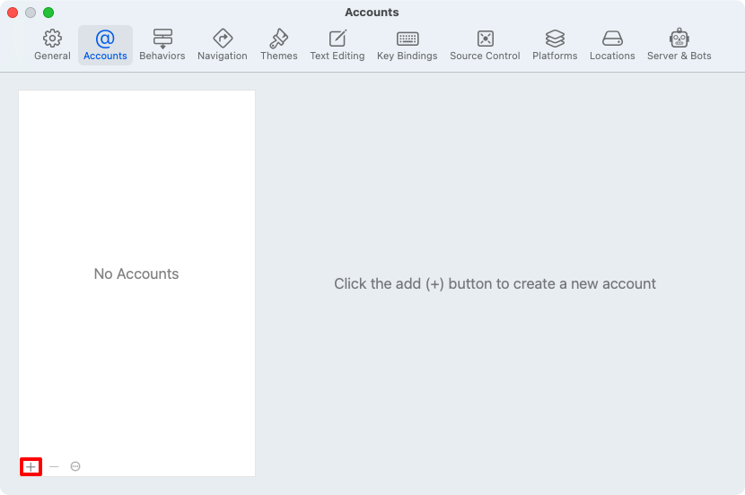
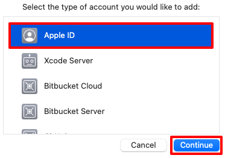
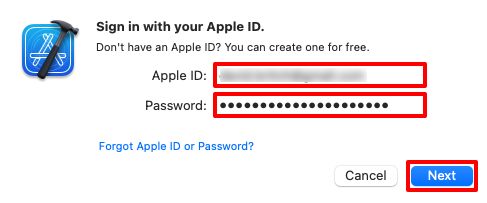
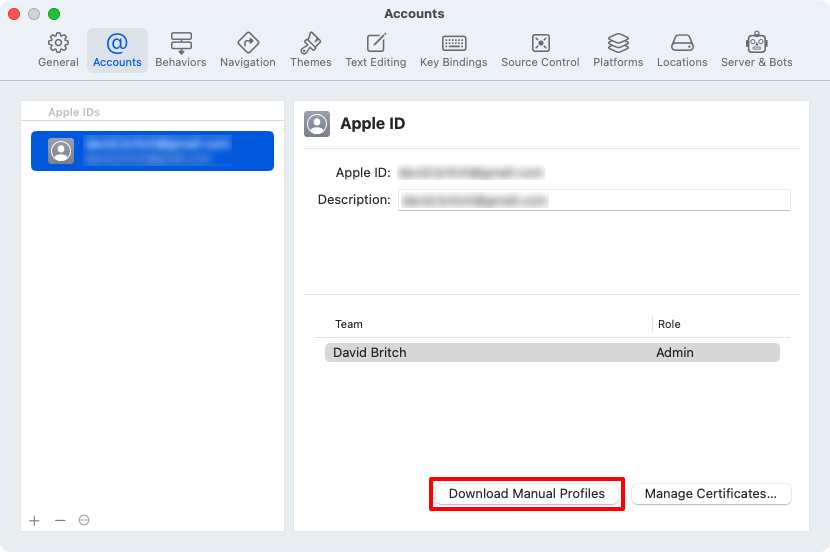

## Download your provisioning profile in Xcode

After creating a provisioning profile in your Apple Developer Account, Xcode can download it so that it's available for signing your app:

1. On your Mac, launch Xcode.
1. In Xcode, select the **Xcode > Preferences...** menu item.
1. In the **Preferences** dialog, select the **Accounts** tab.
1. In the **Accounts** tab, click the **+** button to add your Apple Developer Account to Xcode:

    

1. In the account type popup, select **Apple ID** and then click the **Continue** button:

    

1. In the sign in popup, enter your Apple ID and click the **Next** button.
1. In the sign in popup, enter your Apple ID password and click the **Next** button:

    

1. In the **Accounts** tab, click the **Manage Certificates...** button to ensure that your distribution certificate has been downloaded.
1. In the **Accounts** tab, click the **Download Manual Profiles** button to download your provisioning profiles:

    

1. Wait for the download to complete and then close Xcode.
