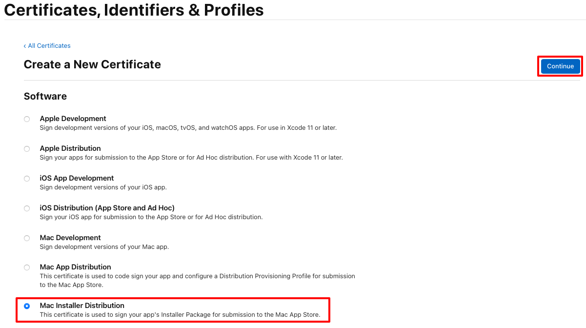
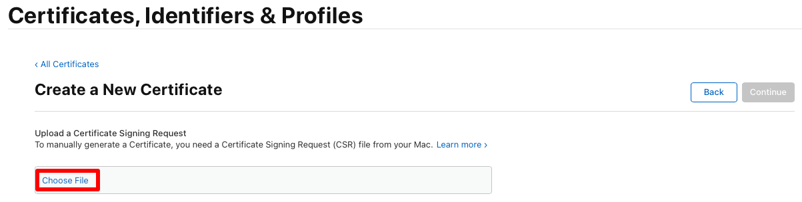
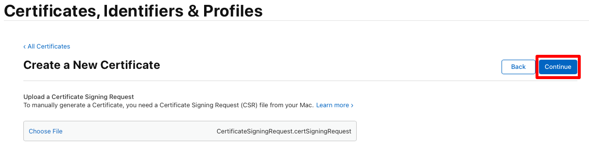
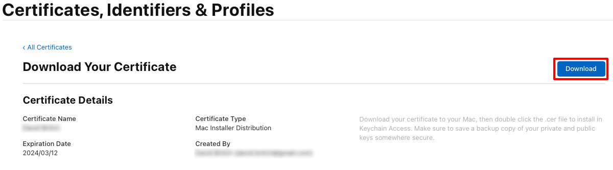
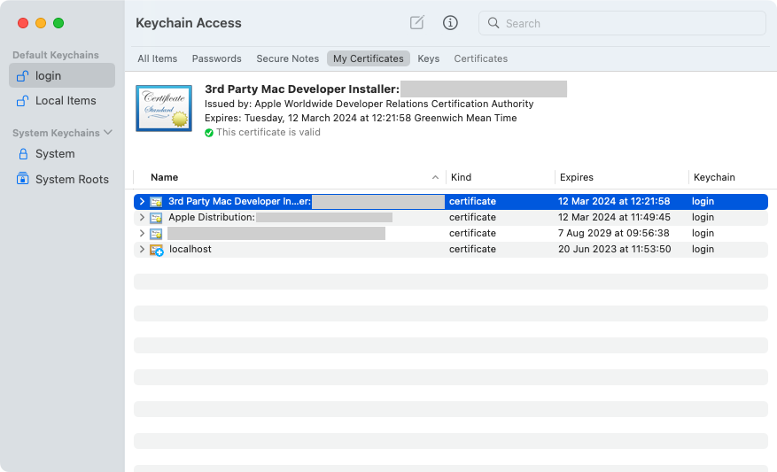

## Create an installer certificate

The CSR allows you to generate an installer certificate, which is required to sign your app's installer package for submission to the Mac App Store. The installer certificate must be created using the Apple ID for your Apple Developer Account:

1. In your Apple Developer Account, select the **Certificates, IDs & Profiles** tab.
1. On the **Certificates, Identifiers & Profiles** page, select the **+** button to create a new certificate.
1. On the **Create a New Certificate** page, select the **Mac Installer Distribution** radio button before selecting the **Continue** button:

    

1. On the **Create a New Certificate** page, select **Choose File**:

    

1. In the **Choose Files to Upload** dialog, select the certificate request file you previously created (a file with a `.certSigningRequest` file extension) and then select **Upload**.
1. On the **Create a New Certificate** page, select the **Continue** button:

    

1. On the **Download Your Certificate** page, select the **Download** button:

    

    The certificate file (a file with a `.cer` extension) will be downloaded to your chosen location.

1. On your Mac, double-click the downloaded certificate file to install the certificate to your keychain. The certificate appears in the **My Certificates** category in **Keychain Access**, and begins with **3rd Party Mac Developer Installer**:

    

    > [!NOTE]
    > Make a note of the full certificate name in Keychain Access. It will be required when signing your app.
