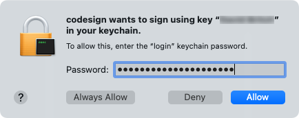
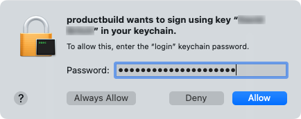

Publishing builds, signs, and packages the app, and then copies the *.pkg* to the *bin/Release/net8.0-maccatalyst/publish/* folder. If you publish the app using only a single architecture, it will be published to the *bin/Release/net8.0-maccatalyst/{architecture}/publish/* folder.

During the signing process it maybe necessary to enter your login password and allow `codesign` and `productbuild` to run:

For more information about the `dotnet publish` command, see [dotnet publish](/dotnet/core/tools/dotnet-publish).

<!-- Todo: It's possible to re-sign an existing app bundle with a different certificate to change the distribution channel -->
