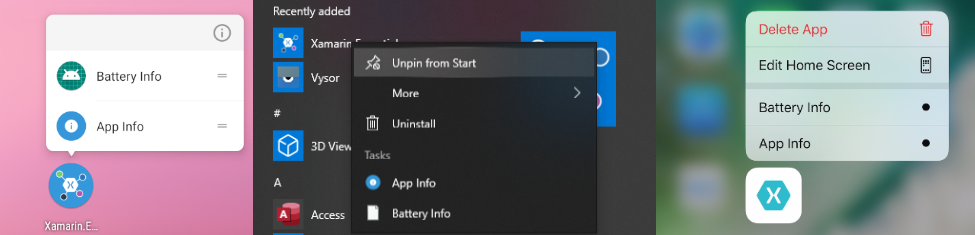

# App actions

[ Browse the sample](/samples/dotnet/maui-samples/platformintegration-essentials)

This article describes how you can use the .NET Multi-platform App UI (.NET MAUI) [[IAppActions|IAppActions]] interface, which lets you create and respond to app shortcuts. App shortcuts are helpful to users because they allow you, as the app developer, to present them with extra ways of starting your app. For example, if you were developing an email and calendar app, you could present two different app actions, one to open the app directly to the current day of the calendar, and another to open to the email inbox folder.

The default implementation of the `IAppActions` interface is available through the [[AppActions.Current|AppActions.Current]] property. Both the `IAppActions` interface and `AppActions` class are contained in the `Microsoft.Maui.ApplicationModel` namespace.

## Get started

To access the `AppActions` functionality, the following platform specific setup is required.

<!-- markdownlint-disable MD025 -->

# [Android](#tab/android)

In the _Platforms/Android/MainActivity.cs_ file, add the `OnResume` and `OnNewIntent` overrides to the `MainActivity` class, and the following `IntentFilter` attribute:

:::code language="csharp" source="../snippets/shared_2/Platforms/Android/MainActivity.cs" id="intent_filter_1":::

# [iOS/Mac Catalyst](#tab/macios)

No setup is required.

# [Windows](#tab/windows)

No setup is required.

-----

<!-- markdownlint-enable MD025 -->

## Create actions

App actions can be created at any time, but are often created when an app starts. To configure app actions, invoke the `IEssentialsBuilder})` method on the [[MauiAppBuilder|MauiAppBuilder]] object in the _MauiProgram.cs_ file. There are two methods you must call on the [[IEssentialsBuilder|IEssentialsBuilder]] object to enable an app action:

01. `AddAppAction%2A`

    This method creates an action. It takes an `id` string to uniquely identify the action, and a `title` string that's displayed to the user. You can optionally provide a subtitle and an icon.

01. `OnAppAction%2A`

    The delegate passed to this method is called when the user invokes an app action, provided the app action instance. Check the `Id` property of the action to determine which app action was started by the user.

The following code demonstrates how to configure the app actions at app startup:

:::code language="csharp" source="../snippets/shared_1/MauiProgram.cs" id="bootstrap_appaction" highlight="12-18":::

## Responding to actions

After app actions [have been configured](#create-actions), the `OnAppAction` method is called for all app actions invoked by the user. Use the `Id` property to differentiate them. The following code demonstrates handling an app action:

:::code language="csharp" source="../snippets/shared_1/App.xaml.cs" id="appaction_handle":::

### Check if app actions are supported

When you create an app action, either at app startup or while the app is being used, check to see if app actions are supported by reading the [[AppActions.IsSupported|`AppActions.Current.IsSupported`]] property.

### Create an app action outside of the startup bootstrap

To create app actions, call the `SetAsync%2A` method:

:::code language="csharp" source="../snippets/shared_2/MainPage.xaml.cs" id="app_actions":::

### More information about app actions

If app actions aren't supported on the specific version of the operating system, a [[FeatureNotSupportedException|FeatureNotSupportedException]] will be thrown.

Use the `String)` constructor to set the following aspects of an app action:

- **Id**: A unique identifier used to respond to the action tap.
- **Title**: the visible title to display.
- **Subtitle**: If supported a subtitle to display under the title.
- **Icon**: Must match icons in the corresponding resources directory on each platform.

<!-- TODO icon in image needs update -->

## Get actions

You can get the current list of app actions by calling [[AppActions.GetAsync|`AppActions.Current.GetAsync`]].
