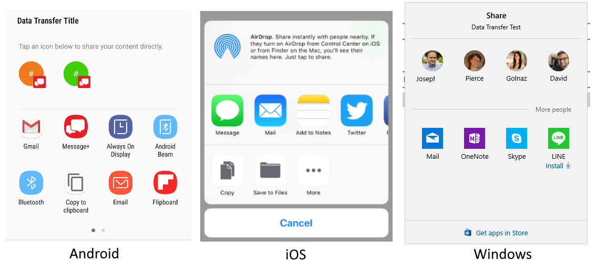

# Share

[ Browse the sample](/samples/dotnet/maui-samples/platformintegration-essentials)

This article describes how you can use the .NET Multi-platform App UI (.NET MAUI) [[IShare|IShare]] interface. This interface provides an API to send data, such as text or web links, to the devices share function.

The default implementation of the `IShare` interface is available through the [[Share.Default|Share.Default]] property. Both the `IShare` interface and `Share` class are contained in the `Microsoft.Maui.ApplicationModel.DataTransfer` namespace.

When a share request is made, the device displays a share window, prompting the user to choose an app to share with:



## Get started

To access the **Share** functionality, the following platform-specific setup is required:

<!-- markdownlint-disable MD025 -->
# [Android](#tab/android)

No setup is required.

# [iOS/Mac Catalyst](#tab/macios)

If your application is going to share media files, such as photos and videos, you must add the following keys to your _Platforms/iOS/Info.plist_ and _Platforms/MacCatalyst/Info.plist_ files:

```xml
<key>NSPhotoLibraryAddUsageDescription</key>
<string>This app needs access to the photo gallery to save photos and videos.</string>
<key>NSPhotoLibraryUsageDescription</key>
<string>This app needs access to the photo gallery to save photos and videos.</string>
```

The `<string>` elements represent the text shown to your users when permission is requested. Make sure that you change the text to something specific to your application.

# [Windows](#tab/windows)

No setup is required.

-----

## Share text and links

The share functionality works by calling the `RequestAsync%2A` method with a data payload that includes information to share to other applications. [[ShareTextRequest.Text|ShareTextRequest.Text]] and [[ShareTextRequest.Uri|ShareTextRequest.Uri]] can be mixed and each platform will handle filtering based on content.

:::code language="csharp" source="../snippets/shared_1/DataPage.xaml.cs" id="share_text_uri":::

## Share a file

You can also share files to other applications on the device. .NET MAUI automatically detects the file type (MIME) and requests a share. However, operating systems may restrict which types of files can be shared. To share a single file, use the [[ShareFileRequest|ShareFileRequest]] type.

The following code example writes a text file to the device, and then requests to share it:

:::code language="csharp" source="../snippets/shared_1/DataPage.xaml.cs" id="share_file":::

## Share multiple files

Sharing multiple files is slightly different from sharing a single file. To share a single file, use the [[ShareFileRequest|ShareFileRequest]] type.

The following code example writes two text files to the device, and then requests to share them:

:::code language="csharp" source="../snippets/shared_1/DataPage.xaml.cs" id="share_file_multiple":::

## Control file locations

![[android-fileproviderpaths]]

## Presentation location

![[ios-PresentationSourceBounds]]

## Platform differences

This section describes the platform-specific differences with the share API.

<!-- markdownlint-disable MD025 -->
<!-- markdownlint-disable MD024 -->
# [Android](#tab/android)

- The [[ShareTextRequest.Subject|ShareTextRequest.Subject]] property is used for the desired subject of a message.

# [iOS/Mac Catalyst](#tab/macios)

- The [[ShareTextRequest.Subject|ShareTextRequest.Subject]] property isn't used.

# [Windows](#tab/windows)

- The [[ShareRequestBase.Title|ShareRequestBase.Title]] property will default to the application name if not set.
- The [[ShareTextRequest.Subject|ShareTextRequest.Subject]] property isn't used.

-----
<!-- markdownlint-enable MD024 -->
<!-- markdownlint-enable MD025 -->
