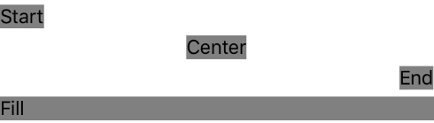
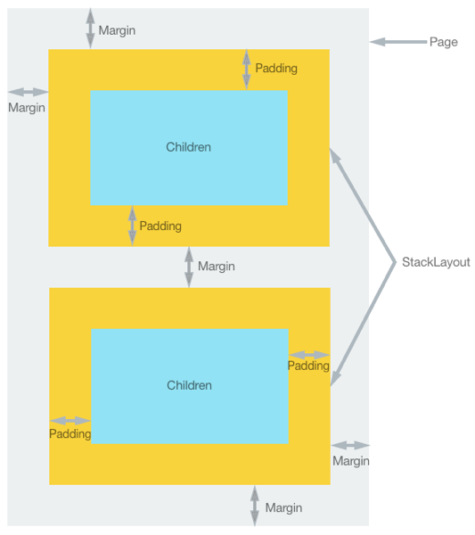

# Align and position .NET MAUI controls

Every .NET Multi-platform App UI (.NET MAUI) control that derives from [[View|View]], which includes views and layouts, has `HorizontalOptions` and `VerticalOptions` properties, of type `LayoutOptions`. The `LayoutOptions` structure encapsulates a view's preferred alignment, which determines its position and size within its parent layout when the parent layout contains unused space (that is, the parent layout is larger than the combined size of all its children).

In addition, the `Margin` and `Padding` properties position controls relative to adjacent, or child controls. For more information, see [Position controls](#position-controls).

## Align views in layouts

The alignment of a [[View|View]], relative to its parent, can be controlled by setting the `HorizontalOptions` or `VerticalOptions` property of the [[View|View]] to one of the public fields from the `LayoutOptions` structure. The public fields are `Start`, `Center`, `End`, and `Fill`.

The `Start`, `Center`, `End`, and `Fill` fields are used to define the view's alignment within the parent layout:

- For horizontal alignment, `Start` positions the [[View|View]] on the left hand side of the parent layout, and for vertical alignment, it positions the [[View|View]] at the top of the parent layout.
- For horizontal and vertical alignment, `Center` horizontally or vertically centers the [[View|View]].
- For horizontal alignment, `End` positions the [[View|View]] on the right hand side of the parent layout, and for vertical alignment, it positions the [[View|View]] at the bottom of the parent layout.
- For horizontal alignment, `Fill` ensures that the [[View|View]] fills the width of the parent layout, and for vertical alignment, it ensures that the [[View|View]] fills the height of the parent layout.

> [!NOTE]
> The default value of a view's `HorizontalOptions` and `VerticalOptions` properties is `LayoutOptions.Fill`.

A [[StackLayout (Controls)|StackLayout]] only respects the `Start`, `Center`, `End`, and `Fill` `LayoutOptions` fields on child views that are in the opposite direction to the [[StackLayout (Controls)|StackLayout]] orientation. Therefore, child views within a vertically oriented [[StackLayout (Controls)|StackLayout]] can set their `HorizontalOptions` properties to one of the `Start`, `Center`, `End`, or `Fill` fields. Similarly, child views within a horizontally oriented [[StackLayout (Controls)|StackLayout]] can set their `VerticalOptions` properties to one of the `Start`, `Center`, `End`, or `Fill` fields.

A [[StackLayout (Controls)|StackLayout]] does not respect the `Start`, `Center`, `End`, and `Fill` `LayoutOptions` fields on child views that are in the same direction as the [[StackLayout (Controls)|StackLayout]] orientation. Therefore, a vertically oriented [[StackLayout (Controls)|StackLayout]] ignores the `Start`, `Center`, `End`, or `Fill` fields if they are set on the `VerticalOptions` properties of child views. Similarly, a horizontally oriented [[StackLayout (Controls)|StackLayout]] ignores the `Start`, `Center`, `End`, or `Fill` fields if they are set on the `HorizontalOptions` properties of child views.

> [!IMPORTANT]
> `LayoutOptions.Fill` generally overrides size requests specified using the  [[VisualElement (Controls).HeightRequest|HeightRequest]] and [[VisualElement (Controls).WidthRequest|WidthRequest]] properties.

The following XAML example demonstrates a vertically oriented [[StackLayout (Controls)|StackLayout]] where each child [[Label (Controls)|Label]] sets its `HorizontalOptions` property to one of the four alignment fields from the `LayoutOptions` structure:

```xaml
<StackLayout>
  ...
  <Label Text="Start" BackgroundColor="Gray" HorizontalOptions="Start" />
  <Label Text="Center" BackgroundColor="Gray" HorizontalOptions="Center" />
  <Label Text="End" BackgroundColor="Gray" HorizontalOptions="End" />
  <Label Text="Fill" BackgroundColor="Gray" HorizontalOptions="Fill" />
</StackLayout>
```

The following screenshot shows the resulting alignment of each [[Label (Controls)|Label]]:



## Position controls

The `Margin` and `Padding` properties position controls relative to adjacent, or child controls. Margin and padding are related layout concepts:

- The `Margin` property represents the distance between an element and its adjacent elements, and is used to control the element's rendering position, and the rendering position of its neighbors. `Margin` values can be specified on layouts and views.
- The `Padding` property represents the distance between an element and its child elements, and is used to separate the control from its own content. `Padding` values can be specified on pages, layouts, and views.

The following diagram illustrates the two concepts:



> [!NOTE]
> `Margin` values are additive. Therefore, if two adjacent elements specify a margin of 20 device-independent units, the distance between the elements will be 40 device-independent units. In addition, margin and padding values are additive when both are applied, in that the distance between an element and any content will be the margin plus padding. For more information about device-independent units, see [[device-independent-units|Device-independent units]].

The `Margin` and `Padding` properties are both of type `Thickness`. There are three possibilities when creating a `Thickness` structure:

- Create a `Thickness` structure defined by a single uniform value. The single value is applied to the left, top, right, and bottom sides of the element.
- Create a `Thickness` structure defined by horizontal and vertical values. The horizontal value is symmetrically applied to the left and right sides of the element, with the vertical value being symmetrically applied to the top and bottom sides of the element.
- Create a `Thickness` structure defined by four distinct values that are applied to the left, top, right, and bottom sides of the element.

The following XAML example shows all three possibilities:

```xaml
<StackLayout Padding="0,20,0,0">
  <!-- Margin defined by a single uniform value. -->
  <Label Text=".NET MAUI" Margin="20" />
  <!-- Margin defined by horizontal and vertical values. -->  
  <Label Text=".NET for iOS" Margin="10,15" />
  <!-- Margin defined by four distinct values that are applied to the left, top, right, and bottom. -->  
  <Label Text=".NET for Android" Margin="0,20,15,5" />
</StackLayout>
```

The equivalent C# code is:

```csharp
StackLayout stackLayout = new StackLayout
{
  Padding = new Thickness(0,20,0,0)
};
// Margin defined by a single uniform value.
stackLayout.Add(new Label { Text = ".NET MAUI", Margin = new Thickness(20) });
// Margin defined by horizontal and vertical values.
stackLayout.Add(new Label { Text = ".NET for iOS", Margin = new Thickness(10,25) });
// Margin defined by four distinct values that are applied to the left, top, right, and bottom.
stackLayout.Add(new Label { Text = ".NET for Android", Margin = new Thickness(0,20,15,5) });  
```

> [!NOTE]
> `Thickness` values can be negative, which typically clips or overdraws the content.
