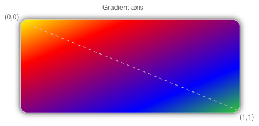
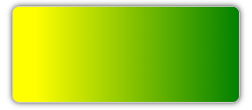
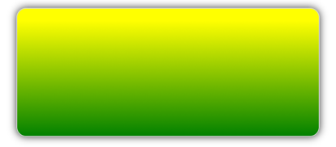
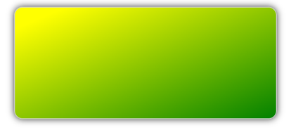

# Linear gradient brushes

[ Browse the sample](/samples/dotnet/maui-samples/userinterface-brushes)

The .NET Multi-platform App UI (.NET MAUI)  [[LinearGradientBrush|LinearGradientBrush]] class derives from the [[GradientBrush|GradientBrush]] class, and paints an area with a linear gradient, which blends two or more colors along a line known as the gradient axis. [[GradientStop|GradientStop]] objects are used to specify the colors in the gradient and their positions. For more information about [[GradientStop|GradientStop]] objects, see [[gradient|Gradients]].

The [[LinearGradientBrush|LinearGradientBrush]] class defines the following properties:

- `StartPoint`, of type `Point`, which represents the starting two-dimensional coordinates of the linear gradient. The default value of this property is (0,0).
- `EndPoint`, of type `Point`, which represents the ending two-dimensional coordinates of the linear gradient. The default value of this property is (1,1).

These properties are backed by [[BindableProperty|BindableProperty]] objects, which means that they can be targets of data bindings, and styled.

The [[LinearGradientBrush|LinearGradientBrush]] class also has an `IsEmpty` method that returns a `bool` that represents whether the brush has been assigned any [[GradientStop|GradientStop]] objects.

> [!NOTE]
> Linear gradients can also be created with the `linear-gradient()` CSS function.

## Create a LinearGradientBrush

A linear gradient brush's gradient stops are positioned along the gradient axis. The orientation and size of the gradient axis can be changed using the brush's `StartPoint` and `EndPoint` properties. By manipulating these properties, you can create horizontal, vertical, and diagonal gradients, reverse the gradient direction, condense the gradient spread, and more.

The `StartPoint` and `EndPoint` properties are relative to the area being painted. (0,0) represents the top-left corner of the area being painted, and (1,1) represents the bottom-right corner of the area being painted. The following diagram shows the gradient axis for a diagonal linear gradient brush:



In this diagram, the dashed line shows the gradient axis, which highlights the interpolation path of the gradient from the start point to the end point.

### Create a horizontal linear gradient

To create a horizontal linear gradient, create a [[LinearGradientBrush|LinearGradientBrush]] object and set its `StartPoint` to (0,0) and its `EndPoint` to (1,0). Then, add two or more [[GradientStop|GradientStop]] objects to the `LinearGradientBrush.GradientStops` collection, that specify the colors in the gradient and their positions.

The following XAML example shows a horizontal [[LinearGradientBrush|LinearGradientBrush]] that's set as the `Background` of a [[Border|Border]]:

```xaml
<Border Stroke="LightGray"
        StrokeShape="RoundRectangle 12"
        HeightRequest="120"
        WidthRequest="120">
    <Border.Background>
        <!-- StartPoint defaults to (0,0) -->
        <LinearGradientBrush EndPoint="1,0">
            <GradientStop Color="Yellow"
                          Offset="0.1" />
            <GradientStop Color="Green"
                          Offset="1.0" />
        </LinearGradientBrush>
    </Border.Background>
</Border>  
```

In this example, the background of the [[Border|Border]] is painted with a [[LinearGradientBrush|LinearGradientBrush]] that interpolates from yellow to green horizontally:



### Create a vertical linear gradient

To create a vertical linear gradient, create a [[LinearGradientBrush|LinearGradientBrush]] object and set its `StartPoint` to (0,0) and its `EndPoint` to (0,1). Then, add two or more [[GradientStop|GradientStop]] objects to the `LinearGradientBrush.GradientStops` collection, that specify the colors in the gradient and their positions.

The following XAML example shows a vertical [[LinearGradientBrush|LinearGradientBrush]] that's set as the `Background` of a [[Border|Border]]:

```xaml
<Border Stroke="LightGray"
        StrokeShape="RoundRectangle 12"
        HeightRequest="120"
        WidthRequest="120">
    <Border.Background>
        <!-- StartPoint defaults to (0,0) -->    
        <LinearGradientBrush EndPoint="0,1">
            <GradientStop Color="Yellow"
                          Offset="0.1" />
            <GradientStop Color="Green"
                          Offset="1.0" />
        </LinearGradientBrush>
    </Border.Background>
</Border>
```

In this example, the background of the [[Border|Border]] is painted with a [[LinearGradientBrush|LinearGradientBrush]] that interpolates from yellow to green vertically:



### Create a diagonal linear gradient

To create a diagonal linear gradient, create a [[LinearGradientBrush|LinearGradientBrush]] object and set its `StartPoint` to (0,0) and its `EndPoint` to (1,1). Then, add two or more [[GradientStop|GradientStop]] objects to the `LinearGradientBrush.GradientStops` collection, that specify the colors in the gradient and their positions.

The following XAML example shows a diagonal [[LinearGradientBrush|LinearGradientBrush]] that's set as the `Background` of a [[Border|Border]]:

```xaml
<Border Stroke="LightGray"
        StrokeShape="RoundRectangle 12"
        HeightRequest="120"
        WidthRequest="120">
    <Border.Background>
        <!-- StartPoint defaults to (0,0)      
             Endpoint defaults to (1,1) -->
        <LinearGradientBrush>
            <GradientStop Color="Yellow"
                          Offset="0.1" />
            <GradientStop Color="Green"
                          Offset="1.0" />
        </LinearGradientBrush>
    </Border.Background>
</Border>
```

In this example, the background of the [[Border|Border]] is painted with a [[LinearGradientBrush|LinearGradientBrush]] that interpolates from yellow to green diagonally:


