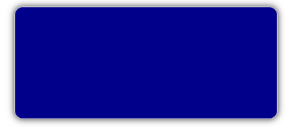
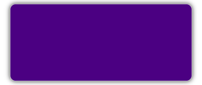
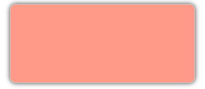
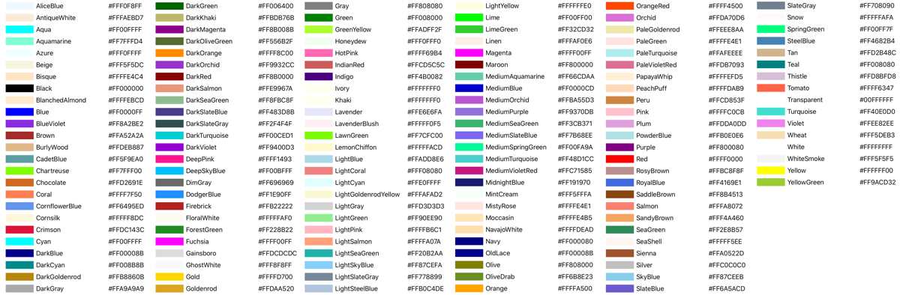

# Solid color brushes

[ Browse the sample](/samples/dotnet/maui-samples/userinterface-brushes)

The .NET Multi-platform App UI (.NET MAUI) [[SolidColorBrush|SolidColorBrush]] class derives from the [[Brush|Brush]] class, and is used to paint an area with a solid color. There are a variety of approaches to specifying the color of a [[SolidColorBrush|SolidColorBrush]]. For example, you can specify its color with a [[Color|Color]] value or by using one of the predefined [[SolidColorBrush|SolidColorBrush]] objects provided by the [[Brush|Brush]] class.

The [[SolidColorBrush|SolidColorBrush]] class defines the `Color` property, of type [[Color|Color]], which represents the color of the brush. This property is the [[ContentPropertyAttribute|`ContentProperty`]] of the [[SolidColorBrush|SolidColorBrush]] class, and therefore does not need to be explicitly set from XAML. In addition, this property is backed by a [[BindableProperty|BindableProperty]] object, which means that it can be the target of data bindings, and styled.

The [[SolidColorBrush|SolidColorBrush]] class also has an `IsEmpty` method that returns a `bool` that represents whether the brush has been assigned a color.

## Create a SolidColorBrush

There are three main techniques for creating a [[SolidColorBrush|SolidColorBrush]]. You can create a [[SolidColorBrush|SolidColorBrush]] from a [[Color|Color]], use a predefined brush, or create a [[SolidColorBrush|SolidColorBrush]] using hexadecimal notation.

### Use a predefined Color

.NET MAUI includes a type converter that creates a [[SolidColorBrush|SolidColorBrush]] from a [[Color|Color]] value. In XAML, this enables a [[SolidColorBrush|SolidColorBrush]] to be created from a predefined [[Color|Color]] value:

```xaml
<Border Background="DarkBlue"
        Stroke="LightGray"
        StrokeShape="RoundRectangle 12"
        HeightRequest="120"
        WidthRequest="120" />
```

In this example, the background of the [[Border|Border]] is painted with a dark blue [[SolidColorBrush|SolidColorBrush]]:



Alternatively, the [[Color|Color]] value can be specified using property tag syntax:

```xaml
<Border Stroke="LightGray"
        StrokeShape="RoundRectangle 12"
        HeightRequest="120"
        WidthRequest="120">
    <Border.Background>
         <SolidColorBrush Color="DarkBlue" />    
    </Border.Background>
</Border>
```

In this example, the background of the [[Border|Border]] is painted with a [[SolidColorBrush|SolidColorBrush]] whose color is specified by setting the `SolidColorBrush.Color` property.

### Use a predefined Brush

The [[Brush|Brush]] class defines a set of commonly used [[SolidColorBrush|SolidColorBrush]] objects. The following example uses one of these predefined [[SolidColorBrush|SolidColorBrush]] objects:

```xaml
<Border Background="{x:Static Brush.Indigo}"
        Stroke="LightGray"
        StrokeShape="RoundRectangle 12"
        HeightRequest="120"
        WidthRequest="120" />   
```

The equivalent C# code is:

```csharp
Border border = new Border
{
    Background = Brush.Indigo,
    Stroke = Colors.LightGray,
    // ...
};
```

In this example, the background of the [[Border|Border]] is painted with an indigo [[SolidColorBrush|SolidColorBrush]]:



For a list of predefined [[SolidColorBrush|SolidColorBrush]] objects provided by the [[Brush|Brush]] class, see [Solid color brushes](#solid-color-brushes).

### Use hexadecimal notation

[[SolidColorBrush|SolidColorBrush]] objects can also be created using hexadecimal notation. With this approach, a color is specified in terms of the amount of red, green, and blue to combine into a single color. The main format for specifying a color using hexadecimal notation is `#rrggbb`, where:

- `rr` is a two-digit hexadecimal number specifying the relative amount of red.
- `gg` is a two-digit hexadecimal number specifying the relative amount of green.
- `bb` is a two-digit hexadecimal number specifying the relative amount of blue.

In addition, a color can be specified as `#aarrggbb` where `aa` specifies the alpha value, or transparency, of the color. This approach enables you to create colors that are partially transparent.

The following example sets the color value of a [[SolidColorBrush|SolidColorBrush]] using hexadecimal notation:

```xaml
<Border Background="#FF9988"
        Stroke="LightGray"
        StrokeShape="RoundRectangle 12"
        HeightRequest="120"
        WidthRequest="120" />       
```

In this example, the background of the [[Border|Border]] is painted with a salmon-colored [[SolidColorBrush|SolidColorBrush]]:



For other ways of describing color, see [[colors|Colors]].

## Solid color brushes

For convenience, the [[Brush|Brush]] class provides a set of commonly used [[SolidColorBrush|SolidColorBrush]] objects, such as `AliceBlue` and `YellowGreen`. The following image shows the color of each predefined brush, its name, and its hexadecimal value:


