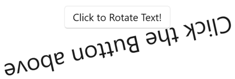

# Button

The .NET Multi-platform App UI (.NET MAUI) [[Button (Controls)|Button]] displays text and responds to a tap or click that directs the app to carry out a task. A [[Button (Controls)|Button]] usually displays a short text string indicating a command, but it can also display a bitmap image, or a combination of text and an image. When the [[Button (Controls)|Button]] is pressed with a finger or clicked with a mouse it initiates that command.

[[Button (Controls)|Button]] defines the following properties:

- `BorderColor`, of type [[Color|Color]], describes the border color of the button.
- `BorderWidth`, of type `double`, defines the width of the button's border.
- `CharacterSpacing`, of type `double`, defines the spacing between characters of the button's text.
- `Command`, of type `ICommand`, defines the command that's executed when the button is tapped.
- `CommandParameter`, of type `object`, is the parameter that's passed to `Command`.
- `ContentLayout`, of type `ButtonContentLayout`, defines the object that controls the position of the button image and the spacing between the button's image and text.
- `CornerRadius`, of type `int`, describes the corner radius of the button's border.
- `FontAttributes`, of type `FontAttributes`, determines text style.
- `FontAutoScalingEnabled`, of type `bool`, defines whether the button text will reflect scaling preferences set in the operating system. The default value of this property is `true`.
- `FontFamily`, of type `string`, defines the font family.
- `FontSize`, of type `double`, defines the font size.
- [[ImageSource|ImageSource]], of type [[ImageSource|ImageSource]], specifies a bitmap image to display as the content of the button.
- `LineBreakMode`, of type `LineBreakMode`, determines how text should be handled when it can't fit on one line.
- `Padding`, of type `Thickness`, determines the button's padding.
- `Text`, of type `string`, defines the text displayed as the content of the button.
- `TextColor`, of type [[Color|Color]], describes the color of the button's text.
- `TextTransform`, of type `TextTransform`, defines the casing of the button's text.

These properties are backed by [[BindableProperty|BindableProperty]] objects, which means that they can be targets of data bindings, and styled.

> [!NOTE]
> While [[Button (Controls)|Button]] defines an [[ImageSource|ImageSource]] property, that allows you to display a image on the [[Button (Controls)|Button]], this property is intended to be used when displaying a small icon next to the [[Button (Controls)|Button]] text.

In addition, [[Button (Controls)|Button]] defines `Clicked`, `Pressed`, and `Released` events. The `Clicked` event is raised when a [[Button (Controls)|Button]] tap with a finger or mouse pointer is released from the button's surface. The `Pressed` event is raised when a finger presses on a [[Button (Controls)|Button]], or a mouse button is pressed with the pointer positioned over the [[Button (Controls)|Button]]. The `Released` event is raised when the finger or mouse button is released. Generally, a `Clicked` event is also raised at the same time as the `Released` event, but if the finger or mouse pointer slides away from the surface of the [[Button (Controls)|Button]] before being released, the `Clicked` event might not occur.

> [!IMPORTANT]
> A [[Button (Controls)|Button]] must have its `IsEnabled` property set to `true` for it to respond to taps.

## Create a Button

To create a button, create a [[Button (Controls)|Button]] object and handle its `Clicked` event.

The following XAML example show how to create a [[Button (Controls)|Button]]:

```xaml
<ContentPage xmlns="http://schemas.microsoft.com/dotnet/2021/maui"
             xmlns:x="http://schemas.microsoft.com/winfx/2009/xaml"
             x:Class="ButtonDemos.BasicButtonClickPage"
             Title="Basic Button Click">
    <StackLayout>
        <Button Text="Click to Rotate Text!"
                VerticalOptions="Center"
                HorizontalOptions="Center"
                Clicked="OnButtonClicked" />
        <Label x:Name="label"
               Text="Click the Button above"
               FontSize="18"
               VerticalOptions="Center"
               HorizontalOptions="Center" />
    </StackLayout>
</ContentPage>
```

The `Text` property specifies the text that appears in the [[Button (Controls)|Button]]. The `Clicked` event is set to an event handler named `OnButtonClicked`. This handler is located in the code-behind file:


```csharp
public partial class BasicButtonClickPage : ContentPage
{
    public BasicButtonClickPage ()
    {
        InitializeComponent ();
    }

    async void OnButtonClicked(object sender, EventArgs args)
    {
        await label.RelRotateTo(360, 1000);
    }
}
```


```csharp
public partial class BasicButtonClickPage : ContentPage
{
    public BasicButtonClickPage ()
    {
        InitializeComponent ();
    }

    async void OnButtonClicked(object sender, EventArgs args)
    {
        await label.RelRotateToAsync(360, 1000);
    }
}
```


In this example, when the [[Button (Controls)|Button]] is tapped, the `OnButtonClicked` method executes. The `sender` argument is the [[Button (Controls)|Button]] object responsible for this event. You can use this to access the [[Button (Controls)|Button]] object, or to distinguish between multiple [[Button (Controls)|Button]] objects sharing the same `Clicked` event. The `Clicked` handler calls an animation function that rotates the [[Label (Controls)|Label]] 360 degrees in 1000 milliseconds:



The equivalent C# code to create a [[Button (Controls)|Button]] is:


```csharp
Button button = new Button
{
    Text = "Click to Rotate Text!",
    VerticalOptions = LayoutOptions.Center,
    HorizontalOptions = LayoutOptions.Center
};
button.Clicked += async (sender, args) => await label.RelRotateTo(360, 1000);
```


```csharp
Button button = new Button
{
    Text = "Click to Rotate Text!",
    VerticalOptions = LayoutOptions.Center,
    HorizontalOptions = LayoutOptions.Center
};
button.Clicked += async (sender, args) => await label.RelRotateToAsync(360, 1000);
```


## Use the command interface

An app can respond to [[Button (Controls)|Button]] taps without handling the `Clicked` event. The [[Button (Controls)|Button]] implements an alternative notification mechanism called the _command_ or _commanding_ interface. This consists of two properties:

- `Command` of type `ICommand`, an interface defined in the `System.Windows.Input` namespace.
- `CommandParameter` property of type `Object`.

This approach is particularly suitable in connection with data-binding, and particularly when implementing the Model-View-ViewModel (MVVM) pattern. In an MVVM application, the viewmodel defines properties of type `ICommand` that are then connected to [[Button (Controls)|Button]] objects with data bindings. .NET MAUI also defines `Command` and `Command<T>` classes that implement the `ICommand` interface and assist the viewmodel in defining properties of type `ICommand`. For more information about commanding, see [[commanding|Commanding]].

The following example shows a very simple viewmodel class that defines a property of type `double` named `Number`, and two properties of type `ICommand` named `MultiplyBy2Command` and `DivideBy2Command`:

```csharp
public class CommandDemoViewModel : INotifyPropertyChanged
{
    double number = 1;

    public event PropertyChangedEventHandler PropertyChanged;

    public ICommand MultiplyBy2Command { get; private set; }
    public ICommand DivideBy2Command { get; private set; }

    public CommandDemoViewModel()
    {
        MultiplyBy2Command = new Command(() => Number *= 2);
        DivideBy2Command = new Command(() => Number /= 2);
    }

    public double Number
    {
        get
        {
            return number;
        }
        set
        {
            if (number != value)
            {
                number = value;
                PropertyChanged?.Invoke(this, new PropertyChangedEventArgs("Number"));
            }
        }
    }
}
```

In this example, the two `ICommand` properties are initialized in the class's constructor with two objects of type `Command`. The `Command` constructors include a little function (called the `execute` constructor argument) that either doubles or halves the value of the `Number` property.

The following XAML example consumes the `CommandDemoViewModel` class:

```xaml
<ContentPage xmlns="http://schemas.microsoft.com/dotnet/2021/maui"
             xmlns:x="http://schemas.microsoft.com/winfx/2009/xaml"
             xmlns:local="clr-namespace:ButtonDemos"
             x:Class="ButtonDemos.BasicButtonCommandPage"
             Title="Basic Button Command"
             x:DataType="local:CommandDemoViewModel">
    <ContentPage.BindingContext>
        <local:CommandDemoViewModel />
    </ContentPage.BindingContext>

    <StackLayout>
        <Label Text="{Binding Number, StringFormat='Value is now {0}'}"
               FontSize="18"
               VerticalOptions="Center"
               HorizontalOptions="Center" />
        <Button Text="Multiply by 2"
                VerticalOptions="Center"
                HorizontalOptions="Center"
                Command="{Binding MultiplyBy2Command}" />
        <Button Text="Divide by 2"
                VerticalOptions="Center"
                HorizontalOptions="Center"
                Command="{Binding DivideBy2Command}" />
    </StackLayout>
</ContentPage>
```

In this example, the [[Label (Controls)|Label]] element and two [[Button (Controls)|Button]] objects contain bindings to the three properties in the `CommandDemoViewModel` class. As the two [[Button (Controls)|Button]] objects are tapped, the commands are executed, and the number changes value. The advantage of this approach over `Clicked` handlers is that all the logic involving the functionality of this page is located in the viewmodel rather than the code-behind file, achieving a better separation of the user interface from the business logic.

It's also possible for the `Command` objects to control the enabling and disabling of the [[Button (Controls)|Button]] objects. For example, suppose you want to limit the range of number values between 2<sup>10</sup> and 2<sup>&ndash;10</sup>. You can add another function to the constructor (called the `canExecute` argument) that returns `true` if the [[Button (Controls)|Button]] should be enabled:

```csharp
public class CommandDemoViewModel : INotifyPropertyChanged
{
    ···
    public CommandDemoViewModel()
    {
        MultiplyBy2Command = new Command(
            execute: () =>
            {
                Number *= 2;
                ((Command)MultiplyBy2Command).ChangeCanExecute();
                ((Command)DivideBy2Command).ChangeCanExecute();
            },
            canExecute: () => Number < Math.Pow(2, 10));

        DivideBy2Command = new Command(
            execute: () =>
            {
                Number /= 2;
                ((Command)MultiplyBy2Command).ChangeCanExecute();
                ((Command)DivideBy2Command).ChangeCanExecute();
            },
            canExecute: () => Number > Math.Pow(2, -10));
    }
    ···
}
```

In this example, the calls to the `ChangeCanExecute` method of `Command` are required so that the `Command` method can call the `canExecute` method and determine whether the [[Button (Controls)|Button]] should be disabled or not. With this code change, as the number reaches the limit, the [[Button (Controls)|Button]] is disabled.

It's also possible for two or more [[Button (Controls)|Button]] elements to be bound to the same `ICommand` property. The [[Button (Controls)|Button]] elements can be distinguished using the `CommandParameter` property of [[Button (Controls)|Button]]. In this case, you'll want to use the generic `Command<T>` class. The `CommandParameter` object is then passed as an argument to the `execute` and `canExecute` methods. For more information, see [[commanding|Commanding]].

## Press and release the button

The `Pressed` event is raised when a finger presses on a [[Button (Controls)|Button]], or a mouse button is pressed with the pointer positioned over the [[Button (Controls)|Button]]. The `Released` event is raised when the finger or mouse button is released. Generally, a `Clicked` event is also raised at the same time as the `Released` event, but if the finger or mouse pointer slides away from the surface of the [[Button (Controls)|Button]] before being released, the `Clicked` event might not occur.

The following XAML example shows a [[Label (Controls)|Label]] and a [[Button (Controls)|Button]] with handlers attached for the `Pressed` and `Released` events:

```xaml
<ContentPage xmlns="http://schemas.microsoft.com/dotnet/2021/maui"
             xmlns:x="http://schemas.microsoft.com/winfx/2009/xaml"
             x:Class="ButtonDemos.PressAndReleaseButtonPage"
             Title="Press and Release Button">
    <StackLayout>
        <Button Text="Press to Rotate Text!"
                VerticalOptions="Center"
                HorizontalOptions="Center"
                Pressed="OnButtonPressed"
                Released="OnButtonReleased" />
        <Label x:Name="label"
               Text="Press and hold the Button above"
               FontSize="18"
               VerticalOptions="Center"
               HorizontalOptions="Center" />
    </StackLayout>
</ContentPage>
```

The code-behind file animates the [[Label (Controls)|Label]] when a `Pressed` event occurs, but suspends the rotation when a `Released` event occurs:

```csharp
public partial class PressAndReleaseButtonPage : ContentPage
{
    IDispatcherTimer timer;
    Stopwatch stopwatch = new Stopwatch();

    public PressAndReleaseButtonPage()
    {
        InitializeComponent();

        timer = Dispatcher.CreateTimer();
        timer.Interval = TimeSpan.FromMilliseconds(16);
        timer.Tick += (s, e) =>
        {
            label.Rotation = 360 * (stopwatch.Elapsed.TotalSeconds % 1);
        };
    }

    void OnButtonPressed(object sender, EventArgs args)
    {
        stopwatch.Start();
        timer.Start();
    }

    void OnButtonReleased(object sender, EventArgs args)
    {
        stopwatch.Stop();
        timer.Stop();
    }
}
```

The result is that the [[Label (Controls)|Label]] only rotates while a finger is in contact with the [[Button (Controls)|Button]], and stops when the finger is released.

## Button visual states

[[Button (Controls)|Button]] has a `Pressed` [[VisualState|VisualState]] that can be used to initiate a visual change to the [[Button (Controls)|Button]] when pressed, provided that it's enabled.

The following XAML example shows how to define a visual state for the `Pressed` state:

```xaml
<Button Text="Click me!"
        ...>
    <VisualStateManager.VisualStateGroups>
        <VisualStateGroupList>
            <VisualStateGroup x:Name="CommonStates">
                <VisualState x:Name="Normal">
                    <VisualState.Setters>
                        <Setter Property="Scale"
                                Value="1" />
                    </VisualState.Setters>
                </VisualState>
                <VisualState x:Name="Pressed">
                    <VisualState.Setters>
                        <Setter Property="Scale"
                                Value="0.8" />
                    </VisualState.Setters>
                </VisualState>
                <VisualState x:Name="PointerOver" />            
            </VisualStateGroup>
        </VisualStateGroupList>
    </VisualStateManager.VisualStateGroups>
</Button>
```

In this example, the `Pressed` [[VisualState|VisualState]] specifies that when the [[Button (Controls)|Button]] is pressed, its `Scale` property will be changed from its default value of 1 to 0.8. The `Normal` [[VisualState|VisualState]] specifies that when the [[Button (Controls)|Button]] is in a normal state, its `Scale` property will be set to 1. Therefore, the overall effect is that when the [[Button (Controls)|Button]] is pressed, it's rescaled to be slightly smaller, and when the [[Button (Controls)|Button]] is released, it's rescaled to its default size.

> [!IMPORTANT]
> For a [[Button (Controls)|Button]] to return to its `Normal` state the `VisualStateGroup` must also define a `PointerOver` state. If you use the styles `ResourceDictionary` created by the .NET MAUI app project template, you'll already have an implicit `Button` style that defines the `PointerOver` state.

For more information about visual states, see [[visual-states|Visual states]].

## Use bitmaps with buttons

The [[Button (Controls)|Button]] class defines an [[ImageSource|ImageSource]] property that allows you to display a small bitmap image on the [[Button (Controls)|Button]], either alone or in combination with text. You can also specify how the text and image are arranged. The [[ImageSource|ImageSource]] property is of type [[ImageSource|ImageSource]], which means that the bitmaps can be loaded from a file, embedded resource, URI, or stream.

<!-- > [!NOTE]
> While a [[Button (Controls)|Button]] can load an animated GIF, it will only display the first frame of the GIF. -->

Bitmaps aren't scaled to fit a [[Button (Controls)|Button]]. The best size is usually between 32 and 64 device-independent units, depending on how large you want the bitmap to be.

You can specify how the `Text` and [[ImageSource|ImageSource]] properties are arranged on the [[Button (Controls)|Button]] using the `ContentLayout` property of [[Button (Controls)|Button]]. This property is of type `ButtonContentLayout`, and its constructor has two arguments:

- A member of the `ImagePosition` enumeration: `Left`, `Top`, `Right`, or `Bottom` indicating how the bitmap appears relative to the text.
- A `double` value for the spacing between the bitmap and the text.

In XAML, you can create a [[Button (Controls)|Button]] and set the `ContentLayout` property by specifying only the enumeration member, or the spacing, or both in any order separated by commas:

```xaml
<Button Text="Button text"
        ImageSource="button.png"
        ContentLayout="Right, 20" />
```

The equivalent C# code is:

```csharp
Button button = new Button
{
    Text = "Button text",
    ImageSource = new FileImageSource
    {
        File = "button.png"
    },
    ContentLayout = new Button.ButtonContentLayout(Button.ButtonContentLayout.ImagePosition.Right, 20)
};
```

> [!NOTE]
> If a [[Button (Controls)|Button]] contains text and an image it might not be possible to fit all the content inside the button, and so you should size your image manually to achieve your desired layout.

## Disable a Button

Sometimes an app enters a state where a [[Button (Controls)|Button]] click is not a valid operation. In such cases, the [[Button (Controls)|Button]] can be disabled by setting its `IsEnabled` property to `false`.
