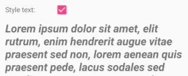
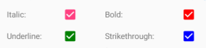

# CheckBox

[ Browse the sample](/samples/dotnet/maui-samples/userinterface-checkbox)

The .NET Multi-platform App UI (.NET MAUI) [[CheckBox|CheckBox]] is a type of button that can either be checked or empty. When a checkbox is checked, it's considered to be on. When a checkbox is empty, it's considered to be off.

[[CheckBox|CheckBox]] defines the following properties:

- `IsChecked`, of type `bool`, which indicates whether the [[CheckBox|CheckBox]] is checked. This property has a default binding mode of `TwoWay`.
- `Color`, of type [[Color|Color]], which indicates the color of the [[CheckBox|CheckBox]].

These properties are backed by [[BindableProperty|BindableProperty]] objects, which means that they can be styled, and be the target of data bindings.

[[CheckBox|CheckBox]] defines a `CheckedChanged` event that's raised when the `IsChecked` property changes, either through user manipulation or when an application sets the `IsChecked` property. The `CheckedChangedEventArgs` object that accompanies the `CheckedChanged` event has a single property named `Value`, of type `bool`. When the event is raised, the value of the `Value` property is set to the new value of the `IsChecked` property.

## Create a CheckBox

The following example shows how to instantiate a [[CheckBox|CheckBox]] in XAML:

```xaml
<CheckBox />
```

This XAML results in the appearance shown in the following screenshot:


By default, the [[CheckBox|CheckBox]] is empty. The [[CheckBox|CheckBox]] can be checked by user manipulation, or by setting the `IsChecked` property to `true`:

```xaml
<CheckBox IsChecked="true"
          SemanticProperties.Description="Agree to terms and conditions" />
```

This XAML results in the appearance shown in the following screenshot:


Alternatively, a [[CheckBox|CheckBox]] can be created in code:

```csharp
CheckBox checkBox = new CheckBox { IsChecked = true };
```

## Respond to a CheckBox changing state

When the `IsChecked` property changes, either through user manipulation or when an application sets the `IsChecked` property, the `CheckedChanged` event fires. An event handler for this event can be registered to respond to the change:

```xaml
<CheckBox CheckedChanged="OnCheckBoxCheckedChanged" />
```

The code-behind file contains the handler for the `CheckedChanged` event:

```csharp
void OnCheckBoxCheckedChanged(object sender, CheckedChangedEventArgs e)
{
    // Perform required operation after examining e.Value
}
```

The `sender` argument is the [[CheckBox|CheckBox]] responsible for this event. You can use this to access the [[CheckBox|CheckBox]] object, or to distinguish between multiple [[CheckBox|CheckBox]] objects sharing the same `CheckedChanged` event handler.

Alternatively, an event handler for the `CheckedChanged` event can be registered in code:

```csharp
CheckBox checkBox = new CheckBox { ... };
checkBox.CheckedChanged += (sender, e) =>
{
    // Perform required operation after examining e.Value
};
```

## Data bind a CheckBox

The `CheckedChanged` event handler can be eliminated by using data binding and triggers to respond to a [[CheckBox|CheckBox]] being checked or empty:

```xaml
<CheckBox x:Name="checkBox" />
<Label Text="Lorem ipsum dolor sit amet, elit rutrum, enim hendrerit augue vitae praesent sed non, lorem aenean quis praesent pede.">
    <Label.Triggers>
        <DataTrigger x:DataType="CheckBox"
                     TargetType="Label"
                     Binding="{Binding Source={x:Reference checkBox}, Path=IsChecked}"
                     Value="true">
            <Setter Property="FontAttributes"
                    Value="Italic, Bold" />
            <Setter Property="FontSize"
                    Value="18" />
        </DataTrigger>
    </Label.Triggers>
</Label>
```

In this example, the [[Label (Controls)|Label]] uses a binding expression in a data trigger to monitor the `IsChecked` property of the [[CheckBox|CheckBox]]. When this property becomes `true`, the `FontAttributes` and `FontSize` properties of the [[Label (Controls)|Label]] change. When the `IsChecked` property returns to `false`, the `FontAttributes` and `FontSize` properties of the [[Label (Controls)|Label]] are reset to their initial state.

The following screenshot shows the [[Label (Controls)|Label]] formatting when the [[CheckBox|CheckBox]] is checked:



For more information about triggers, see [[triggers|Triggers]].

## Disable a Checkbox

Sometimes an application enters a state where a [[CheckBox|CheckBox]] being checked is not a valid operation. In such cases, the [[CheckBox|CheckBox]] can be disabled by setting its `IsEnabled` property to `false`.

## CheckBox appearance

In addition to the properties that [[CheckBox|CheckBox]] inherits from the [[View|View]] class, [[CheckBox|CheckBox]] also defines a `Color` property that sets its color to a [[Color|Color]]:

```xaml
<CheckBox Color="Red" />
```

The following screenshot shows a series of checked [[CheckBox|CheckBox]] objects, where each object has its `Color` property set to a different [[Color|Color]]:



## CheckBox visual states

[[CheckBox|CheckBox]] has an `IsChecked` [[VisualState|VisualState]] that can be used to initiate a visual change to the [[CheckBox|CheckBox]] when it becomes checked.

The following XAML example shows how to define a visual state for the `IsChecked` state:

```xaml
<CheckBox ...>
    <VisualStateManager.VisualStateGroups>
        <VisualStateGroupList>
            <VisualStateGroup x:Name="CommonStates">
                <VisualState x:Name="Normal">
                    <VisualState.Setters>
                        <Setter Property="Color"
                                Value="Red" />
                    </VisualState.Setters>
                </VisualState>

                <VisualState x:Name="IsChecked">
                    <VisualState.Setters>
                        <Setter Property="Color"
                                Value="Green" />
                    </VisualState.Setters>
                </VisualState>
            </VisualStateGroup>
        </VisualStateGroupList>
    </VisualStateManager.VisualStateGroups>
</CheckBox>
```

In this example, the `IsChecked` [[VisualState|VisualState]] specifies that when the [[CheckBox|CheckBox]] is checked, its `Color` property will be set to green. The `Normal` [[VisualState|VisualState]] specifies that when the [[CheckBox|CheckBox]] is in a normal state, its `Color` property will be set to red. Therefore, the overall effect is that the [[CheckBox|CheckBox]] is red when it's empty, and green when it's checked.

For more information about visual states, see [[visual-states|Visual states]].
