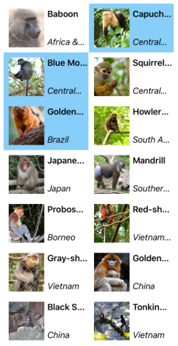

# CollectionView

[ Browse the sample](/samples/dotnet/maui-samples/userinterface-collectionview)

The .NET Multi-platform App UI (.NET MAUI) [[CollectionView|CollectionView]] is a view for presenting lists of data using different layout specifications. It aims to provide a more flexible, and performant alternative to [[ListView (Controls)|ListView]].

The following screenshot shows a [[CollectionView|CollectionView]] that uses a two-column vertical grid and allows multiple selections:



[[CollectionView|CollectionView]] should be used for presenting lists of data that require scrolling or selection. A bindable layout can be used when the data to be displayed doesn't require scrolling or selection. For more information, see [[bindablelayout|BindableLayout]].


> [!NOTE]
> On iOS and Mac Catalyst, the optimized handlers that were optional in .NET 9 are the default handlers for [[CollectionView|CollectionView]] in .NET 10, providing improved performance and stability.

## Revert to .NET 9 behavior

We recommend using the new handler for [[CollectionView|CollectionView]], but if you want to opt-out of this behavior and revert back to the .NET 9 handler, you can use the code below in your `MauiProgram.cs`.

```csharp
#if IOS || MACCATALYST
builder.ConfigureMauiHandlers(handlers =>
{
    handlers.AddHandler<Microsoft.Maui.Controls.CollectionView, Microsoft.Maui.Controls.Handlers.Items.CollectionViewHandler>();
});
#endif
```


## CollectionView and ListView differences

While the [[CollectionView|CollectionView]] and [[ListView (Controls)|ListView]] APIs are similar, there are some notable differences:

- [[CollectionView|CollectionView]] has a flexible layout model, which allows data to be presented vertically or horizontally, in a list or a grid.
- [[CollectionView|CollectionView]] supports single and multiple selection.
- [[CollectionView|CollectionView]] has no concept of cells. Instead, a data template is used to define the appearance of each item of data in the list.
- [[CollectionView|CollectionView]] automatically utilizes the virtualization provided by the underlying native controls.
- [[CollectionView|CollectionView]] reduces the API surface of [[ListView (Controls)|ListView]]. Many properties and events from [[ListView (Controls)|ListView]] are not present in [[CollectionView|CollectionView]].
- [[CollectionView|CollectionView]] does not include built-in separators.
- [[CollectionView|CollectionView]] will throw an exception if its `ItemsSource` is updated off the UI thread.

## Move from ListView to CollectionView

[[ListView (Controls)|ListView]] implementations can be migrated to [[CollectionView|CollectionView]] implementations with the help of the following table:

| Concept | ListView API | CollectionView |
|---|---|---|
| Data | `ItemsSource` | A [[CollectionView|CollectionView]] is populated with data by setting its `ItemsSource` property. For more information, see [[populate-data#populate-a-collectionview-with-data|Populate a CollectionView with data]]. |
| Item appearance | `ItemTemplate` | The appearance of each item in a [[CollectionView|CollectionView]] can be defined by setting the `ItemTemplate` property to a [[DataTemplate|DataTemplate]]. For more information, see [[populate-data#define-item-appearance|Define item appearance]]. |
| Cells | [[TextCell|TextCell]], [[ImageCell|ImageCell]], [[ViewCell (Controls)|ViewCell]] | [[CollectionView|CollectionView]] has no concept of cells, and therefore no concept of disclosure indicators. Instead, a data template is used to define the appearance of each item of data in the list. |
| Row separators | `SeparatorColor`, `SeparatorVisibility` | [[CollectionView|CollectionView]] does not include built-in separators. These can be provided, if desired, in the item template. |
| Selection | `SelectionMode`, `SelectedItem` | [[CollectionView|CollectionView]] supports single and multiple selection. For more information, see [[selection|Configure CollectionView item selection]]. |
| Row height | `HasUnevenRows`, `RowHeight` | In a [[CollectionView|CollectionView]], the row height of each item is determined by the `ItemSizingStrategy` property. For more information, see [[layout#item-sizing|Item sizing]].|
| Caching | `CachingStrategy` | [[CollectionView|CollectionView]] automatically uses the virtualization provided by the underlying native controls. |
| Headers and footers | `Header`, `HeaderElement`, `HeaderTemplate`, `Footer`, `FooterElement`, `FooterTemplate` | [[CollectionView|CollectionView]] can present a header and footer that scroll with the items in the list, via the `Header`, `Footer`, `HeaderTemplate`, and `FooterTemplate` properties. For more information, see [[layout#headers-and-footers|Headers and footers]]. |
| Grouping | `GroupDisplayBinding`, `GroupHeaderTemplate`, `GroupShortNameBinding`, `IsGroupingEnabled` | [[CollectionView|CollectionView]] displays correctly grouped data by setting its `IsGrouped` property to `true`. Group headers and group footers can be customized by setting the `GroupHeaderTemplate` and `GroupFooterTemplate` properties to  [[DataTemplate|DataTemplate]] objects. For more information, see [[grouping|Display grouped data in a CollectionView]]. |
| Pull to refresh | `IsPullToRefreshEnabled`, `IsRefreshing`, `RefreshAllowed`, `RefreshCommand`, `RefreshControlColor`, `BeginRefresh()`, `EndRefresh()` | Pull to refresh functionality is supported by setting a [[CollectionView|CollectionView]] as the child of a [[RefreshView (Controls)|RefreshView]]. For more information, see [[populate-data#pull-to-refresh|Pull to refresh]]. |
| Context menu items | `ContextActions` | Context menu items are supported by setting a [[SwipeView (Controls)|SwipeView]] as the root view in the [[DataTemplate|DataTemplate]] that defines the appearance of each item of data in the [[CollectionView|CollectionView]]. For more information, see [[populate-data#context-menus|Context menus]]. |
| Scrolling | `ScrollTo()` | [[CollectionView|CollectionView]] defines `ScrollTo` methods, which scroll items into view. For more information, see [[scrolling|Control scrolling in a CollectionView]]. |
