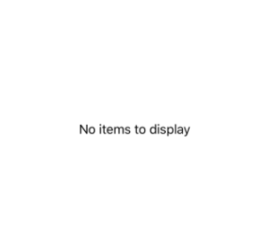
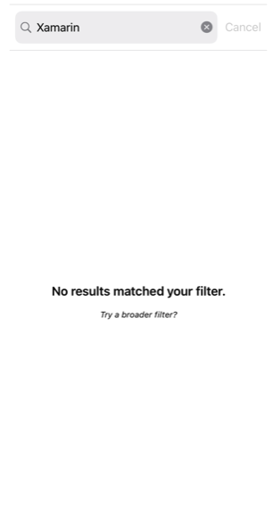
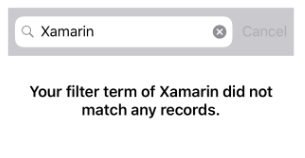
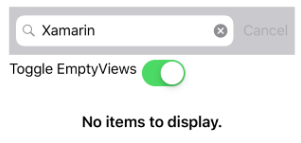
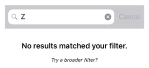

# Define an EmptyView for a CollectionView

[ Browse the sample](/samples/dotnet/maui-samples/userinterface-collectionview)

The .NET Multi-platform App UI (.NET MAUI) [[CollectionView|CollectionView]] defines the following properties that can be used to provide user feedback when there's no data to display:

- `EmptyView`, of type `object`, the string, binding, or view that will be displayed when the `ItemsSource` property is `null`, or when the collection specified by the `ItemsSource` property is `null` or empty. The default value is `null`.
- `EmptyViewTemplate`, of type [[DataTemplate|DataTemplate]], the template to use to format the specified `EmptyView`. The default value is `null`.

These properties are backed by [[BindableProperty|BindableProperty]] objects, which means that the properties can be targets of data bindings.

The main usage scenarios for setting the `EmptyView` property are displaying user feedback when a filtering operation on a [[CollectionView|CollectionView]] yields no data, and displaying user feedback while data is being retrieved from a web service.

> [!NOTE]
> The `EmptyView` property can be set to a view that includes interactive content if required.

For more information about data templates, see [[datatemplate|Data templates]].

## Display a string when data is unavailable

The `EmptyView` property can be set to a string, which will be displayed when the `ItemsSource` property is `null`, or when the collection specified by the `ItemsSource` property is `null` or empty. The following XAML shows an example of this scenario:

```xaml
<CollectionView ItemsSource="{Binding EmptyMonkeys}"
                EmptyView="No items to display" />
```

The equivalent C# code is:

```csharp
CollectionView collectionView = new CollectionView
{
    EmptyView = "No items to display"
};
collectionView.SetBinding(ItemsView.ItemsSourceProperty, static (MonkeysViewModel vm) => vm.EmptyMonkeys);
```

The result is that, because the data bound collection is `null`, the string set as the `EmptyView` property value is displayed:



## Display views when data is unavailable

The `EmptyView` property can be set to a view, which will be displayed when the `ItemsSource` property is `null`, or when the collection specified by the `ItemsSource` property is `null` or empty. This can be a single view, or a view that contains multiple child views. The following XAML example shows the `EmptyView` property set to a view that contains multiple child views:

```xaml
<Grid Margin="20" RowDefinitions="Auto,*">
    <SearchBar x:Name="searchBar"
               SearchCommand="{Binding FilterCommand}"
               SearchCommandParameter="{Binding x:DataType='SearchBar', Source={x:Reference searchBar}, Path=Text}"
               Placeholder="Filter" />
    <CollectionView ItemsSource="{Binding Monkeys}"
                    Grid.Row="1">
        <CollectionView.ItemTemplate>
            <DataTemplate x:DataType="models:Monkey">
                ...
            </DataTemplate>
        </CollectionView.ItemTemplate>
        <CollectionView.EmptyView>
            <ContentView>
                <StackLayout HorizontalOptions="Center"
                             VerticalOptions="Center">
                    <Label Text="No results matched your filter."
                           Margin="10,25,10,10"
                           FontAttributes="Bold"
                           FontSize="18"
                           HorizontalOptions="Fill"
                           HorizontalTextAlignment="Center" />
                    <Label Text="Try a broader filter?"
                           FontAttributes="Italic"
                           FontSize="12"
                           HorizontalOptions="Fill"
                           HorizontalTextAlignment="Center" />
                </StackLayout>
            </ContentView>
        </CollectionView.EmptyView>
    </CollectionView>
</Grid>
```

In this example, what looks like a redundant has been added as the root element of the `EmptyView`. This is because internally, the `EmptyView` is added to a native container that doesn't provide any context for .NET MAUI layout. Therefore, to position the views that comprise your `EmptyView`, you must add a root layout, whose child is a layout that can position itself within the root layout.

The equivalent C# code is:

```csharp
StackLayout stackLayout = new StackLayout();
stackLayout.Add(new Label { Text = "No results matched your filter.", ... } );
stackLayout.Add(new Label { Text = "Try a broader filter?", ... } );

SearchBar searchBar = new SearchBar { ... };
CollectionView collectionView = new CollectionView
{
    EmptyView = new ContentView
    {
        Content = stackLayout
    }
};
collectionView.SetBinding(ItemsView.ItemsSourceProperty, static (MonkeysViewModel vm) => vm.Monkeys);
```

When the [[SearchBar (Controls)|SearchBar]] executes the `FilterCommand`, the collection displayed by the [[CollectionView|CollectionView]] is filtered for the search term stored in the `SearchBar.Text` property. If the filtering operation yields no data, the [[StackLayout (Controls)|StackLayout]] set as the `EmptyView` property value is displayed:



## Display a templated custom type when data is unavailable

The `EmptyView` property can be set to a custom type, whose template is displayed when the `ItemsSource` property is `null`, or when the collection specified by the `ItemsSource` property is `null` or empty. The `EmptyViewTemplate` property can be set to a [[DataTemplate|DataTemplate]] that defines the appearance of the `EmptyView`. The following XAML shows an example of this scenario:

```xaml
<Grid Margin="20" RowDefinitions="Auto,*">
    <SearchBar x:Name="searchBar"
               SearchCommand="{Binding FilterCommand}"
               SearchCommandParameter="{Binding x:DataType='SearchBar', Source={x:Reference searchBar}, Path=Text}"
               Placeholder="Filter" />
    <CollectionView ItemsSource="{Binding Monkeys}"
                    Grid.Row="1">
        <CollectionView.ItemTemplate>
            <DataTemplate x:DataType="models:Monkey">
                ...
            </DataTemplate>
        </CollectionView.ItemTemplate>
        <CollectionView.EmptyView>
            <views:FilterData x:DataType="SearchBar"
                              Filter="{Binding Source={x:Reference searchBar}, Path=Text}" />
        </CollectionView.EmptyView>
        <CollectionView.EmptyViewTemplate>
            <DataTemplate>
                <Label x:DataType="controls:FilterData"
                       Text="{Binding Filter, StringFormat='Your filter term of {0} did not match any records.'}"
                       Margin="10,25,10,10"
                       FontAttributes="Bold"
                       FontSize="18"
                       HorizontalOptions="Fill"
                       HorizontalTextAlignment="Center" />
            </DataTemplate>
        </CollectionView.EmptyViewTemplate>
    </CollectionView>
</Grid>
```

The equivalent C# code is:

```csharp
SearchBar searchBar = new SearchBar { ... };
CollectionView collectionView = new CollectionView
{
    EmptyView = new FilterData { Filter = searchBar.Text },
    EmptyViewTemplate = new DataTemplate(() =>
    {
        return new Label { ... };
    })
};
```

The `FilterData` type defines a `Filter` property, and a corresponding [[BindableProperty|BindableProperty]]:

```csharp
public class FilterData : BindableObject
{
    public static readonly BindableProperty FilterProperty = BindableProperty.Create(nameof(Filter), typeof(string), typeof(FilterData), null);

    public string Filter
    {
        get { return (string)GetValue(FilterProperty); }
        set { SetValue(FilterProperty, value); }
    }
}
```

The `EmptyView` property is set to a `FilterData` object, and the `Filter` property data binds to the `SearchBar.Text` property. When the [[SearchBar (Controls)|SearchBar]] executes the `FilterCommand`, the collection displayed by the [[CollectionView|CollectionView]] is filtered for the search term stored in the `Filter` property. If the filtering operation yields no data, the [[Label (Controls)|Label]] defined in the [[DataTemplate|DataTemplate]], that's set as the `EmptyViewTemplate` property value, is displayed:



> [!NOTE]
> When displaying a templated custom type when data is unavailable, the `EmptyViewTemplate` property can be set to a view that contains multiple child views.

## Choose an EmptyView at runtime

Views that will be displayed as an `EmptyView` when data is unavailable, can be defined as [[ContentView (Controls)|ContentView]] objects in a [[ResourceDictionary|ResourceDictionary]]. The `EmptyView` property can then be set to a specific [[ContentView (Controls)|ContentView]], based on some business logic, at runtime. The following XAML shows an example of this scenario:

```xaml
<ContentPage xmlns="http://schemas.microsoft.com/dotnet/2021/maui"
             xmlns:x="http://schemas.microsoft.com/winfx/2009/xaml"
             xmlns:models="clr-namespace:CollectionViewDemos.Models"
             xmlns:viewmodels="clr-namespace:CollectionViewDemos.ViewModels"
             x:Class="CollectionViewDemos.Views.EmptyViewSwapPage"
             Title="EmptyView (swap)"
             x:DataType="viewmodels:MonkeysViewModel">
    <ContentPage.Resources>
        <ContentView x:Key="BasicEmptyView">
            <StackLayout>
                <Label Text="No items to display."
                       Margin="10,25,10,10"
                       FontAttributes="Bold"
                       FontSize="18"
                       HorizontalOptions="Fill"
                       HorizontalTextAlignment="Center" />
            </StackLayout>
        </ContentView>
        <ContentView x:Key="AdvancedEmptyView">
            <StackLayout>
                <Label Text="No results matched your filter."
                       Margin="10,25,10,10"
                       FontAttributes="Bold"
                       FontSize="18"
                       HorizontalOptions="Fill"
                       HorizontalTextAlignment="Center" />
                <Label Text="Try a broader filter?"
                       FontAttributes="Italic"
                       FontSize="12"
                       HorizontalOptions="Fill"
                       HorizontalTextAlignment="Center" />
            </StackLayout>
        </ContentView>
    </ContentPage.Resources>

    <Grid Margin="20" RowDefinitions="Auto, Auto, *">
        <SearchBar x:Name="searchBar"
                   SearchCommand="{Binding FilterCommand}"
                   SearchCommandParameter="{Binding x:DataType='SearchBar', Source={x:Reference searchBar}, Path=Text}"
                   Placeholder="Filter" />
        <HorizontalStackLayout Grid.Row="1">
            <Label Text="Toggle EmptyViews" />
            <Switch Toggled="OnEmptyViewSwitchToggled" />
        </HorizontalStackLayout>
        <CollectionView x:Name="collectionView"
                        ItemsSource="{Binding Monkeys}"
                        Grid.Row="2">
            <CollectionView.ItemTemplate>
                <DataTemplate x:DataType="models:Monkey">
                    ...
                </DataTemplate>
            </CollectionView.ItemTemplate>
        </CollectionView>
    </Grid>
</ContentPage>
```

This XAML defines two [[ContentView (Controls)|ContentView]] objects in the page-level [[ResourceDictionary|ResourceDictionary]], with the [[Switch (Controls)|Switch]] object controlling which [[ContentView (Controls)|ContentView]] object will be set as the `EmptyView` property value. When the [[Switch (Controls)|Switch]] is toggled, the `OnEmptyViewSwitchToggled` event handler executes the `ToggleEmptyView` method:

```csharp
void ToggleEmptyView(bool isToggled)
{
    collectionView.EmptyView = isToggled ? Resources["BasicEmptyView"] : Resources["AdvancedEmptyView"];
}
```

The `ToggleEmptyView` method sets the `EmptyView` property of the [[CollectionView|CollectionView]] object to one of the two [[ContentView (Controls)|ContentView]] objects stored in the [[ResourceDictionary|ResourceDictionary]], based on the value of the `Switch.IsToggled` property. When the [[SearchBar (Controls)|SearchBar]] executes the `FilterCommand`, the collection displayed by the [[CollectionView|CollectionView]] is filtered for the search term stored in the `SearchBar.Text` property. If the filtering operation yields no data, the [[ContentView (Controls)|ContentView]] object set as the `EmptyView` property is displayed:



For more information about resource dictionaries, see [[resource-dictionaries|Resource dictionaries]].

## Choose an EmptyViewTemplate at runtime

The appearance of the `EmptyView` can be chosen at runtime, based on its value, by setting the `CollectionView.EmptyViewTemplate` property to a [[DataTemplateSelector|DataTemplateSelector]] object:

```xaml
<ContentPage ...
             xmlns:controls="clr-namespace:CollectionViewDemos.Controls"
             xmlns:viewmodels="clr-namespace:CollectionViewDemos.ViewModels"
             x:DataType="viewmodels:MonkeysViewModel">
    <ContentPage.Resources>
        <DataTemplate x:Key="AdvancedTemplate">
            ...
        </DataTemplate>

        <DataTemplate x:Key="BasicTemplate">
            ...
        </DataTemplate>

        <controls:SearchTermDataTemplateSelector x:Key="SearchSelector"
                                                 DefaultTemplate="{StaticResource AdvancedTemplate}"
                                                 OtherTemplate="{StaticResource BasicTemplate}" />
    </ContentPage.Resources>

    <Grid Margin="20" RowDefinitions="Auto,*">
        <SearchBar x:Name="searchBar"
                   SearchCommand="{Binding FilterCommand}"
                   SearchCommandParameter="{Binding x:DataType='SearchBar', Source={x:Reference searchBar}, Path=Text}"
                   Placeholder="Filter" />
        <CollectionView ItemsSource="{Binding Monkeys}"
                        EmptyView="{Binding x:DataType='SearchBar', Source={x:Reference searchBar}, Path=Text}"
                        EmptyViewTemplate="{StaticResource SearchSelector}"
                        Grid.Row="1" />
    </Grid>
</ContentPage>
```

The equivalent C# code is:

```csharp
SearchBar searchBar = new SearchBar { ... };
CollectionView collectionView = new CollectionView
{
    EmptyView = searchBar.Text,
    EmptyViewTemplate = new SearchTermDataTemplateSelector { ... }
};
collectionView.SetBinding(ItemsView.ItemsSourceProperty, static (MonkeysViewModel vm) => vm.Monkeys);
```

The `EmptyView` property is set to the `SearchBar.Text` property, and the `EmptyViewTemplate` property is set to a `SearchTermDataTemplateSelector` object.

When the [[SearchBar (Controls)|SearchBar]] executes the `FilterCommand`, the collection displayed by the [[CollectionView|CollectionView]] is filtered for the search term stored in the `SearchBar.Text` property. If the filtering operation yields no data, the [[DataTemplate|DataTemplate]] chosen by the `SearchTermDataTemplateSelector` object is set as the `EmptyViewTemplate` property and displayed.

The following example shows the `SearchTermDataTemplateSelector` class:

```csharp
public class SearchTermDataTemplateSelector : DataTemplateSelector
{
    public DataTemplate DefaultTemplate { get; set; }
    public DataTemplate OtherTemplate { get; set; }

    protected override DataTemplate OnSelectTemplate(object item, BindableObject container)
    {
        string query = (string)item;
        return query.ToLower().Equals("xamarin") ? OtherTemplate : DefaultTemplate;
    }
}
```

The `SearchTermTemplateSelector` class defines `DefaultTemplate` and `OtherTemplate` [[DataTemplate|DataTemplate]] properties that are set to different data templates. The `OnSelectTemplate` override returns `DefaultTemplate`, which displays a message to the user, when the search query isn't equal to "xamarin". When the search query is equal to "xamarin", the `OnSelectTemplate` override returns `OtherTemplate`, which displays a basic message to the user:



For more information about data template selectors, see [[datatemplate#create-a-datatemplateselector|Create a DataTemplateSelector]].
