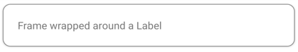
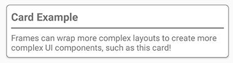

# Frame

The .NET Multi-platform App UI (.NET MAUI) [[Frame|Frame]] is used to wrap a view or layout with a border that can be configured with color, shadow, and other options. Frames can be used to create borders around controls but can also be used to create more complex UI.


> [!IMPORTANT]
> The [[Frame|Frame]] control is marked as obsolete in .NET MAUI 9, and will be completely removed in a future release. The [[Border|Border]] control should be used in its place. For more information, see [[border|Border]].


The [[Frame|Frame]] class defines the following properties:

- `BorderColor`, of type [[Color|Color]], determines the color of the [[Frame|Frame]] border.
- `CornerRadius`, of type `float`, determines the rounded radius of the corner.
- `HasShadow`, of type `bool`, determines whether the frame has a drop shadow.

These properties are backed by [[BindableProperty|BindableProperty]] objects, which means that they can be targets of data bindings, and styled.

The [[Frame|Frame]] class inherits from [[ContentView (Controls)|ContentView]], which provides a `Content` bindable property. The `Content` property is the [[ContentPropertyAttribute|`ContentProperty`]] of the [[Frame|Frame]] class, and therefore does not need to be explicitly set from XAML.

> [!NOTE]
> The [[Frame|Frame]] class existed in Xamarin.Forms and is present in .NET MAUI for users who are migrating their apps from Xamarin.Forms to .NET MAUI. If you're building a new .NET MAUI app it's recommended to use [[Border|Border]] instead, and to set shadows using the `Shadow` bindable property on [[VisualElement (Controls)|VisualElement]]. For more information, see [[border|Border]] and [[shadow|Shadow]].

## Create a Frame

A [[Frame|Frame]] object typically wraps another control, such as a [[Label (Controls)|Label]]:

```xaml
<Frame>
  <Label Text="Frame wrapped around a Label" />
</Frame>
```

The appearance of [[Frame|Frame]] objects can be customized by setting properties:

```xaml
<Frame BorderColor="Gray"
       CornerRadius="10">
  <Label Text="Frame wrapped around a Label" />
</Frame>
```

The equivalent C# code is:

```csharp
Frame frame = new Frame
{
    BorderColor = Colors.Gray,
    CornerRadius = 10,
    Content = new Label { Text = "Frame wrapped around a Label" }
};
```

The following screenshot shows the example [[Frame|Frame]]:



## Create a card with a Frame

Combining a [[Frame|Frame]] object with a layout such as a [[StackLayout (Controls)|StackLayout]] enables the creation of more complex UI.

The following XAML shows how to create a card with a [[Frame|Frame]]:

```xaml
<Frame BorderColor="Gray"
       CornerRadius="5"
       Padding="8">
  <StackLayout>
    <Label Text="Card Example"
           FontSize="14"
           FontAttributes="Bold" />
    <BoxView Color="Gray"
             HeightRequest="2"
             HorizontalOptions="Fill" />
    <Label Text="Frames can wrap more complex layouts to create more complex UI components, such as this card!"/>
  </StackLayout>
</Frame>
```

The following screenshot shows the example card:



## Round elements

The `CornerRadius` property of the [[Frame|Frame]] control is one approach to creating a circle image. The following XAML shows how to create a circle image with a [[Frame|Frame]]:

```xaml
<Frame Margin="10"
       BorderColor="Black"
       CornerRadius="50"
       HeightRequest="60"
       WidthRequest="60"
       IsClippedToBounds="True"
       HorizontalOptions="Center"
       VerticalOptions="Center">
  <Image Source="outdoors.jpg"
         Aspect="AspectFill"
         Margin="-20"
         HeightRequest="100"
         WidthRequest="100" />
</Frame>
```

The following screenshot shows the example circle image:


