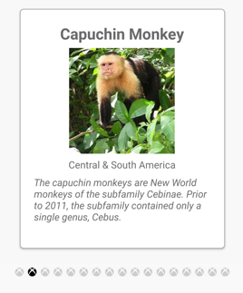
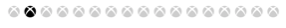

# IndicatorView

[ Browse the sample](/samples/dotnet/maui-samples/userinterface-indicatorview)

The .NET Multi-platform App UI (.NET MAUI) [[IndicatorView|IndicatorView]] is a control that displays indicators that represent the number of items, and current position, in a [[CarouselView|CarouselView]]:


[[IndicatorView|IndicatorView]] defines the following properties:

- `Count`, of type `int`, the number of indicators.
- `HideSingle`, of type `bool`, indicates whether the indicator should be hidden when only one exists. The default value is `true`.
- `IndicatorColor`, of type [[Color|Color]], the color of the indicators.
- `IndicatorSize`, of type `double`, the size of the indicators. The default value is 6.0.
- `IndicatorLayout`, of type `Layout<View>`, defines the layout class used to render the [[IndicatorView|IndicatorView]]. This property is set by .NET MAUI, and does not typically need to be set by developers.
- `IndicatorTemplate`, of type [[DataTemplate|DataTemplate]], the template that defines the appearance of each indicator.
- `IndicatorsShape`, of type `IndicatorShape`, the shape of each indicator.
- `ItemsSource`, of type `IEnumerable`, the collection that indicators will be displayed for. This property will automatically be set when the `CarouselView.IndicatorView` property is set.
- `MaximumVisible`, of type `int`, the maximum number of visible indicators. The default value is `int.MaxValue`.
- `Position`, of type `int`, the currently selected indicator index. This property uses a `TwoWay` binding. This property will automatically be set when the `CarouselView.IndicatorView` property is set.
- `SelectedIndicatorColor`, of type [[Color|Color]], the color of the indicator that represents the current item in the [[CarouselView|CarouselView]].

These properties are backed by [[BindableProperty|BindableProperty]] objects, which means that they can be targets of data bindings, and styled.

## Create an IndicatorView

To add indicators to a page, create an [[IndicatorView|IndicatorView]] object and set its `IndicatorColor` and `SelectedIndicatorColor` properties. In addition, set the `CarouselView.IndicatorView` property to the name of the [[IndicatorView|IndicatorView]] object.

The following example shows how to create an [[IndicatorView|IndicatorView]] in XAML:

```xaml
<Grid RowDefinitions="*,Auto">
    <CarouselView ItemsSource="{Binding Monkeys}"
                  IndicatorView="indicatorView">
        <CarouselView.ItemTemplate>
            <!-- DataTemplate that defines item appearance -->
        </CarouselView.ItemTemplate>
    </CarouselView>
    <IndicatorView x:Name="indicatorView"
                   Grid.Row="1"
                   IndicatorColor="LightGray"
                   SelectedIndicatorColor="DarkGray"
                   HorizontalOptions="Center" />
</Grid>
```

In this example, the [[IndicatorView|IndicatorView]] is rendered beneath the [[CarouselView|CarouselView]], with an indicator for each item in the [[CarouselView|CarouselView]]. The [[IndicatorView|IndicatorView]] is populated with data by setting the `CarouselView.IndicatorView` property to the [[IndicatorView|IndicatorView]] object. Each indicator is a light gray circle, while the indicator that represents the current item in the [[CarouselView|CarouselView]] is dark gray.

> [!IMPORTANT]
> Setting the `CarouselView.IndicatorView` property results in the `IndicatorView.Position` property binding to the `CarouselView.Position` property, and the `IndicatorView.ItemsSource` property binding to the `CarouselView.ItemsSource` property.

## Change indicator shape

The [[IndicatorView|IndicatorView]] class has an `IndicatorsShape` property, which determines the shape of the indicators. This property can be set to one of the `IndicatorShape` enumeration members:

- `Circle` specifies that the indicator shapes will be circular. This is the default value of the `IndicatorView.IndicatorsShape` property.
- `Square` indicates that the indicator shapes will be square.

The following example shows an [[IndicatorView|IndicatorView]] configured to use square indicators:

```xaml
<IndicatorView x:Name="indicatorView"
               IndicatorsShape="Square"
               IndicatorColor="LightGray"
               SelectedIndicatorColor="DarkGray" />
```

## Change indicator size

The [[IndicatorView|IndicatorView]] class has an `IndicatorSize` property, of type `double`, which determines the size of the indicators in device-independent units. The default value of this property is 6.0.

The following example shows an [[IndicatorView|IndicatorView]] configured to display larger indicators:

```xaml
<IndicatorView x:Name="indicatorView"
               IndicatorSize="18" />
```

## Limit the number of indicators displayed

The [[IndicatorView|IndicatorView]] class has a `MaximumVisible` property, of type `int`, which determines the maximum number of visible indicators.

The following example shows an [[IndicatorView|IndicatorView]] configured to display a maximum of six indicators:

```xaml
<IndicatorView x:Name="indicatorView"
               MaximumVisible="6" />
```

## Define indicator appearance

The appearance of each indicator can be defined by setting the `IndicatorView.IndicatorTemplate` property to a [[DataTemplate|DataTemplate]]:

```xaml
<Grid RowDefinitions="*,Auto">
    <CarouselView ItemsSource="{Binding Monkeys}"
                  IndicatorView="indicatorView">
        <CarouselView.ItemTemplate>
            <!-- DataTemplate that defines item appearance -->
        </CarouselView.ItemTemplate>
    </CarouselView>
    <IndicatorView x:Name="indicatorView"
                   Grid.Row="1"
                   Margin="0,0,0,40"
                   IndicatorColor="Transparent"
                   SelectedIndicatorColor="Transparent"
                   HorizontalOptions="Center">
        <IndicatorView.IndicatorTemplate>
            <DataTemplate>
                <Label Text="&#xf30c;"
                       FontFamily="ionicons"
                       FontSize="12" />
            </DataTemplate>
        </IndicatorView.IndicatorTemplate>
    </IndicatorView>
</Grid>
```

The elements specified in the [[DataTemplate|DataTemplate]] define the appearance of each indicator. In this example, each indicator is a [[Label (Controls)|Label]] that displays a font icon.

The following screenshot shows indicators rendered using a font icon:



## Set visual states

[[IndicatorView|IndicatorView]] has a `Selected` visual state that can be used to initiate a visual change to the indicator for the current position in the [[IndicatorView|IndicatorView]]. A common use case for this [[VisualState|VisualState]] is to change the color of the indicator that represents the current position:

```xaml
<ContentPage ...>
    <ContentPage.Resources>
        <Style x:Key="IndicatorLabelStyle"
               TargetType="Label">
            <Setter Property="VisualStateManager.VisualStateGroups">
                <VisualStateGroupList>
                    <VisualStateGroup x:Name="CommonStates">
                        <VisualState x:Name="Normal">
                            <VisualState.Setters>
                                <Setter Property="TextColor"
                                        Value="LightGray" />
                            </VisualState.Setters>
                        </VisualState>
                        <VisualState x:Name="Selected">
                            <VisualState.Setters>
                                <Setter Property="TextColor"
                                        Value="Black" />
                            </VisualState.Setters>
                        </VisualState>
                    </VisualStateGroup>
                </VisualStateGroupList>
            </Setter>
        </Style>
    </ContentPage.Resources>

    <Grid RowDefinitions="*,Auto">
        ...
        <IndicatorView x:Name="indicatorView"
                       Grid.Row="1"
                       Margin="0,0,0,40"
                       IndicatorColor="Transparent"
                       SelectedIndicatorColor="Transparent"
                       HorizontalOptions="Center">
            <IndicatorView.IndicatorTemplate>
                <DataTemplate>
                    <Label Text="&#xf30c;"
                           FontFamily="ionicons"
                           FontSize="12"
                           Style="{StaticResource IndicatorLabelStyle}" />
                </DataTemplate>
            </IndicatorView.IndicatorTemplate>
        </IndicatorView>
    </Grid>
</ContentPage>
```

In this example, the `Selected` visual state specifies that the indicator that represents the current position will have its `TextColor` set to black. Otherwise the `TextColor` of the indicator will be light gray:



For more information about visual states, see [[visual-states|Visual states]].
