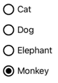
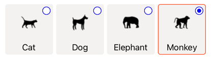
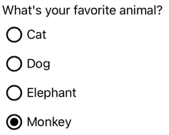
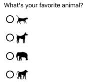
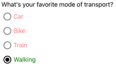
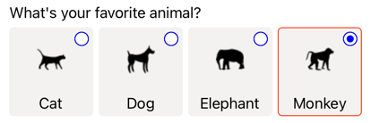

# RadioButton

[ Browse the sample](/samples/dotnet/maui-samples/userinterface-radiobutton)

The .NET Multi-platform App UI (.NET MAUI) [[RadioButton|RadioButton]] is a type of button that allows users to select one option from a set. Each option is represented by one radio button, and you can only select one radio button in a group. By default, each [[RadioButton|RadioButton]] displays text:



However, on some platforms a [[RadioButton|RadioButton]] can display a [[View|View]], and on all platforms the appearance of each [[RadioButton|RadioButton]] can be redefined with a [[ControlTemplate|ControlTemplate]]:



[[RadioButton|RadioButton]] defines the following properties:

- `Content`, of type `object`, which defines the `string` or [[View|View]] to be displayed by the [[RadioButton|RadioButton]].
- `IsChecked`, of type `bool`, which defines whether the [[RadioButton|RadioButton]] is checked. This property uses a `TwoWay` binding, and has a default value of `false`.
- `GroupName`, of type `string`, which defines the name that specifies which [[RadioButton|RadioButton]] controls are mutually exclusive. This property has a default value of `null`.
- `Value`, of type `object`, which defines an optional unique value associated with the [[RadioButton|RadioButton]].
- `BorderColor`, of type [[Color|Color]], which defines the border stroke color.
- `BorderWidth`, of type `double`, which defines the width of the [[RadioButton|RadioButton]] border.
- `CharacterSpacing`, of type `double`, which defines the spacing between characters of any displayed text.
- `CornerRadius`, of type `int`, which defines the corner radius of the [[RadioButton|RadioButton]].
- `FontAttributes`, of type `FontAttributes`, which determines text style.
- `FontAutoScalingEnabled`, of type `bool`, which defines whether an app's UI reflects text scaling preferences set in the operating system. The default value of this property is `true`.
- `FontFamily`, of type `string`, which defines the font family.
- `FontSize`, of type `double`, which defines the font size.
- `TextColor`, of type [[Color|Color]], which defines the color of any displayed text.
- `TextTransform`, of type `TextTransform`, which defines the casing of any displayed text.

These properties are backed by [[BindableProperty|BindableProperty]] objects, which means that they can be targets of data bindings, and styled.

[[RadioButton|RadioButton]] also defines a `CheckedChanged` event that's raised when the `IsChecked` property changes, either through user or programmatic manipulation. The `CheckedChangedEventArgs` object that accompanies the `CheckedChanged` event has a single property named `Value`, of type `bool`. When the event is raised, the value of the `CheckedChangedEventArgs.Value` property is set to the new value of the `IsChecked` property.

[[RadioButton|RadioButton]] grouping can be managed by the `RadioButtonGroup` class, which defines the following attached properties:

- `GroupName`, of type `string`, which defines the group name for [[RadioButton|RadioButton]] objects in an `ILayout`.
- `SelectedValue`, of type `object`, which represents the value of the checked [[RadioButton|RadioButton]] object within an `ILayout` group. This attached property uses a `TwoWay` binding by default.

> [!TIP]
> Although not mandatory, it's strongly recommended that you set the `GroupName` property to ensure that the `SelectedValue` property works correctly across all platforms.

For more information about the `GroupName` attached property, see [Group RadioButtons](#group-radiobuttons). For more information about the `SelectedValue` attached property, see [Respond to RadioButton state changes](#respond-to-radiobutton-state-changes).

## Create RadioButtons

The appearance of a [[RadioButton|RadioButton]] is defined by the type of data assigned to the `RadioButton.Content` property:

- When the `RadioButton.Content` property is assigned a `string`, it will be displayed on each platform, horizontally aligned next to the radio button circle.
- When the `RadioButton.Content` is assigned a [[View|View]], it will be displayed on supported platforms (iOS, Windows), while unsupported platforms will fallback to a string representation of the [[View|View]] object (Android). In both cases, the content is displayed horizontally aligned next to the radio button circle.
- When a [[ControlTemplate|ControlTemplate]] is applied to a [[RadioButton|RadioButton]], a [[View|View]] can be assigned to the `RadioButton.Content` property on all platforms. For more information, see [Redefine RadioButton appearance](#redefine-radiobutton-appearance).

### Display string-based content

A [[RadioButton|RadioButton]] displays text when the `Content` property is assigned a `string`:

```xaml
<StackLayout>
    <Label Text="What's your favorite animal?" />
    <RadioButton Content="Cat" />
    <RadioButton Content="Dog" />
    <RadioButton Content="Elephant" />
    <RadioButton Content="Monkey"
                 IsChecked="true" />
</StackLayout>
```

In this example, [[RadioButton|RadioButton]] objects are implicitly grouped inside the same parent container. This XAML results in the appearance shown in the following screenshot:



### Display arbitrary content

On iOS and Windows, a [[RadioButton|RadioButton]] can display arbitrary content when the `Content` property is assigned a [[View|View]]:

```xaml
<StackLayout>
    <Label Text="What's your favorite animal?" />
    <RadioButton>
        <RadioButton.Content>
            <Image Source="cat.png"
                   SemanticProperties.Description="Cat" />
        </RadioButton.Content>
    </RadioButton>
    <RadioButton>
        <RadioButton.Content>
            <Image Source="dog.png"
                   SemanticProperties.Description="Dog" />
        </RadioButton.Content>
    </RadioButton>
    <RadioButton>
        <RadioButton.Content>
            <Image Source="elephant.png"
                   SemanticProperties.Description="Elephant" />
        </RadioButton.Content>
    </RadioButton>
    <RadioButton>
        <RadioButton.Content>
            <Image Source="monkey.png"
                   SemanticProperties.Description="Monkey" />
        </RadioButton.Content>
    </RadioButton>
</StackLayout>
```

In this example, [[RadioButton|RadioButton]] objects are implicitly grouped inside the same parent container. This XAML results in the appearance shown in the following screenshot:



On Android, [[RadioButton|RadioButton]] objects will display a string-based representation of the [[View|View]] object that's been set as content.

> [!NOTE]
> When a [[ControlTemplate|ControlTemplate]] is applied to a [[RadioButton|RadioButton]], a [[View|View]] can be assigned to the `RadioButton.Content` property on all platforms. For more information, see [Redefine RadioButton appearance](#redefine-radiobutton-appearance).

## Associate values with RadioButtons

Each [[RadioButton|RadioButton]] object has a `Value` property, of type `object`, which defines an optional unique value to associate with the radio button. This enables the value of a [[RadioButton|RadioButton]] to be different to its content, and is particularly useful when [[RadioButton|RadioButton]] objects are displaying [[View|View]] objects.

The following XAML shows setting the `Content` and `Value` properties on each [[RadioButton|RadioButton]] object:

```xaml
<StackLayout>
    <Label Text="What's your favorite animal?" />
    <RadioButton Value="Cat">
        <RadioButton.Content>
            <Image Source="cat.png"
                   SemanticProperties.Description="Cat" />
        </RadioButton.Content>
    </RadioButton>
    <RadioButton Value="Dog">
        <RadioButton.Content>
            <Image Source="dog.png"
                   SemanticProperties.Description="Dog" />
        </RadioButton.Content>
    </RadioButton>
    <RadioButton Value="Elephant">
        <RadioButton.Content>
            <Image Source="elephant.png"
                   SemanticProperties.Description="Elephant" />
        </RadioButton.Content>
    </RadioButton>
    <RadioButton Value="Monkey">
        <RadioButton.Content>
            <Image Source="monkey.png"
                   SemanticProperties.Description="Monkey" />
        </RadioButton.Content>
    </RadioButton>
</StackLayout>
```

In this example, each [[RadioButton|RadioButton]] has an [[Image (Controls)|Image]] as its content, while also defining a string-based value. This enables the value of the checked radio button to be easily identified.

## Group RadioButtons

Radio buttons work in groups, and there are three approaches to grouping radio buttons:

- Place them inside the same parent container. This is known as *implicit* grouping.
- Set the `GroupName` property on each radio button in the group to the same value. This is known as *explicit* grouping.
- Set the `RadioButtonGroup.GroupName` attached property on a parent container, which in turn sets the `GroupName` property of any [[RadioButton|RadioButton]] objects in the container. This is also known as *explicit* grouping.

> [!IMPORTANT]
> [[RadioButton|RadioButton]] objects don't have to belong to the same parent to be grouped. They are mutually exclusive provided that they share a group name.

### Explicit grouping with the GroupName property

The following XAML example shows explicitly grouping [[RadioButton|RadioButton]] objects by setting their `GroupName` properties:

```xaml
<Label Text="What's your favorite color?" />
<RadioButton Content="Red"
             GroupName="colors" />
<RadioButton Content="Green"
             GroupName="colors" />
<RadioButton Content="Blue"
             GroupName="colors" />
<RadioButton Content="Other"
             GroupName="colors" />
```

In this example, each [[RadioButton|RadioButton]] is mutually exclusive because it shares the same `GroupName` value.

### Explicit grouping with the RadioButtonGroup.GroupName attached property

The `RadioButtonGroup` class defines a `GroupName` attached property, of type `string`, which can be set on a `Layout<View>` object. This enables any layout to be turned into a radio button group:

```xaml
<StackLayout RadioButtonGroup.GroupName="colors">
    <Label Text="What's your favorite color?" />
    <RadioButton Content="Red" />
    <RadioButton Content="Green" />
    <RadioButton Content="Blue" />
    <RadioButton Content="Other" />
</StackLayout>
```

In this example, each [[RadioButton|RadioButton]] in the [[StackLayout (Controls)|StackLayout]] will have its `GroupName` property set to `colors`, and will be mutually exclusive.

> [!NOTE]
> When an `ILayout` object that sets the `RadioButtonGroup.GroupName` attached property contains a [[RadioButton|RadioButton]] that sets its `GroupName` property, the value of the `RadioButton.GroupName` property will take precedence.

## Respond to RadioButton state changes

A radio button has two states: checked or unchecked. When a radio button is checked, its `IsChecked` property is `true`. When a radio button is unchecked, its `IsChecked` property is `false`. A radio button can be cleared by tapping another radio button in the same group, but it cannot be cleared by tapping it again. However, you can clear a radio button programmatically by setting its `IsChecked` property to `false`.

### Respond to an event firing

When the `IsChecked` property changes, either through user or programmatic manipulation, the `CheckedChanged` event fires. An event handler for this event can be registered to respond to the change:

```xaml
<RadioButton Content="Red"
             GroupName="colors"
             CheckedChanged="OnColorsRadioButtonCheckedChanged" />
```

The code-behind contains the handler for the `CheckedChanged` event:

```csharp
void OnColorsRadioButtonCheckedChanged(object sender, CheckedChangedEventArgs e)
{
    // Perform required operation
}
```

The `sender` argument is the [[RadioButton|RadioButton]] responsible for this event. You can use this to access the [[RadioButton|RadioButton]] object, or to distinguish between multiple [[RadioButton|RadioButton]] objects sharing the same `CheckedChanged` event handler.

### Respond to a property change

The `RadioButtonGroup` class defines a `SelectedValue` attached property, of type `object`, which can be set on an `ILayout` object. This attached property represents the value of the checked [[RadioButton|RadioButton]] within a group defined on a layout.

When the `IsChecked` property changes, either through user or programmatic manipulation, the `RadioButtonGroup.SelectedValue` attached property also changes. Therefore, the `RadioButtonGroup.SelectedValue` attached property can be data bound to a property that stores the user's selection:

```xaml
<ContentPage ...
             xmlns:local="clr-namespace:RadioButtonDemos"
             x:DataType="local:AnimalViewModel">
    <StackLayout Margin="10"
                 RadioButtonGroup.GroupName="{Binding GroupName}"
                 RadioButtonGroup.SelectedValue="{Binding Selection}">
        <Label Text="What's your favorite animal?" />
        <RadioButton Content="Cat"
                     Value="Cat" />
        <RadioButton Content="Dog"
                     Value="Dog" />
        <RadioButton Content="Elephant"
                     Value="Elephant" />
        <RadioButton Content="Monkey"
                     Value="Monkey"/>
        <Label x:Name="animalLabel">
            <Label.FormattedText>
                <FormattedString>
                    <Span Text="You have chosen:" />
                    <Span Text="{Binding Selection}" />
                </FormattedString>
            </Label.FormattedText>
        </Label>
    </StackLayout>
</ContentPage>
```

In this example, the value of the `RadioButtonGroup.GroupName` attached property is set by the `GroupName` property on the binding context. Similarly, the value of the `RadioButtonGroup.SelectedValue` attached property is set by the `Selection` property on the binding context. In addition, the `Selection` property is updated to the `Value` property of the checked [[RadioButton|RadioButton]].

## RadioButton visual states

[[RadioButton|RadioButton]] objects have `Checked` and `Unchecked` visual states that can be used to initiate a visual change when a [[RadioButton|RadioButton]] is checked or unchecked.

The following XAML example shows how to define a visual state for the `Checked` and `Unchecked` states:

```xaml
<ContentPage ...>
    <ContentPage.Resources>
        <Style TargetType="RadioButton">
            <Setter Property="VisualStateManager.VisualStateGroups">
                <VisualStateGroupList>
                    <VisualStateGroup x:Name="CheckedStates">
                        <VisualState x:Name="Checked">
                            <VisualState.Setters>
                                <Setter Property="TextColor"
                                        Value="Green" />
                                <Setter Property="Opacity"
                                        Value="1" />
                            </VisualState.Setters>
                        </VisualState>
                        <VisualState x:Name="Unchecked">
                            <VisualState.Setters>
                                <Setter Property="TextColor"
                                        Value="Red" />
                                <Setter Property="Opacity"
                                        Value="0.5" />
                            </VisualState.Setters>
                        </VisualState>
                    </VisualStateGroup>
                </VisualStateGroupList>
            </Setter>
        </Style>
    </ContentPage.Resources>
    <StackLayout>
        <Label Text="What's your favorite mode of transport?" />
        <RadioButton Content="Car" />
        <RadioButton Content="Bike" />
        <RadioButton Content="Train" />
        <RadioButton Content="Walking" />
    </StackLayout>
</ContentPage>
```

In this example, the implicit [[Style|Style]] targets [[RadioButton|RadioButton]] objects. The `Checked` [[VisualState|VisualState]] specifies that when a [[RadioButton|RadioButton]] is checked, its `TextColor` property will be set to green with an `Opacity` value of 1. The `Unchecked` [[VisualState|VisualState]] specifies that when a [[RadioButton|RadioButton]] is in a unchecked state, its `TextColor` property will be set to red with an `Opacity` value of 0.5. Therefore, the overall effect is that when a [[RadioButton|RadioButton]] is unchecked it's red and partially transparent, and is green without transparency when it's checked:



For more information about visual states, see [[visual-states|Visual states]].

## Redefine RadioButton appearance

By default, [[RadioButton|RadioButton]] objects use handlers to utilize native controls on supported platforms. However, [[RadioButton|RadioButton]] visual structure can be redefined with a [[ControlTemplate|ControlTemplate]], so that [[RadioButton|RadioButton]] objects have an identical appearance on all platforms. This is possible because the [[RadioButton|RadioButton]] class inherits from the `TemplatedView` class.

The following XAML shows a [[ControlTemplate|ControlTemplate]] that can be used to redefine the visual structure of [[RadioButton|RadioButton]] objects:

```xaml
<ContentPage ...>
    <ContentPage.Resources>
        <ControlTemplate x:Key="RadioButtonTemplate">
            <Border Stroke="#F3F2F1"
                    StrokeThickness="2"
                    StrokeShape="RoundRectangle 10"
                    BackgroundColor="#F3F2F1"
                    HeightRequest="90"
                    WidthRequest="90"
                    HorizontalOptions="Start"
                    VerticalOptions="Start">
                <VisualStateManager.VisualStateGroups>
                    <VisualStateGroupList>
                        <VisualStateGroup x:Name="CheckedStates">
                            <VisualState x:Name="Checked">
                                <VisualState.Setters>
                                    <Setter Property="Stroke"
                                            Value="#FF3300" />
                                    <Setter TargetName="check"
                                            Property="Opacity"
                                            Value="1" />
                                </VisualState.Setters>
                            </VisualState>
                            <VisualState x:Name="Unchecked">
                                <VisualState.Setters>
                                    <Setter Property="BackgroundColor"
                                            Value="#F3F2F1" />
                                    <Setter Property="Stroke"
                                            Value="#F3F2F1" />
                                    <Setter TargetName="check"
                                            Property="Opacity"
                                            Value="0" />
                                </VisualState.Setters>
                            </VisualState>
                        </VisualStateGroup>
                    </VisualStateGroupList>
                </VisualStateManager.VisualStateGroups>
                <Grid Margin="4"
                      WidthRequest="90">
                    <Grid Margin="0,0,4,0"
                          WidthRequest="18"
                          HeightRequest="18"
                          HorizontalOptions="End"
                          VerticalOptions="Start">
                        <Ellipse Stroke="Blue"
                                 Fill="White"
                                 WidthRequest="16"
                                 HeightRequest="16"
                                 HorizontalOptions="Center"
                                 VerticalOptions="Center" />
                        <Ellipse x:Name="check"
                                 Fill="Blue"
                                 WidthRequest="8"
                                 HeightRequest="8"
                                 HorizontalOptions="Center"
                                 VerticalOptions="Center" />
                    </Grid>
                    <ContentPresenter />
                </Grid>
            </Border>
        </ControlTemplate>

        <Style TargetType="RadioButton">
            <Setter Property="ControlTemplate"
                    Value="{StaticResource RadioButtonTemplate}" />
        </Style>
    </ContentPage.Resources>
    <!-- Page content -->
</ContentPage>
```

In this example, the root element of the [[ControlTemplate|ControlTemplate]] is a [[Border|Border]] object that defines `Checked` and `Unchecked` visual states. The [[Border|Border]] object uses a combination of [[Grid (Controls)|Grid]], [[Ellipse|Ellipse]], and [[ContentPresenter|ContentPresenter]] objects to define the visual structure of a [[RadioButton|RadioButton]]. The example also includes an *implicit* style that will assign the `RadioButtonTemplate` to the [[ControlTemplate|ControlTemplate]] property of any [[RadioButton|RadioButton]] objects on the page.

> [!NOTE]
> The [[ContentPresenter|ContentPresenter]] object marks the location in the visual structure where [[RadioButton|RadioButton]] content will be displayed.

The following XAML shows [[RadioButton|RadioButton]] objects that consume the [[ControlTemplate|ControlTemplate]] via the *implicit* style:

```xaml
<StackLayout>
    <Label Text="What's your favorite animal?" />
    <StackLayout RadioButtonGroup.GroupName="animals"
                 Orientation="Horizontal">
        <RadioButton Value="Cat">
            <RadioButton.Content>
                <StackLayout>
                    <Image Source="cat.png"
                           HorizontalOptions="Center"
                           VerticalOptions="Center" />
                    <Label Text="Cat"
                           HorizontalOptions="Center"
                           VerticalOptions="End" />
                </StackLayout>
            </RadioButton.Content>
        </RadioButton>
        <RadioButton Value="Dog">
            <RadioButton.Content>
                <StackLayout>
                    <Image Source="dog.png"
                           HorizontalOptions="Center"
                           VerticalOptions="Center" />
                    <Label Text="Dog"
                           HorizontalOptions="Center"
                           VerticalOptions="End" />
                </StackLayout>
            </RadioButton.Content>
        </RadioButton>
        <RadioButton Value="Elephant">
            <RadioButton.Content>
                <StackLayout>
                    <Image Source="elephant.png"
                           HorizontalOptions="Center"
                           VerticalOptions="Center" />
                    <Label Text="Elephant"
                           HorizontalOptions="Center"
                           VerticalOptions="End" />
                </StackLayout>
            </RadioButton.Content>
        </RadioButton>
        <RadioButton Value="Monkey">
            <RadioButton.Content>
                <StackLayout>
                    <Image Source="monkey.png"
                           HorizontalOptions="Center"
                           VerticalOptions="Center" />
                    <Label Text="Monkey"
                           HorizontalOptions="Center"
                           VerticalOptions="End" />
                </StackLayout>
            </RadioButton.Content>
        </RadioButton>
    </StackLayout>
</StackLayout>
```

In this example, the visual structure defined for each [[RadioButton|RadioButton]] is replaced with the visual structure defined in the [[ControlTemplate|ControlTemplate]], and so at runtime the objects in the [[ControlTemplate|ControlTemplate]] become part of the visual tree for each [[RadioButton|RadioButton]]. In addition, the content for each [[RadioButton|RadioButton]] is substituted into the [[ContentPresenter|ContentPresenter]] defined in the control template. This results in the following [[RadioButton|RadioButton]] appearance:



For more information about control templates, see [[controltemplate|Control templates]].

## Disable a RadioButton

Sometimes an app enters a state where a [[RadioButton|RadioButton]] being checked is not a valid operation. In such cases, the [[RadioButton|RadioButton]] can be disabled by setting its `IsEnabled` property to `false`.
