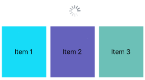
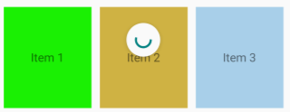

# RefreshView

[ Browse the sample](/samples/dotnet/maui-samples/userinterface-refreshview)

The .NET Multi-platform App UI (.NET MAUI) [[RefreshView (Controls)|RefreshView]] is a container control that provides pull to refresh functionality for scrollable content. Therefore, the child of a [[RefreshView (Controls)|RefreshView]] must be a scrollable control, such as [[ScrollView (Controls)|ScrollView]], [[CollectionView|CollectionView]], or [[ListView (Controls)|ListView]].

[[RefreshView (Controls)|RefreshView]] defines the following properties:

- `Command`, of type `ICommand`, which is executed when a refresh is triggered.
- `CommandParameter`, of type `object`, which is the parameter that's passed to the `Command`.
- `IsRefreshing`, of type `bool`, which indicates the current state of the [[RefreshView (Controls)|RefreshView]].
- `RefreshColor`, of type [[Color|Color]], the color of the progress circle that appears during the refresh.

These properties are backed by [[BindableProperty|BindableProperty]] objects, which means that they can be targets of data bindings, and styled.

> [!NOTE]
> On Windows, the pull direction of a [[RefreshView (Controls)|RefreshView]] can be set with a platform-specific. For more information, see [[refreshview-pulldirection|RefreshView pull direction on Windows]].

## Create a RefreshView

To add a [[RefreshView (Controls)|RefreshView]] to a page, create a [[RefreshView (Controls)|RefreshView]] object and set its `IsRefreshing` and `Command` properties. Then set its child to a scrollable control.

The following example shows how to instantiate a [[RefreshView (Controls)|RefreshView]] in XAML:

```xaml
<ContentPage ...
             xmlns:local="clr-namespace:RefreshViewDemo"
             x:DataType="local:MainPageViewModel">
    <ContentPage.BindingContext>
        <local:MainPageViewModel />
    </ContentPage.BindingContext>             
    <RefreshView IsRefreshing="{Binding IsRefreshing}"
                 Command="{Binding RefreshCommand}">
        <ScrollView>
            <FlexLayout Direction="Row"
                        Wrap="Wrap"
                        AlignItems="Center"
                        AlignContent="Center"
                        BindableLayout.ItemsSource="{Binding Items}"
                        BindableLayout.ItemTemplate="{StaticResource ColorItemTemplate}" />
        </ScrollView>
    </RefreshView>
</ContentPage>
```

A [[RefreshView (Controls)|RefreshView]] can also be created in code:

```csharp
RefreshView refreshView = new RefreshView();
ICommand refreshCommand = new Command(() =>
{
    // IsRefreshing is true
    // Refresh data here
    refreshView.IsRefreshing = false;
});
refreshView.Command = refreshCommand;

ScrollView scrollView = new ScrollView();
FlexLayout flexLayout = new FlexLayout { ... };
scrollView.Content = flexLayout;
refreshView.Content = scrollView;
```

In this example, the [[RefreshView (Controls)|RefreshView]] provides pull to refresh functionality to a [[ScrollView (Controls)|ScrollView]] whose child is a [[FlexLayout (Controls)|FlexLayout]]. The [[FlexLayout (Controls)|FlexLayout]] uses a bindable layout to generate its content by binding to a collection of items, and sets the appearance of each item with a [[DataTemplate|DataTemplate]]. For more information about bindable layouts, see [[bindablelayout|Bindable layout]].

The value of the `RefreshView.IsRefreshing` property indicates the current state of the [[RefreshView (Controls)|RefreshView]]. When a refresh is triggered by the user, this property will automatically transition to `true`. Once the refresh completes, you should reset the property to `false`.

When the user initiates a refresh, the `ICommand` defined by the `Command` property is executed, which should refresh the items being displayed. A refresh visualization is shown while the refresh occurs, which consists of an animated progress circle. The following screenshot shows the progress circle on iOS:



> [!NOTE]
> Manually setting the `IsRefreshing` property to `true` will trigger the refresh visualization, and will execute the `ICommand` defined by the `Command` property.

## RefreshView appearance

In addition to the properties that [[RefreshView (Controls)|RefreshView]] inherits from the [[VisualElement (Controls)|VisualElement]] class, [[RefreshView (Controls)|RefreshView]] also defines the `RefreshColor` property. This property can be set to define the color of the progress circle that appears during the refresh:

```xaml
<RefreshView RefreshColor="Teal"
             ... />
```

The following Android screenshot shows a [[RefreshView (Controls)|RefreshView]] with the `RefreshColor` property:



In addition, the `BackgroundColor` property can be set to a [[Color|Color]] that represents the background color of the progress circle.

> [!NOTE]
> On iOS, the `BackgroundColor` property sets the background color of the `UIView` that contains the progress circle.

## Disable a RefreshView

An app may enter a state where pull to refresh is not a valid operation. In such cases, the [[RefreshView (Controls)|RefreshView]] can be disabled by setting its `IsEnabled` property to `false`. This will prevent users from being able to trigger pull to refresh.

Alternatively, when defining the `Command` property, the `CanExecute` delegate of the `ICommand` can be specified to enable or disable the command.
