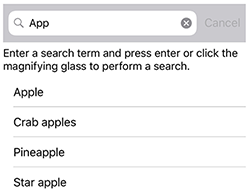

# SearchBar

The .NET Multi-platform App UI (.NET MAUI) [[SearchBar (Controls)|SearchBar]] is a user input control used to initiating a search. The [[SearchBar (Controls)|SearchBar]] control supports placeholder text, query input, search execution, and cancellation. The following iOS screenshot shows a [[SearchBar (Controls)|SearchBar]] query with results displayed in a [[ListView (Controls)|ListView]]:



[[SearchBar (Controls)|SearchBar]] defines the following properties:


- `CancelButtonColor` is a [[Color|Color]] that defines the color of the cancel button.
- `HorizontalTextAlignment` is a [[TextAlignment|TextAlignment]] enum value that defines the horizontal alignment of the query text.
- `SearchCommand` is an `ICommand` that allows binding user actions, such as finger taps or clicks, to commands defined on a viewmodel.
- `SearchCommandParameter` is an `object` that specifies the parameter that should be passed to the `SearchCommand`.
- `VerticalTextAlignment` is a [[TextAlignment|TextAlignment]] enum value that defines the vertical alignment of the query text.


- `CancelButtonColor` is a [[Color|Color]] that defines the color of the cancel button.
- `HorizontalTextAlignment` is a [[TextAlignment|TextAlignment]] enum value that defines the horizontal alignment of the query text.
- `ReturnType`, of type [[ReturnType|ReturnType]], specifies the appearance of the return button. The default value of this property is `Search`.
- `SearchCommand` is an `ICommand` that allows binding user actions, such as finger taps or clicks, to commands defined on a viewmodel.
- `SearchCommandParameter` is an `object` that specifies the parameter that should be passed to the `SearchCommand`.
- `SearchIconColor` is a [[Color|Color]] that defines the color of the search icon.
- `VerticalTextAlignment` is a [[TextAlignment|TextAlignment]] enum value that defines the vertical alignment of the query text.


These properties are backed by [[BindableProperty|BindableProperty]] objects, which means that they can be targets of data bindings, and styled.

In addition, [[SearchBar (Controls)|SearchBar]] defines a `SearchButtonPressed` event, which is raised when the search button is clicked, or the enter key is pressed.

[[SearchBar (Controls)|SearchBar]] derives from the [[InputView (Controls)|InputView]] class, from which it inherits the following properties:

- `CharacterSpacing`, of type `double`, sets the spacing between characters in the text content, including both the user-entered or displayed text and the placeholder text.
- `CursorPosition`, of type `int`, defines the position of the cursor within the editor.
- `FontAttributes`, of type `FontAttributes`, determines text style.
- `FontAutoScalingEnabled`, of type `bool`, defines whether the text will reflect scaling preferences set in the operating system. The default value of this property is `true`.
- `FontFamily`, of type `string`, defines the font family.
- `FontSize`, of type `double`, defines the font size.
- `IsReadOnly`, of type `bool`, defines whether the user should be prevented from modifying text. The default value of this property is `false`.
- `IsSpellCheckEnabled`, of type `bool`, controls whether spell checking is enabled.
- `IsTextPredictionEnabled`, of type `bool`, controls whether text prediction and automatic text correction is enabled.
- `Keyboard`, of type `Keyboard`, specifies the soft input keyboard that's displayed when entering text.
- `MaxLength`, of type `int`, defines the maximum input length.
- `Placeholder`, of type `string`, defines the text that's displayed when the control is empty.
- `PlaceholderColor`, of type [[Color|Color]], defines the color of the placeholder text.
- `SelectionLength`, of type `int`, represents the length of selected text within the control.
- `Text`, of type `string`, defines the text entered into the control.
- `TextColor`, of type [[Color|Color]], defines the color of the entered text.
- `TextTransform`, of type `TextTransform`, specifies the casing of the entered text.

These properties are backed by [[BindableProperty|BindableProperty]] objects, which means that they can be targets of data bindings, and styled.

In addition, [[InputView (Controls)|InputView]] defines a `TextChanged` event, which is raised when the text in the [[Entry (Controls)|Entry]] changes. The `TextChangedEventArgs` object that accompanies the `TextChanged` event has `NewTextValue` and `OldTextValue` properties, which specify the new and old text, respectively.

## Create a SearchBar

To create a search bar, create a [[SearchBar (Controls)|SearchBar]] object and set its `Placeholder` property to text that instructs the user to enter a search term.

The following XAML example shows how to create a [[SearchBar (Controls)|SearchBar]]:

```xaml
<SearchBar Placeholder="Search items..." />
```

The equivalent C# code is:

```csharp
SearchBar searchBar = new SearchBar { Placeholder = "Search items..." };
```

![[keyboardautomanagerscroll]]

## Perform a search with event handlers

A search can be executed using the [[SearchBar (Controls)|SearchBar]] control by attaching an event handler to one of the following events:

- `SearchButtonPressed`, which is called when the user either clicks the search button or presses the enter key.
- `TextChanged`, which is called anytime the text in the query box is changed. This event is inherited from the [[InputView (Controls)|InputView]] class.

The following XAML example shows an event handler attached to the `TextChanged` event and uses a [[ListView (Controls)|ListView]] to display search results:

```xaml
<SearchBar TextChanged="OnTextChanged" />
<ListView x:Name="searchResults" >
```

In this example, the `TextChanged` event is set to an event handler named `OnTextChanged`. This handler is located in the code-behind file:

```csharp
void OnTextChanged(object sender, EventArgs e)
{
    SearchBar searchBar = (SearchBar)sender;
    searchResults.ItemsSource = DataService.GetSearchResults(searchBar.Text);
}
```

In this example, a `DataService` class with a `GetSearchResults` method is used to returnitems that match a query. The [[SearchBar (Controls)|SearchBar]] control's `Text` property value is passed to the `GetSearchResults` method and the result is used to update the [[ListView (Controls)|ListView]] control's `ItemsSource` property. The overall effect is that search results are displayed in the [[ListView (Controls)|ListView]].

## Perform a search using a viewmodel

A search can be executed without event handlers by binding the `SearchCommand` property to an `ICommand` implementation. For more information about commanding, see [[commanding|Commanding]].

The following example shows a viewmodel class that contains an `ICommand` property named `PerformSearch`:

```csharp
public class SearchViewModel : INotifyPropertyChanged
{
    public event PropertyChangedEventHandler PropertyChanged;

    protected virtual void NotifyPropertyChanged([CallerMemberName] string propertyName = "")
    {
        PropertyChanged?.Invoke(this, new PropertyChangedEventArgs(propertyName));
    }

    public ICommand PerformSearch => new Command<string>((string query) =>
    {
        SearchResults = DataService.GetSearchResults(query);
    });

    private List<string> searchResults = DataService.Fruits;
    public List<string> SearchResults
    {
        get
        {
            return searchResults;
        }
        set
        {
            searchResults = value;
            NotifyPropertyChanged();
        }
    }
}
```

> [!NOTE]
> The viewmodel assumes the existence of a `DataService` class capable of performing searches.

The following XAML example consumes the `SearchViewModel` class:

```xaml
<ContentPage ...
             xmlns:viewmodels="clr-namespace:SearchBarDemos.ViewModels"
             x:DataType="viewmodels:SearchViewModel">
    <ContentPage.BindingContext>
        <viewmodels:SearchViewModel />
    </ContentPage.BindingContext>
    <StackLayout>
        <SearchBar x:Name="searchBar"
                   SearchCommand="{Binding PerformSearch}"
                   SearchCommandParameter="{Binding Text, x:DataType='SearchBar', Source={x:Reference searchBar}}"/>
        <ListView x:Name="searchResults"
                  ItemsSource="{Binding SearchResults}" />
    </StackLayout>
</ContentPage>
```

In this example, the `BindingContext` is set to an instance of the `SearchViewModel` class. The `SearchBar.SearchCommand` property binds to `PerformSearch` viewmodel property, and the `SearchCommandParameter` property binds to the `SearchBar.Text` property. Similarly, the `ListView.ItemsSource` property is bound to the `SearchResults` property of the viewmodel.

<!--
> [!NOTE]
> On iOS, the `SearchBarRenderer` class contains an overridable `UpdateCancelButton` method. This method controls when the cancel button appears, and can be overridden in a custom renderer.
 -->

![[soft-input-extensions]]

The following example shows how to hide the soft input keyboard on a [[SearchBar (Controls)|SearchBar]] named `searchBar`, if it's currently showing:

```csharp
if (searchBar.IsSoftInputShowing())
   await searchBar.HideSoftInputAsync(System.Threading.CancellationToken.None);
```
