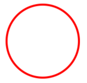

# Ellipse

[ Browse the sample](/samples/dotnet/maui-samples/userinterface-shapes)

The .NET Multi-platform App UI (.NET MAUI) [[Ellipse|Ellipse]] class derives from the [[Shape|Shape]] class, and can be used to draw ellipses and circles. For information on the properties that the [[Ellipse|Ellipse]] class inherits from the [[Shape|Shape]] class, see [[shapes|Shapes]].

The [[Ellipse|Ellipse]] class sets the [[Shape.Aspect|Aspect]] property, inherited from the [[Shape|Shape]] class, to `Stretch.Fill`. For more information about the [[Shape.Aspect|Aspect]] property, see [[index#stretch-shapes|Stretch shapes]].

## Create an Ellipse

To draw an ellipse, create an [[Ellipse|Ellipse]] object and set its [[VisualElement (Controls).WidthRequest|WidthRequest]] and [[VisualElement (Controls).HeightRequest|HeightRequest]] properties. To paint the inside of the ellipse, set its [[Shape.Fill|Fill]] property to a [[Brush|Brush]]-derived object. To give the ellipse an outline, set its [[Shape.Stroke|Stroke]] property to a [[Brush|Brush]]-derived object. The [[Shape.StrokeThickness|StrokeThickness]] property specifies the thickness of the ellipse outline. For more information about [[Brush|Brush]] objects, see [[brushes|Brushes]].

To draw a circle, make the [[VisualElement (Controls).WidthRequest|WidthRequest]] and [[VisualElement (Controls).HeightRequest|HeightRequest]] properties of the [[Ellipse|Ellipse]] object equal.

The following XAML example shows how to draw a filled ellipse:

```xaml
<Ellipse Fill="Red"
         WidthRequest="150"
         HeightRequest="50"
         HorizontalOptions="Start" />
```

In this example, a red filled ellipse with dimensions 150x50 (device-independent units) is drawn:


The following XAML example shows how to draw a circle:

```xaml
<Ellipse Stroke="Red"
         StrokeThickness="4"
         WidthRequest="150"
         HeightRequest="150"
         HorizontalOptions="Start" />
```

In this example, a red circle with dimensions 150x150 (device-independent units) is drawn:



For information about drawing a dashed ellipse, see [[index#draw-dashed-shapes|Draw dashed shapes]].
