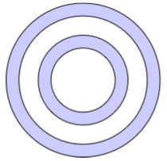
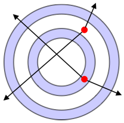
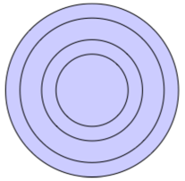
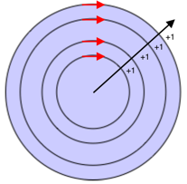
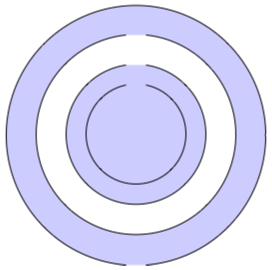
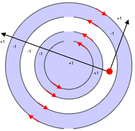

# Fill rules

[ Browse the sample](/samples/dotnet/maui-samples/userinterface-shapes)

Several .NET Multi-platform App UI (.NET MAUI) Shapes classes have `FillRule` properties, of type [[FillRule|FillRule]]. These include [[Polygon (Shapes)|Polygon]], [[Polyline (Shapes)|Polyline]], and [[GeometryGroup|GeometryGroup]].

The [[FillRule|FillRule]] enumeration defines [[FillRule.EvenOdd|EvenOdd]] and [[FillRule.Nonzero|Nonzero]] members. Each member represents a different rule for determining whether a point is in the fill region of a shape.

> [!IMPORTANT]
> All shapes are considered closed for the purposes of fill rules.

## EvenOdd

The [[FillRule.EvenOdd|EvenOdd]] fill rule draws a ray from the point to infinity in any direction and counts the number of segments within the shape that the ray crosses. If this number is odd, the point is inside. If this number is even, the point is outside.

The following XAML example creates and renders a composite shape, with the `FillRule` defaulting to [[FillRule.EvenOdd|EvenOdd]]:

```xaml
<Path Stroke="Black"
      Fill="#CCCCFF"
      Aspect="Uniform"
      HorizontalOptions="Start">
    <Path.Data>
        <!-- FillRule doesn't need to be set, because EvenOdd is the default. -->
        <GeometryGroup>
            <EllipseGeometry RadiusX="50"
                             RadiusY="50"
                             Center="75,75" />
            <EllipseGeometry RadiusX="70"
                             RadiusY="70"
                             Center="75,75" />
            <EllipseGeometry RadiusX="100"
                             RadiusY="100"
                             Center="75,75" />
            <EllipseGeometry RadiusX="120"
                             RadiusY="120"
                             Center="75,75" />
        </GeometryGroup>
    </Path.Data>
</Path>
```

In this example, a composite shape made up of a series of concentric rings is displayed:



In the composite shape, notice that the center and third rings are not filled. This is because a ray drawn from any point within either of those two rings passes through an even number of segments:



In the image above, the red circles represent points, and the lines represent arbitrary rays. For the upper point, the two arbitrary rays each pass through an even number of line segments. Therefore, the ring the point is in isn't filled. For the lower point, the two arbitrary rays each pass through an odd number of line segments. Therefore, the ring the point is in is filled.

## Nonzero

The [[FillRule.Nonzero|Nonzero]] fill rule draws a ray from the point to infinity in any direction and then examines the places where a segment of the shape crosses the ray. Starting with a count of zero, the count is incremented each time a segment crosses the ray from left to right and decremented each time a segment crosses the ray from right to left. After counting the crossings, if the result is zero then the point is outside the polygon. Otherwise, it's inside.

The following XAML example creates and renders a composite shape, with the `FillRule` set to [[FillRule.Nonzero|Nonzero]]:

```xaml
<Path Stroke="Black"
      Fill="#CCCCFF"
      Aspect="Uniform"
      HorizontalOptions="Start">
    <Path.Data>
        <GeometryGroup FillRule="Nonzero">
            <EllipseGeometry RadiusX="50"
                             RadiusY="50"
                             Center="75,75" />
            <EllipseGeometry RadiusX="70"
                             RadiusY="70"
                             Center="75,75" />
            <EllipseGeometry RadiusX="100"
                             RadiusY="100"
                             Center="75,75" />
            <EllipseGeometry RadiusX="120"
                             RadiusY="120"
                             Center="75,75" />
        </GeometryGroup>
    </Path.Data>
</Path>
```

In this example, a composite shape made up of a series of concentric rings is displayed:



In the composite shape, notice that all rings are filled. This is because all the segments are running in the same direction, and so a ray drawn from any point will cross one or more segments and the sum of the crossings will not equal zero:



In the image above the red arrows represent the direction the segments are drawn, and black arrow represents an arbitrary ray running from a point in the innermost ring. Starting with a value of zero, for each segment that the ray crosses, a value of one is added because the segment crosses the ray from left to right.

A more complex shape with segments running in different directions is required to better demonstrate the behavior of the [[FillRule.Nonzero|Nonzero]] fill rule. The following XAML example creates a similar shape to the previous example, except that it's created with a [[PathGeometry|PathGeometry]] rather than an [[EllipseGeometry|EllipseGeometry]]:

```xaml
<Path Stroke="Black"
      Fill="#CCCCFF">
     <Path.Data>
         <GeometryGroup FillRule="Nonzero">
             <PathGeometry>
                 <PathGeometry.Figures>
                     <!-- Inner ring -->
                     <PathFigure StartPoint="120,120">
                         <PathFigure.Segments>
                             <PathSegmentCollection>
                                 <ArcSegment Size="50,50"
                                             IsLargeArc="True"
                                             SweepDirection="CounterClockwise"
                                             Point="140,120" />
                             </PathSegmentCollection>
                         </PathFigure.Segments>
                     </PathFigure>

                     <!-- Second ring -->
                     <PathFigure StartPoint="120,100">
                         <PathFigure.Segments>
                             <PathSegmentCollection>
                                 <ArcSegment Size="70,70"
                                             IsLargeArc="True"
                                             SweepDirection="CounterClockwise"
                                             Point="140,100" />
                             </PathSegmentCollection>
                         </PathFigure.Segments>
                     </PathFigure>

                     <!-- Third ring  -->
                         <PathFigure StartPoint="120,70">
                         <PathFigure.Segments>
                             <PathSegmentCollection>
                                 <ArcSegment Size="100,100"
                                             IsLargeArc="True"
                                             SweepDirection="CounterClockwise"
                                             Point="140,70" />
                             </PathSegmentCollection>
                         </PathFigure.Segments>
                     </PathFigure>

                     <!-- Outer ring -->
                     <PathFigure StartPoint="120,300">
                         <PathFigure.Segments>
                             <ArcSegment Size="130,130"
                                         IsLargeArc="True"
                                         SweepDirection="Clockwise"
                                         Point="140,300" />
                         </PathFigure.Segments>
                     </PathFigure>
                 </PathGeometry.Figures>
             </PathGeometry>
         </GeometryGroup>
     </Path.Data>
 </Path>
```

In this example, a series of arc segments are drawn, that aren't closed:



In the image above, the third arc from the center is not filled. This is because the sum of the values from a given ray crossing the segments in its path is zero:



In the image above, the red circle represents a point, the black lines represent arbitrary rays that move out from the point in the non-filled region, and the red arrows represent the direction the segments are drawn. As can be seen, the sum of the values from the rays crossing the segments is zero:

- The arbitrary ray that travels diagonally right crosses two segments that run in different directions. Therefore, the segments cancel each other out giving a value of zero.
- The arbitrary ray that travels diagonally left crosses a total of six segments. However, the crossings cancel each other out so that zero is the final sum.

A sum of zero results in the ring not being filled.
