# Geometries

[ Browse the sample](/samples/dotnet/maui-samples/userinterface-shapes)

The .NET Multi-platform App UI (.NET MAUI) [[Geometry|Geometry]] class, and the classes that derive from it, enable you to describe the geometry of a 2D shape. [[Geometry|Geometry]] objects can be simple, such as rectangles and circles, or composite, created from two or more geometry objects. In addition, more complex geometries can be created that include arcs and curves.

The [[Geometry|Geometry]] class is the parent class for several classes that define different categories of geometries:

- [[EllipseGeometry|EllipseGeometry]], which represents the geometry of an ellipse or circle.
- [[GeometryGroup|GeometryGroup]], which represents a container that can combine multiple geometry objects into a single object.
- [[LineGeometry|LineGeometry]], which represents the geometry of a line.
- [[PathGeometry|PathGeometry]], which represents the geometry of a complex shape that can be composed of arcs, curves, ellipses, lines, and rectangles.
- [[RectangleGeometry|RectangleGeometry]], which represents the geometry of a rectangle or square.

> [!NOTE]
> There's also a [[RoundRectangleGeometry|RoundRectangleGeometry]] class that derives from the [[GeometryGroup|GeometryGroup]] class. For more information, see [RoundRectangleGeometry](#roundrectanglegeometry).

The [[Geometry|Geometry]] and [[Shape|Shape]] classes seem similar, in that they both describe 2D shapes, but have an important difference. The [[Geometry|Geometry]] class derives from the [[BindableObject|BindableObject]] class, while the [[Shape|Shape]] class derives from the [[View|View]] class. Therefore, [[Shape|Shape]] objects can render themselves and participate in the layout system, while [[Geometry|Geometry]] objects cannot. While [[Shape|Shape]] objects are more readily usable than [[Geometry|Geometry]] objects, [[Geometry|Geometry]] objects are more versatile. While a [[Shape|Shape]] object is used to render 2D graphics, a [[Geometry|Geometry]] object can be used to define the geometric region for 2D graphics, and define a region for clipping.

The following classes have properties that can be set to [[Geometry|Geometry]] objects:

- The [[Path|Path]] class uses a [[Geometry|Geometry]] to describe its contents. You can render a [[Geometry|Geometry]] by setting the `Path.Data` property to a [[Geometry|Geometry]] object, and setting the [[Path|Path]] object's [[Shape.Fill|Fill]] and [[Shape.Stroke|Stroke]] properties.
- The [[VisualElement (Controls)|VisualElement]] class has a [[VisualElement (Controls).Clip|Clip]] property, of type [[Geometry|Geometry]], that defines the outline of the contents of an element. When the [[VisualElement (Controls).Clip|Clip]] property is set to a [[Geometry|Geometry]] object, only the area that is within the region of the [[Geometry|Geometry]] will be visible. For more information, see [Clip with a Geometry](#clip-with-a-geometry).

The classes that derive from the [[Geometry|Geometry]] class can be grouped into three categories: simple geometries, path geometries, and composite geometries.

## Simple geometries

The simple geometry classes are [[EllipseGeometry|EllipseGeometry]], [[LineGeometry|LineGeometry]], and [[RectangleGeometry|RectangleGeometry]]. They are used to create basic geometric shapes, such as circles, lines, and rectangles. These same shapes, as well as more complex shapes, can be created using a [[PathGeometry|PathGeometry]] or by combining geometry objects together, but these classes provide a simpler approach for producing these basic geometric shapes.

### EllipseGeometry

An ellipse geometry represents the geometry or an ellipse or circle, and is defined by a center point, an x-radius, and a y-radius.

The [[EllipseGeometry|EllipseGeometry]] class defines the following properties:

- [[EllipseGeometry.Center|Center]], of type `Point`, which represents the center point of the geometry.
- [[EllipseGeometry.RadiusX|RadiusX]], of type `double`, which represents the x-radius value of the geometry. The default value of this property is 0.0.
- [[EllipseGeometry.RadiusY|RadiusY]], of type `double`, which represents the y-radius value of the geometry. The default value of this property is 0.0.

These properties are backed by [[BindableProperty|BindableProperty]] objects, which means that they can be targets of data bindings, and styled.

The following example shows how to create and render an [[EllipseGeometry|EllipseGeometry]] in a [[Path|Path]] object:

```xaml
<Path Fill="Blue"
      Stroke="Red">
  <Path.Data>
    <EllipseGeometry Center="50,50"
                     RadiusX="50"
                     RadiusY="50" />
  </Path.Data>
</Path>
```

In this example, the center of the [[EllipseGeometry|EllipseGeometry]] is set to (50,50) and the x-radius and y-radius are both set to 50. This creates a red circle with a diameter of 100 device-independent units, whose interior is painted blue:

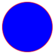

### LineGeometry

A line geometry represents the geometry of a line, and is defined by specifying the start point of the line and the end point.

The [[LineGeometry|LineGeometry]] class defines the following properties:

- [[LineGeometry.StartPoint|StartPoint]], of type `Point`, which represents the start point of the line.
- [[LineGeometry.EndPoint|EndPoint]], of type `Point`, which represents the end point of the line.

These properties are backed by [[BindableProperty|BindableProperty]] objects, which means that they can be targets of data bindings, and styled.

The following example shows how to create and render a [[LineGeometry|LineGeometry]] in a [[Path|Path]] object:

```xaml
<Path Stroke="Black">
  <Path.Data>
    <LineGeometry StartPoint="10,20"
                  EndPoint="100,130" />
  </Path.Data>
</Path>
```

In this example, a [[LineGeometry|LineGeometry]] is drawn from (10,20) to (100,130):

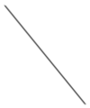

> [!NOTE]
> Setting the [[Shape.Fill|Fill]] property of a [[Path|Path]] that renders a [[LineGeometry|LineGeometry]] will have no effect, because a line has no interior.

### RectangleGeometry

A rectangle geometry represents the geometry of a rectangle or square, and is defined with a `Rect` structure that specifies its relative position and its height and width.

The [[RectangleGeometry|RectangleGeometry]] class defines the `Rect` property, of type `Rect`, which represents the dimensions of the rectangle. This property is backed by a [[BindableProperty|BindableProperty]] object, which means that it can be the target of data bindings, and styled.

The following example shows how to create and render a [[RectangleGeometry|RectangleGeometry]] in a [[Path|Path]] object:

```xaml
<Path Fill="Blue"
      Stroke="Red">
  <Path.Data>
    <RectangleGeometry Rect="10,10,150,100" />
  </Path.Data>
</Path>
```

The position and dimensions of the rectangle are defined by a `Rect` structure. In this example, the position is (10,10), the width is 150, and the height is 100 device-independent units:

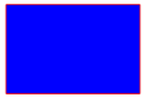

## Path geometries

A path geometry describes a complex shape that can be composed of arcs, curves, ellipses, lines, and rectangles.

The [[PathGeometry|PathGeometry]] class defines the following properties:

- [[PathGeometry.Figures|Figures]], of type [[PathFigureCollection|PathFigureCollection]], which represents the collection of [[PathFigure|PathFigure]] objects that describe the path's contents.
- [[PathGeometry.FillRule|FillRule]], of type [[FillRule|FillRule]], which determines how the intersecting areas contained in the geometry are combined. The default value of this property is `FillRule.EvenOdd`.

These properties are backed by [[BindableProperty|BindableProperty]] objects, which means that they can be targets of data bindings, and styled.

For more information about the [[FillRule|FillRule]] enumeration, see [[fillrules|.NET MAUI Shapes: Fill rules]].

> [!NOTE]
> The [[PathGeometry.Figures|Figures]] property is the [[ContentPropertyAttribute|`ContentProperty`]] of the [[PathGeometry|PathGeometry]] class, and so does not need to be explicitly set from XAML.

A [[PathGeometry|PathGeometry]] is made up of a collection of [[PathFigure|PathFigure]] objects, with each [[PathFigure|PathFigure]] describing a shape in the geometry. Each [[PathFigure|PathFigure]] is itself comprised of one or more [[PathSegment|PathSegment]] objects, each of which describes a segment of the shape. There are many types of segments:

- [[ArcSegment|ArcSegment]], which creates an elliptical arc between two points.
- [[BezierSegment|BezierSegment]], which creates a cubic Bezier curve between two points.
- [[LineSegment|LineSegment]], which creates a line between two points.
- [[PolyBezierSegment|PolyBezierSegment]], which creates a series of cubic Bezier curves.
- [[PolyLineSegment|PolyLineSegment]], which creates a series of lines.
- [[PolyQuadraticBezierSegment|PolyQuadraticBezierSegment]], which creates a series of quadratic Bezier curves.
- [[QuadraticBezierSegment|QuadraticBezierSegment]], which creates a quadratic Bezier curve.

All the above classes derive from the abstract [[PathSegment|PathSegment]] class.

The segments within a [[PathFigure|PathFigure]] are combined into a single geometric shape with the end point of each segment being the start point of the next segment. The [[PathFigure.StartPoint|StartPoint]] property of a [[PathFigure|PathFigure]] specifies the point from which the first segment is drawn. Each subsequent segment starts at the end point of the previous segment. For example, a vertical line from `10,50` to `10,150` can be defined by setting the [[PathFigure.StartPoint|StartPoint]] property to `10,50` and creating a [[LineSegment|LineSegment]] with a `Point` property setting of `10,150`:

```xaml
<Path Stroke="Black">
    <Path.Data>
        <PathGeometry>
            <PathGeometry.Figures>
                <PathFigureCollection>
                    <PathFigure StartPoint="10,50">
                        <PathFigure.Segments>
                            <PathSegmentCollection>
                                <LineSegment Point="10,150" />
                            </PathSegmentCollection>
                        </PathFigure.Segments>
                    </PathFigure>
                </PathFigureCollection>
            </PathGeometry.Figures>
        </PathGeometry>
    </Path.Data>
</Path>
```

More complex geometries can be created by using a combination of [[PathSegment|PathSegment]] objects, and by using multiple [[PathFigure|PathFigure]] objects within a [[PathGeometry|PathGeometry]].

### Create an ArcSegment

An [[ArcSegment|ArcSegment]] creates an elliptical arc between two points. An elliptical arc is defined by its start and end points, x- and y-radius, x-axis rotation factor, a value indicating whether the arc should be greater than 180 degrees, and a value describing the direction in which the arc is drawn.

The [[ArcSegment|ArcSegment]] class defines the following properties:

- [[ArcSegment.Point|Point]], of type `Point`, which represents the endpoint of the elliptical arc. The default value of this property is (0,0).
- [[ArcSegment.Size|Size]], of type `Size`, which represents the x- and y-radius of the arc. The default value of this property is (0,0).
- [[ArcSegment.RotationAngle|RotationAngle]], of type `double`, which represents the amount in degrees by which the ellipse is rotated around the x-axis. The default value of this property is 0.
- [[ArcSegment.SweepDirection|SweepDirection]], of type [[SweepDirection|SweepDirection]], which specifies the direction in which the arc is drawn. The default value of this property is `SweepDirection.CounterClockwise`.
- [[ArcSegment.IsLargeArc|IsLargeArc]], of type `bool`, which indicates whether the arc should be greater than 180 degrees. The default value of this property is `false`.

These properties are backed by [[BindableProperty|BindableProperty]] objects, which means that they can be targets of data bindings, and styled.

> [!NOTE]
> The [[ArcSegment|ArcSegment]] class does not contain a property for the starting point of the arc. It only defines the end point of the arc it represents. The start point of the arc is the current point of the [[PathFigure|PathFigure]] to which the [[ArcSegment|ArcSegment]] is added.

The [[SweepDirection|SweepDirection]] enumeration defines the following members:

- [[SweepDirection.CounterClockwise|CounterClockwise]], which specifies that arcs are drawn in a counter clockwise direction.
- [[SweepDirection.Clockwise|Clockwise]], which specifies that arcs are drawn in a clockwise direction.

The following example shows how to create and render an [[ArcSegment|ArcSegment]] in a [[Path|Path]] object:

```xaml
<Path Stroke="Black">
    <Path.Data>
        <PathGeometry>
            <PathGeometry.Figures>
                <PathFigureCollection>
                    <PathFigure StartPoint="10,10">
                        <PathFigure.Segments>
                            <PathSegmentCollection>
                                <ArcSegment Size="100,50"
                                            RotationAngle="45"
                                            IsLargeArc="True"
                                            SweepDirection="CounterClockwise"
                                            Point="200,100" />
                            </PathSegmentCollection>
                        </PathFigure.Segments>
                    </PathFigure>
                </PathFigureCollection>
            </PathGeometry.Figures>
        </PathGeometry>
    </Path.Data>
</Path>
```

In this example, an elliptical arc is drawn from (10,10) to (200,100).

### Create a BezierSegment

A [[BezierSegment|BezierSegment]] creates a cubic Bezier curve between two points. A cubic Bezier curve is defined by four points: a start point, an end point, and two control points.

The [[BezierSegment|BezierSegment]] class defines the following properties:

- [[BezierSegment.Point1|Point1]], of type `Point`, which represents the first control point of the curve. The default value of this property is (0,0).
- [[BezierSegment.Point2|Point2]], of type `Point`, which represents the second control point of the curve. The default value of this property is (0,0).
- [[BezierSegment.Point3|Point3]], of type `Point`, which represents the end point of the curve. The default value of this property is (0,0).

These properties are backed by [[BindableProperty|BindableProperty]] objects, which means that they can be targets of data bindings, and styled.

> [!NOTE]
> The [[BezierSegment|BezierSegment]] class does not contain a property for the starting point of the curve. The start point of the curve is the current point of the [[PathFigure|PathFigure]] to which the [[BezierSegment|BezierSegment]] is added.

The two control points of a cubic Bezier curve behave like magnets, attracting portions of what would otherwise be a straight line toward themselves and producing a curve. The first control point affects the start portion of the curve. The second control point affects the end portion of the curve. The curve doesn't necessarily pass through either of the control points. Instead, each control point moves its portion of the line toward itself, but not through itself.

The following example shows how to create and render a [[BezierSegment|BezierSegment]] in a [[Path|Path]] object:

```xaml
<Path Stroke="Black">
    <Path.Data>
        <PathGeometry>
            <PathGeometry.Figures>
                <PathFigureCollection>
                    <PathFigure StartPoint="10,10">
                        <PathFigure.Segments>
                            <PathSegmentCollection>
                                <BezierSegment Point1="100,0"
                                               Point2="200,200"
                                               Point3="300,10" />
                            </PathSegmentCollection>
                        </PathFigure.Segments>
                    </PathFigure>
                </PathFigureCollection>
            </PathGeometry.Figures>
        </PathGeometry>
    </Path.Data>
</Path>
```

In this example, a cubic Bezier curve is drawn from (10,10) to (300,10). The curve has two control points at (100,0) and (200,200):

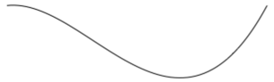

### Create a LineSegment

A [[LineSegment|LineSegment]] creates a line between two points.

The [[LineSegment|LineSegment]] class defines the `Point` property, of type `Point`, which represents the end point of the line segment. The default value of this property is (0,0), and it's backed by a [[BindableProperty|BindableProperty]] object, which means that it can be the target of data bindings, and styled.

> [!NOTE]
> The [[LineSegment|LineSegment]] class does not contain a property for the starting point of the line. It only defines the end point. The start point of the line is the current point of the [[PathFigure|PathFigure]] to which the [[LineSegment|LineSegment]] is added.

The following example shows how to create and render [[LineSegment|LineSegment]] objects in a [[Path|Path]] object:

```xaml
<Path Stroke="Black"      
      Aspect="Uniform"
      HorizontalOptions="Start">
    <Path.Data>
        <PathGeometry>
            <PathGeometry.Figures>
                <PathFigureCollection>
                    <PathFigure IsClosed="True"
                                StartPoint="10,100">
                        <PathFigure.Segments>
                            <PathSegmentCollection>
                                <LineSegment Point="100,100" />
                                <LineSegment Point="100,50" />
                            </PathSegmentCollection>
                        </PathFigure.Segments>
                    </PathFigure>
                </PathFigureCollection>
            </PathGeometry.Figures>
        </PathGeometry>
    </Path.Data>
</Path>
```

In this example, a line segment is drawn from (10,100) to (100,100), and from (100,100) to (100,50). In addition, the [[PathFigure|PathFigure]] is closed because its `IsClosed` property is set to `true`. This results in a triangle being drawn:

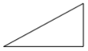

### Create a PolyBezierSegment

A [[PolyBezierSegment|PolyBezierSegment]] creates one or more cubic Bezier curves.

The [[PolyBezierSegment|PolyBezierSegment]] class defines the `Points` property, of type [[PointCollection|PointCollection]], which represents the points that define the [[PolyBezierSegment|PolyBezierSegment]]. A [[PointCollection|PointCollection]] is an `ObservableCollection` of `Point` objects. This property is backed by a [[BindableProperty|BindableProperty]] object, which means that it can be the target of data bindings, and styled.

> [!NOTE]
> The [[PolyBezierSegment|PolyBezierSegment]] class does not contain a property for the starting point of the curve. The start point of the curve is the current point of the [[PathFigure|PathFigure]] to which the [[PolyBezierSegment|PolyBezierSegment]] is added.

The following example shows how to create and render a [[PolyBezierSegment|PolyBezierSegment]] in a [[Path|Path]] object:

```xaml
<Path Stroke="Black">
    <Path.Data>
        <PathGeometry>
            <PathGeometry.Figures>
                <PathFigureCollection>
                    <PathFigure StartPoint="10,10">
                        <PathFigure.Segments>
                            <PathSegmentCollection>
                                <PolyBezierSegment Points="0,0 100,0 150,100 150,0 200,0 300,10" />
                            </PathSegmentCollection>
                        </PathFigure.Segments>
                    </PathFigure>
                </PathFigureCollection>
            </PathGeometry.Figures>
        </PathGeometry>
    </Path.Data>
</Path>
```

In this example, the [[PolyBezierSegment|PolyBezierSegment]] specifies two cubic Bezier curves. The first curve is from (10,10) to (150,100) with a control point of (0,0), and another control point of (100,0). The second curve is from (150,100) to (300,10) with a control point of (150,0) and another control point of (200,0):

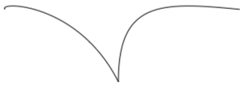

### Create a PolyLineSegment

A [[PolyLineSegment|PolyLineSegment]] creates one or more line segments.

The [[PolyLineSegment|PolyLineSegment]] class defines the `Points` property, of type [[PointCollection|PointCollection]], which represents the points that define the [[PolyLineSegment|PolyLineSegment]]. A [[PointCollection|PointCollection]] is an `ObservableCollection` of `Point` objects. This property is backed by a [[BindableProperty|BindableProperty]] object, which means that it can be the target of data bindings, and styled.

> [!NOTE]
> The [[PolyLineSegment|PolyLineSegment]] class does not contain a property for the starting point of the line. The start point of the line is the current point of the [[PathFigure|PathFigure]] to which the [[PolyLineSegment|PolyLineSegment]] is added.

The following example shows how to create and render a [[PolyLineSegment|PolyLineSegment]] in a [[Path|Path]] object:

```xaml
<Path Stroke="Black">
    <Path.Data>
        <PathGeometry>
            <PathGeometry.Figures>
                <PathFigure StartPoint="10,10">
                    <PathFigure.Segments>
                        <PolyLineSegment Points="50,10 50,50" />
                    </PathFigure.Segments>
                </PathFigure>
            </PathGeometry.Figures>
        </PathGeometry>
    </Path.Data>
</Path>
```

In this example, the [[PolyLineSegment|PolyLineSegment]] specifies two lines. The first line is from (10,10) to (50,10), and the second line is from (50,10) to (50,50):

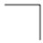

### Create a PolyQuadraticBezierSegment

A [[PolyQuadraticBezierSegment|PolyQuadraticBezierSegment]] creates one or more quadratic Bezier curves.

The [[PolyQuadraticBezierSegment|PolyQuadraticBezierSegment]] class defines the `Points` property, of type [[PointCollection|PointCollection]], which represents the points that define the [[PolyQuadraticBezierSegment|PolyQuadraticBezierSegment]]. A [[PointCollection|PointCollection]] is an `ObservableCollection` of `Point` objects. This property is backed by a [[BindableProperty|BindableProperty]] object, which means that it can be the target of data bindings, and styled.

> [!NOTE]
> The [[PolyQuadraticBezierSegment|PolyQuadraticBezierSegment]] class does not contain a property for the starting point of the curve. The start point of the curve is the current point of the [[PathFigure|PathFigure]] to which the [[PolyQuadraticBezierSegment|PolyQuadraticBezierSegment]] is added.

The following example shows to create and render a [[PolyQuadraticBezierSegment|PolyQuadraticBezierSegment]] in a [[Path|Path]] object:

```xaml
<Path Stroke="Black">
    <Path.Data>
        <PathGeometry>
            <PathGeometry.Figures>
                <PathFigureCollection>
                    <PathFigure StartPoint="10,10">
                        <PathFigure.Segments>
                            <PathSegmentCollection>
                                <PolyQuadraticBezierSegment Points="100,100 150,50 0,100 15,200" />
                            </PathSegmentCollection>
                        </PathFigure.Segments>
                    </PathFigure>
                </PathFigureCollection>
            </PathGeometry.Figures>
        </PathGeometry>
    </Path.Data>
</Path>
```

In this example, the [[PolyQuadraticBezierSegment|PolyQuadraticBezierSegment]] specifies two Bezier curves. The first curve is from (10,10) to (150,50) with a control point at (100,100). The second curve is from (100,100) to (15,200) with a control point at (0,100):

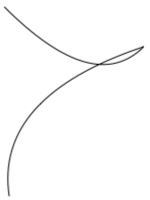

### Create a QuadraticBezierSegment

A [[QuadraticBezierSegment|QuadraticBezierSegment]] creates a quadratic Bezier curve between two points.

The [[QuadraticBezierSegment|QuadraticBezierSegment]] class defines the following properties:

- [[QuadraticBezierSegment.Point1|Point1]], of type `Point`, which represents the control point of the curve. The default value of this property is (0,0).
- [[QuadraticBezierSegment.Point2|Point2]], of type `Point`, which represents the end point of the curve. The default value of this property is (0,0).

These properties are backed by [[BindableProperty|BindableProperty]] objects, which means that they can be targets of data bindings, and styled.

> [!NOTE]
> The [[QuadraticBezierSegment|QuadraticBezierSegment]] class does not contain a property for the starting point of the curve. The start point of the curve is the current point of the [[PathFigure|PathFigure]] to which the [[QuadraticBezierSegment|QuadraticBezierSegment]] is added.

The following example shows how to create and render a [[QuadraticBezierSegment|QuadraticBezierSegment]] in a [[Path|Path]] object:

```xaml
<Path Stroke="Black">
    <Path.Data>
        <PathGeometry>
            <PathGeometry.Figures>
                <PathFigureCollection>
                    <PathFigure StartPoint="10,10">
                        <PathFigure.Segments>
                            <PathSegmentCollection>
                                <QuadraticBezierSegment Point1="200,200"
                                                        Point2="300,10" />
                            </PathSegmentCollection>
                        </PathFigure.Segments>
                    </PathFigure>
                </PathFigureCollection>
            </PathGeometry.Figures>
        </PathGeometry>
    </Path.Data>
</Path>
```

In this example, a quadratic Bezier curve is drawn from (10,10) to (300,10). The curve has a control point at (200,200):

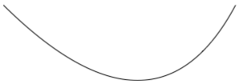

### Create complex geometries

More complex geometries can be created by using a combination of [[PathSegment|PathSegment]] objects. The following example creates a shape using a [[BezierSegment|BezierSegment]], a [[LineSegment|LineSegment]], and an [[ArcSegment|ArcSegment]]:

```xaml
<Path Stroke="Black">
    <Path.Data>
        <PathGeometry>
            <PathGeometry.Figures>
                <PathFigure StartPoint="10,50">
                    <PathFigure.Segments>
                        <BezierSegment Point1="100,0"
                                       Point2="200,200"
                                       Point3="300,100"/>
                        <LineSegment Point="400,100" />
                        <ArcSegment Size="50,50"
                                    RotationAngle="45"
                                    IsLargeArc="True"
                                    SweepDirection="Clockwise"
                                    Point="200,100"/>
                    </PathFigure.Segments>
                </PathFigure>
            </PathGeometry.Figures>
        </PathGeometry>
    </Path.Data>
</Path>
```

In this example, a [[BezierSegment|BezierSegment]] is first defined using four points. The example then adds a [[LineSegment|LineSegment]], which is drawn between the end point of the [[BezierSegment|BezierSegment]] to the point specified by the [[LineSegment|LineSegment]]. Finally, an [[ArcSegment|ArcSegment]] is drawn from the end point of the [[LineSegment|LineSegment]] to the point specified by the [[ArcSegment|ArcSegment]].

Even more complex geometries can be created by using multiple [[PathFigure|PathFigure]] objects within a [[PathGeometry|PathGeometry]]. The following example creates a [[PathGeometry|PathGeometry]] from seven [[PathFigure|PathFigure]] objects, some of which contain multiple [[PathSegment|PathSegment]] objects:

```xaml
<Path Stroke="Red"
      StrokeThickness="12"
      StrokeLineJoin="Round">
    <Path.Data>
        <PathGeometry>
            <!-- H -->
            <PathFigure StartPoint="0,0">
                <LineSegment Point="0,100" />
            </PathFigure>
            <PathFigure StartPoint="0,50">
                <LineSegment Point="50,50" />
            </PathFigure>
            <PathFigure StartPoint="50,0">
                <LineSegment Point="50,100" />
            </PathFigure>

            <!-- E -->
            <PathFigure StartPoint="125, 0">
                <BezierSegment Point1="60, -10"
                               Point2="60, 60"
                               Point3="125, 50" />
                <BezierSegment Point1="60, 40"
                               Point2="60, 110"
                               Point3="125, 100" />
            </PathFigure>

            <!-- L -->
            <PathFigure StartPoint="150, 0">
                <LineSegment Point="150, 100" />
                <LineSegment Point="200, 100" />
            </PathFigure>

            <!-- L -->
            <PathFigure StartPoint="225, 0">
                <LineSegment Point="225, 100" />
                <LineSegment Point="275, 100" />
            </PathFigure>

            <!-- O -->
            <PathFigure StartPoint="300, 50">
                <ArcSegment Size="25, 50"
                            Point="300, 49.9"
                            IsLargeArc="True" />
            </PathFigure>
        </PathGeometry>
    </Path.Data>
</Path>
```

In this example, the word "Hello" is drawn using a combination of [[LineSegment|LineSegment]] and [[BezierSegment|BezierSegment]] objects, along with a single [[ArcSegment|ArcSegment]] object:

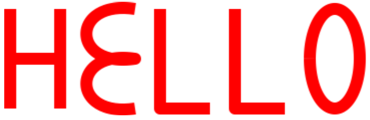

## Composite geometries

Composite geometry objects can be created using a [[GeometryGroup|GeometryGroup]]. The [[GeometryGroup|GeometryGroup]] class creates a composite geometry from one or more [[Geometry|Geometry]] objects. Any number of [[Geometry|Geometry]] objects can be added to a [[GeometryGroup|GeometryGroup]].

The [[GeometryGroup|GeometryGroup]] class defines the following properties:

- [[GeometryGroup.Children|Children]], of type [[GeometryCollection|GeometryCollection]], which specifies the objects that define the [[GeometryGroup|GeometryGroup]]. A [[GeometryCollection|GeometryCollection]] is an `ObservableCollection` of [[Geometry|Geometry]] objects.
- [[GeometryGroup.FillRule|FillRule]], of type [[FillRule|FillRule]], which specifies how the intersecting areas in the [[GeometryGroup|GeometryGroup]] are combined. The default value of this property is `FillRule.EvenOdd`.

These properties are backed by [[BindableProperty|BindableProperty]] objects, which means that they can be targets of data bindings, and styled.

> [!NOTE]
> The `Children` property is the [[ContentPropertyAttribute|`ContentProperty`]] of the [[GeometryGroup|GeometryGroup]] class, and so does not need to be explicitly set from XAML.

For more information about the [[FillRule|FillRule]] enumeration, see [[fillrules|Fill rules]].

To draw a composite geometry, set the required [[Geometry|Geometry]] objects as the children of a [[GeometryGroup|GeometryGroup]], and display them with a [[Path|Path]] object. The following XAML shows an example of this:

```xaml
<Path Stroke="Green"
      StrokeThickness="2"
      Fill="Orange">
    <Path.Data>
        <GeometryGroup>
            <EllipseGeometry RadiusX="100"
                             RadiusY="100"
                             Center="150,150" />
            <EllipseGeometry RadiusX="100"
                             RadiusY="100"
                             Center="250,150" />
            <EllipseGeometry RadiusX="100"
                             RadiusY="100"
                             Center="150,250" />
            <EllipseGeometry RadiusX="100"
                             RadiusY="100"
                             Center="250,250" />
        </GeometryGroup>
    </Path.Data>
</Path>
```

In this example, four [[EllipseGeometry|EllipseGeometry]] objects with identical x-radius and y-radius coordinates, but with different center coordinates, are combined. This creates four overlapping circles, whose interiors are filled orange due to the default [[FillRule.EvenOdd|EvenOdd]] fill rule:

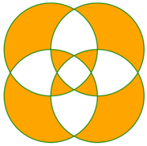

### RoundRectangleGeometry

A round rectangle geometry represents the geometry of a rectangle, or square, with rounded corners, and is defined by a corner radius and a `Rect` structure that specifies its relative position and its height and width.

The [[RoundRectangleGeometry|RoundRectangleGeometry]] class, which derives from the [[GeometryGroup|GeometryGroup]] class, defines the following properties:

- [[RoundRectangleGeometry.CornerRadius|CornerRadius]], of type `CornerRadius`, which is the corner radius of the geometry.
- [[RoundRectangleGeometry.Rect|Rect]], of type `Rect`, which represents the dimensions of the rectangle.

These properties are backed by [[BindableProperty|BindableProperty]] objects, which means that they can be targets of data bindings, and styled.

> [!NOTE]
> The fill rule used by the [[RoundRectangleGeometry|RoundRectangleGeometry]] is `FillRule.Nonzero`. For more information about fill rules, see [[fillrules|Fill rules]].

The following example shows how to create and render a [[RoundRectangleGeometry|RoundRectangleGeometry]] in a [[Path|Path]] object:

```xaml
<Path Fill="Blue"
      Stroke="Red">
    <Path.Data>
        <RoundRectangleGeometry CornerRadius="5"
                                Rect="10,10,150,100" />
    </Path.Data>
</Path>
```

The position and dimensions of the rectangle are defined by a `Rect` structure. In this example, the position is (10,10), the width is 150, and the height is 100 device-independent units. In addition, the rectangle corners are rounded with a radius of 5 device-independent units.

## Clip with a Geometry

The [[VisualElement (Controls)|VisualElement]] class has a [[VisualElement (Controls).Clip|Clip]] property, of type [[Geometry|Geometry]], that defines the outline of the contents of an element. When the [[VisualElement (Controls).Clip|Clip]] property is set to a [[Geometry|Geometry]] object, only the area that is within the region of the [[Geometry|Geometry]] will be visible.

The following example shows how to use a [[Geometry|Geometry]] object as the clip region for an [[Image (Controls)|Image]]:

```xaml
<Image Source="monkeyface.png">
    <Image.Clip>
        <EllipseGeometry RadiusX="100"
                         RadiusY="100"
                         Center="180,180" />
    </Image.Clip>
</Image>
```

In this example, an [[EllipseGeometry|EllipseGeometry]] with [[EllipseGeometry.RadiusX|RadiusX]] and [[EllipseGeometry.RadiusY|RadiusY]] values of 100, and a [[EllipseGeometry.Center|Center]] value of (180,180) is set to the [[VisualElement (Controls).Clip|Clip]] property of an [[Image (Controls)|Image]]. Only the part of the image that is within the area of the ellipse will be displayed:


> [!NOTE]
> Simple geometries, path geometries, and composite geometries can all be used to clip [[VisualElement (Controls)|VisualElement]] objects.

## Other features

The [[GeometryHelper|GeometryHelper]] class provides the following helper methods:

- `FlattenGeometry%2A`, which flattens a [[Geometry|Geometry]] into a [[PathGeometry|PathGeometry]].
- `FlattenCubicBezier%2A`, which flattens a cubic Bezier curve into a `List<Point>` collection.
- `FlattenQuadraticBezier%2A`, which flattens a quadratic Bezier curve into a `List<Point>` collection.
- `FlattenArc%2A`, which flattens an elliptical arc into a `List<Point>` collection.
